# LDMOS 算例对标阶段汇报：物理与结果通过工程验收，性能优化进入单次求解成本阶段


> 建议用 15–20 分钟汇报：先讲第 1 节结论与第 2 节器件，再展示第 6 节电学/热学结果、第 7 节性能，最后讨论第 9 节后续工作。第 3–5 节及附录用于算法说明和技术问答。所有曲线与场图来自实际冻结结果，没有拟合参考曲线或补造数据。

## 1. 本阶段完成了什么

从“独立电热实验能够完成曲线”推进到“生产入口可复现、完整曲线与局部场通过验收、同环境重复性能达到既定目标”。本次对标对象为 **Sentaurus Device T-2022.03-SP2 的原 LDMOS 脚本生效配置**，不是对所有商业 TCAD 功能或其未公开内部算法的全面复刻。

| 关注点 | 截至 9 月 17 日的结论 | 对项目的意义 |
|---|---|---|
| 原脚本生效物理 | Fermi/BGN、IALMob/高场饱和、SRH/Auger、有限空穴接触及晶格自热已实现并对照 | 形成可解释、可回归的电热模型 |
| D0 电热输出曲线 | Vg=4/8 V，Vd=0–40 V，各 31 点；最大漏极电流误差 **0.024087% / 0.007144%** | 终端电流与参考高度一致 |
| 局部物理量 | 最差分组密度 RMS **0.508509% / 1.284860%**；带边最大差 **7.803 / 26.653 meV** | 通过已批准的 2% / 30 meV 工程门限，仍保留局部余差 |
| 自热 | 最大峰值温升误差 **0.009401 / 0.041982 K**；温升场 RMS 误差 **0.006308 / 0.010847 K** | 温度反馈、热源及热边界获得整器件联合验证 |
| 生产与恢复 | 中性初始化、栅压预偏置、完整扫描、失败恢复、保存/加载、温度/热流输出均已验证 | 能从原始输入运行并可靠续接 |
| 最新性能 | R11 对 R10 四组完整配对墙钟减少 **6.754%–12.257%**；R11/原生墙钟 **0.752–0.837 倍** | 通过 ≤1.5 倍目标；CPU 仍为原生 **1.302–1.488 倍** |
| 最终源码等温回归 | G3 31 点、D5 62 点、D4 62 点，共 **155/155 点通过原门限** | 补齐最终 R11 源码的等温长曲线回归 |

**当前推荐配置为显式 R11，R10 保留回退；导出器兼容默认仍为 R7。** 本报告中的“R11 电热配置”与“R11 源码下的等温配置”分别标注，不混用后端、模型或计时结论。上述验收限定于当前网格、输入与冻结程序。[S1–S3]

## 2. 算例背景、结构及基本参数

### 2.1 为什么选择这组算例

二维硅 LDMOS 的沟道与漂移区使低场输运、界面迁移率、高场饱和和自热同时影响输出特性。它适合检查：低栅压下的载流子统计与阈值、双栅压输出电流、高压局部场以及温升反馈能否在同一模型中保持一致。

对标采用同一原始器件拓扑、掺杂场和参数来源，通过分阶段消融定位差异。图 1 是实际导入网格，不是重新绘制的理想结构示意。原文件以 x/y 表示坐标，本报告保留原方向，不将坐标范围误写成沟道长度或栅长。

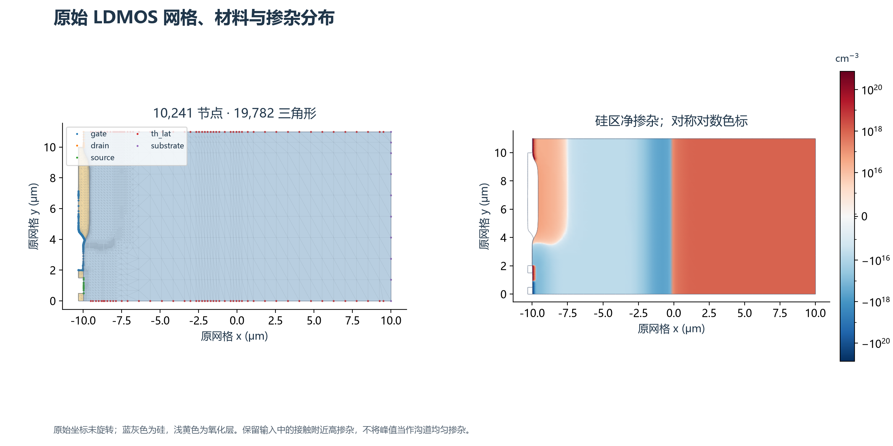

**图 1.** 原始网格、材料和净掺杂。接触附近存在高掺杂峰值；这些峰值来自输入场，不代表沟道或漂移区均匀掺杂。

| 基本项目 | 本次实际设置 |
|---|---|
| 器件与求解维度 | 二维 Si/SiO₂ LDMOS，按单位出平面宽度计算 |
| 网格 | **10,241 节点、19,782 个 Tri3 三角形** |
| 硅区 | 5,723 节点、10,515 单元；Si/oxide 共享界面节点 762 个 |
| 氧化层 | 两个区域，分别 9,246 / 21 单元 |
| 原始坐标包围盒 | x：−10.32～10 μm；y：0～11 μm；SI 入口乘 `1e-6` 转为 m |
| 电学端子 | gate、source、drain、substrate；另有热端子 `th_lat` |
| 栅极 | 原脚本 `Material="PolySi"(N)`；其接触语义按原参数及导入配置处理 |
| 掺杂 | 读取原逐节点 donor/acceptor 场，不用平均掺杂替代，也不为拟合电流调参 |
| 晶向输入 | IALMob `crystal_x=[1,0,0]`、`crystal_y=[0,1,0]`，使用已审计界面几何和 AutoOrientation 对应参数 |
| 输出扫描 | Vg=4 V、8 V；Vd=0～40 V，各 31 个精确参考点，间隔 40/30 V |
| 转移扫描 | G3：Vd=0.1 V，Vg=0～5 V，31 点 |
| 热环境 | 300 K；`th_lat` 采用有限热阻 Robin 边界 |
| 电流单位 | 图中统一使用 **A/m**；原评分通常为 A/μm，两者相差 `10⁶`；均不是器件总电流 A |

### 2.2 模型分层与每个阶段验证的问题

| 阶段 | 配置及用途 | 当前证据范围 |
|---|---|---|
| G3 | 无 IALMob 的等温 Id–Vg 控制，检查统计、阈值和跨导 | 最终 R11 源码，31 点完整栅压扫描，从既有预偏置种子开始 |
| D5 | 无 IALMob 的等温 Id–Vd 控制 | 最终 R11 源码，双栅压各从零漏压重新闭合后完整推进 |
| D4 | 包含 IALMob 的经典等温 Id–Vd | 同上，双栅压共 62 点 |
| D3/D2/D1 | 原脚本量子声明与接触选项的阶段链审计 | 按原 `Solve` 实际激活方程认领等效范围；不另计为本轮新增曲线 |
| D0 | 有限空穴接触、原生 Poisson 几何、完整晶格自热 | 生产 R11 中性冷启动、双栅压 62 点及两轮重复联合验收 |

原脚本虽然在 `Physics` 中声明 `eQuantumPotential/hQuantumPotential`，但原 `Solve` 未联立这些方程。本阶段不把完整量子求解、Thermodynamic、Peltier、RecGenHeat 列为已验证功能。`Plot` 中出现 Avalanche 等名称也不代表激活相应物理模型。[S4–S6]

## 3. 物理模型与理论依据

以下给出解释实现与验证所需的核心方程。连续方程用于说明物理，实际离散还包含原网格权重、Fermi 修正、界面及接触处理；不以简化公式替代完整实现。[S4–S7]

### 3.1 Poisson、载流子连续性与晶格热方程

令电势为 $\psi$，电子/空穴电流密度为 $\mathbf J_n,\mathbf J_p$，净复合率为 $R$，则稳态核心方程为：

$$
-\nabla\cdot(\epsilon\nabla\psi)=q(p-n+N_D^+-N_A^-)+\rho_f,
\qquad \nabla\cdot\mathbf J_n=qR,
\qquad \nabla\cdot\mathbf J_p=-qR.
$$

$$
-\nabla\cdot[\kappa(T)\nabla T]=H,
\qquad \mathbf q_T=-\kappa\nabla T.
$$

电热求解未知量为 $\mathbf u=(\psi,\varphi_n,\varphi_p,T)$。迁移率、带边、有效态密度、复合率及中性接触密度随温度变化，因此四方程 Jacobian 包含电学对温度及热方程对电学的交叉项。只在收敛后补算温度不能代替此自洽反馈。

**热源与电流共用离散路径。** 实现按边上的电子/空穴电流与导带/价带电势差计算功率，以一致方向记为：

$$
P_e=I_{n,e}\,\Delta(E_c/q)+I_{p,e}\,\Delta(E_v/q),
\qquad Q_i\mathrel{+}=P_e/2,\quad Q_j\mathrel{+}=P_e/2.
$$

这里 $E_c,E_v$ 按能量定义；源码带边用 eV 时，其数值差对应上述电势差的 V 数值。边方向由电流/带边差合同统一，保留负功，两端各半保守沉积。热源不是从另一个不一致的节点电流插值重新计算。原 D0 不额外加入 Peltier/复合热项。

### 3.2 Fermi 统计、能带和 BGN

$$
n=N_c(T)F_{1/2}\!\left(\frac{E_{Fn}-E_c}{k_BT}\right),\qquad
p=N_v(T)F_{1/2}\!\left(\frac{E_v-E_{Fp}}{k_BT}\right).
$$

采用归一化 Fermi–Dirac 积分：

$$
F_j(\eta)=\frac{1}{\Gamma(j+1)}\int_0^\infty\frac{t^j}{1+\exp(t-\eta)}\,dt,
\qquad \frac{dF_{1/2}}{d\eta}=F_{-1/2}(\eta).
$$

本阶段同时校验函数、导数及逆函数，避免密度值正确但 Jacobian 不一致。带隙采用温度规律；以 300 K 参数写成：

$$
E_g(T)=E_g(300)+\alpha\left[\frac{300^2}{300+\beta}-\frac{T^2}{T+\beta}\right].
$$

OldSlotboom 的基础收窄项及有效带隙为：

$$
\Delta E_g^{\rm OS}=E_{\rm ref}\left[\ln\frac{N}{N_{\rm ref}}+
\sqrt{\ln^2\frac{N}{N_{\rm ref}}+\frac12}\right],\qquad
E_g^{\rm eff}=E_g-\Delta E_g.
$$

$N=N_D+N_A$，零掺杂单独处理；完整 $\Delta E_g$ 还包含对应 Fermi 统计修正。该修正按原生规定在 **300 K** 计算；全局参考电势固定，不随局部温度漂移。局部温度仍进入 $E_g,N_c,N_v$、载流子密度和其温度导数。

| 物性参数 | 数值/规律 |
|---|---|
| 硅相对介电常数 / 氧化层 | 11.7 / 3.9 |
| $E_g(300)$ / $\chi(300)$ | 1.12416 eV / 4.0727 eV |
| 带隙温度参数 $\alpha,\beta$ | $4.73\times10^{-4}$ eV/K，636 K |
| OldSlotboom $E_{\rm ref},N_{\rm ref}$ | 0.009 eV，$10^{17}$ cm⁻³；带边分配系数 0.5 |
| 有效态密度 | 来源于 `Siliconc100.par` 的 Formula-1 有效质量与温度关系，不以固定 300 K 常数覆盖全温区 |
| 硅热导 | $\kappa(T)=100/[-0.0393+0.00155T+1.82\times10^{-6}T^2]$ W/(m·K) |
| SiO₂ 热导 | 1.4 W/(m·K) |

### 3.3 SRH 与 Auger：生成语义也是模型的一部分

Fermi 情况下定义 $\gamma_n=F_{1/2}(\eta_n)e^{-\eta_n}$、$\gamma_p=F_{1/2}(\eta_p)e^{-\eta_p}$，过剩乘积为
$\mathcal P=np-\gamma_n\gamma_p(n_i^{\rm eff})^2$。对应当前局部模型：

$$
R_{\rm SRH}=\frac{\mathcal P}{\tau_p(n+\gamma_n n_i^{\rm eff})+\tau_n(p+\gamma_p n_i^{\rm eff})},
\qquad
\tau_{n,p}=\frac{\tau_{n,p,300}}{1+N/N_{\rm SRH}}\left(\frac{T}{300}\right)^{-1.5}.
$$

$$
R_{\rm Auger}=[C_n(n,T)n+C_p(p,T)p]\max(\mathcal P,0),
$$

$$
C_n(n,T)=(a_n+b_nt+c_nt^2)[1+H_n e^{-n/N_{0n}}],\quad t=T/300,
$$

空穴系数形式相同。`max` 表示原脚本普通 `Auger` 未启用 `WithGeneration` 的分支语义；SRH 的生成行为不因此一起关闭。源码使用准费米分裂及 `expm1` 等稳定表达，避免近平衡直接相减丢失有效位。

| 参数 | 电子 | 空穴 |
|---|---:|---:|
| SRH $\tau_{300}$ | $10^{-5}$ s | $3\times10^{-6}$ s |
| SRH $N_{\rm SRH}$ | $10^{16}$ cm⁻³ | $10^{16}$ cm⁻³ |
| Auger $(a,b,c)$，cm⁶/s | $(6.7\times10^{-32},2.45\times10^{-31},-2.2\times10^{-32})$ | $(7.2\times10^{-32},4.5\times10^{-33},2.63\times10^{-32})$ |
| $H$ | 3.46667 | 8.25688 |
| $N_0$ | $10^{18}$ cm⁻³ | $10^{18}$ cm⁻³ |

9 月 13 日已将该生成开关同步到共享等温路径，随后独立复核 G3/D5/D4；不是只修正电热局部探针后继承其他配置资格。[S5、S8]

### 3.4 IALMob、高场饱和及显式偏导

IALMob 低场内核考虑掺杂/载流子屏蔽、体与界面散射、法向场、距界面距离、晶向及温度。真实实现含多个分支和屏蔽下限，不能用单一经验常数替代。高场部分采用：

$$
\mu=\frac{\mu_0}{[1+(\mu_0E/v_{\rm sat})^\beta]^{1/\beta}},
\quad x=\mu_0E/v_{\rm sat},\quad s=x^\beta,\quad d=(1+s)^{1/\beta},\quad r=\frac{s}{1+s}.
$$

对 $E>0$，R11 使用的显式偏导核心为：

$$
\frac{\partial\mu}{\partial\mu_0}=\frac{1}{d(1+s)},\qquad
\frac{\partial\mu}{\partial E}=-\frac{\mu r}{E},
$$

$$
\left.\frac{\partial\ln\mu}{\partial T}\right|_{\mu_0,E}
=\frac{\beta'}{\beta^2}[\ln(1+s)-r\ln s]
+r\frac{v_{\rm sat}'}{v_{\rm sat}}.
$$

零场和 $s=0$ 按原分支/极限处理。装配时继续使用完整链式法则，例如
$d\mu/dT=(\partial\mu/\partial\mu_0)(d\mu_0/dT)+(\partial\mu/\partial E)(dE/dT)+\partial\mu/\partial T$，不能漏掉密度、场及温度耦合。

| 高场设置 | 电子 | 空穴 |
|---|---:|---:|
| 300 K 饱和速度 | $1.07\times10^5$ m/s | $8.37\times10^4$ m/s |
| 300 K $\beta$ | 1.109 | 1.213 |
| 驱动场 | 准费米势梯度 | 准费米势梯度 |

场采用输运单元向量梯度；参考密度 $10^{12}$ cm⁻³。高场显式值/偏导已纳入 R11。低场七方向偏导已用 SymPy 离线生成 C++，并保留自动微分/有限差分对照，但未证明稳定整体收益，**生成低场仍关闭**。符号求导消除的是求值冗余，不代表原自动微分 Jacobian 不精确。[S9]

### 3.5 有限接触与热边界

源、漏空穴交换速度 $v_p=1.93\times10^6$ cm/s，即 $1.93\times10^4$ m/s。连续性边界的向外损失为：

$$
J_{p,\perp}=qv_p(p-p_0),\qquad I_{p,i}=qv_pL_i(p_i-p_{0,i}).
$$

$L_i$ 为对应接触半边长度；端子注入电流采用相反符号。原脚本未开启 `hRecVel(TempDep)`，所以 $v_p$ 常数，但中性接触的 $p_0(T)$ 与电势随温度变，其偏导必须进入 Jacobian，不能跨温度复用旧根。

热边界为：

$$
\mathbf q_T\cdot\mathbf n=h(T-300),\qquad
R_s=0.005\ {\rm cm^2K/W}=5\times10^{-7}\ {\rm m^2K/W},\quad
h=2\times10^6\ {\rm W/(m^2K)}.
$$

其他未指定热通量外边界按该有限体积热模型的自然边界处理。[S4–S5]

## 4. 仿真参数与数值算法

### 4.1 原生脚本与当前生产配置的区别

两边求解相同生效物理范围，但变量表示、非线性接受规则、步长控制和线性求解实现并不宣称完全相同。以下为实际配置，不能仅比较相同名称的参数数值。

| 项目 | 原 Sentaurus D0 | Vela 生产 R11 D0 |
|---|---|---|
| 生效联立方程 | Poisson、Electron、Hole、Temperature | $\psi,\varphi_n,\varphi_p,T$ 四方程 |
| 初始化 | Poisson：100 次上限、LineSearchDamping=$10^{-4}$；再耦合平衡 | 中性 300 K 起步，Poisson/耦合平衡，初始化上限 100 |
| 栅压预偏置 | Poisson，依次 4 V、8 V；InitialStep=.01、Increment=1.35、MaxStep=.4、MinStep=$10^{-4}$ | 保留对应分阶段 Poisson 栅压预偏置，8 V 经过 4 V |
| 漏压初始/最小/最大步 | 归一化 .00025 / $10^{-6}$ / .05；0–40 V 对应 **.01 V / .00004 V / 2 V** | **.1 V / .0001 V / 1.333333 V**；精确输出点截短 |
| 漏压迭代上限 | 25；Notdamped=100 | 60；`growth_newton=12` |
| 外推 | `Extrapolate` | `predictor="linear"`，合格历史及既有保护 |
| 收敛控制 | Digits=6，ErrRef(n,p)=$10^8$ cm⁻³ | 残差范数、分块、载流子逐行及物理守恒联合检查 |
| Newton 更新 | 原生内部实现不完全公开 | QF 坐标、有界更新与残差线搜索；通常电势/QF 0.2 V、温度 30 K 更新上限 |
| 线性后端 | 依原生配置及日志 | **UMFPACK**；重复稀疏结构复用符号分析 |
| 输出 | 31 个精确电流点及匹配场输出 | 同偏压电流、状态、温度/热流、全部尝试和检查点 |

**精确输出点间隔不等于内部步长。** 从 0 到 40 V 的 31 点是对比采样要求，两个求解器都可在点间插入内部求解。原生 `MaxStep=.05` 是归一化扫压参数，不能误读为 0.05 V。

9 月 17 日补跑的 G3/D5/D4 走独立等温入口：UCRT64 Release、SparseLU/COLAMD，保留等温控制器的原步长与门限。D5/D4 每条包含 253 次点服务请求，不能与 D0 R11 的点服务/更新次数直接比较。[S2–S3]

### 4.2 离散、Jacobian 与 Newton 更新

空间上使用三角形网格与 Box/有限体积残差。D0 已联合对齐原生 **Poisson 边系数与硅电荷体积**；输运、复合源、热源各使用对应几何，不能把它们统一替换成某一个节点面积。9 月 13 日的差异定位说明，即使本构公式相同，几何积分权重不同也会产生显著局部带边误差。

在等温、非简并、常系数的一维边极限，Scharfetter–Gummel 电流可示意为：

$$
I_{n,ij}=q\mu_n V_T\frac{A_{ij}}{\ell_{ij}}
\left[n_jB(\delta)-n_iB(-\delta)\right],\quad
\delta=\frac{\psi_j-\psi_i}{V_T},\quad B(z)=\frac{z}{e^z-1}.
$$

该式用于解释指数拟合如何兼顾漂移与扩散；实际电热实现还使用 Fermi 割线因子、温度/DOS 及准费米表示，不能直接以此简式替代。

离散后求解非线性方程 $\mathbf F(\mathbf u)=0$：

$$
\mathbf J_k\Delta\mathbf u_k=-\mathbf F_k,\qquad
\mathbf u_{k+1}=\mathbf u_k+\alpha_k\Delta\mathbf u_k.
$$

实际先行列缩放，再对稀疏矩阵分解。符号分析处理稀疏结构，数值分解处理当前系数，回代得到方向；结构不变时可复用前者，但不能把复用符号分析等同于跳过每次数值分解。残差试算尽量只求物理值，接受后再按需准备完整 Jacobian。

### 4.3 算法流程图与伪代码

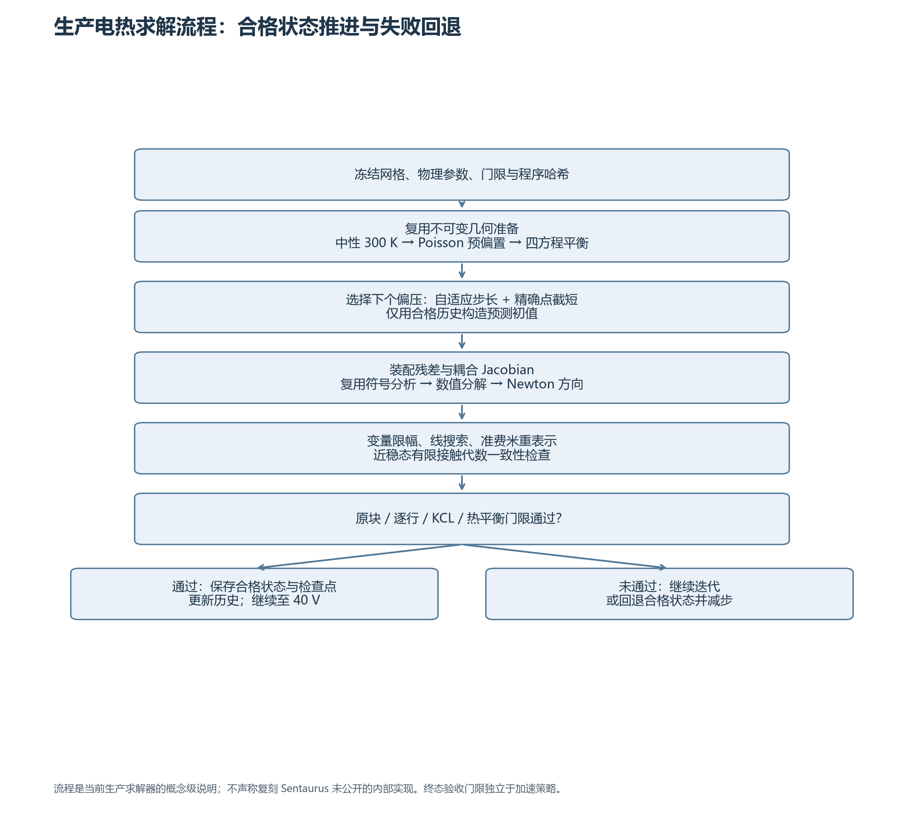

流程图的可编辑 Mermaid 版本：

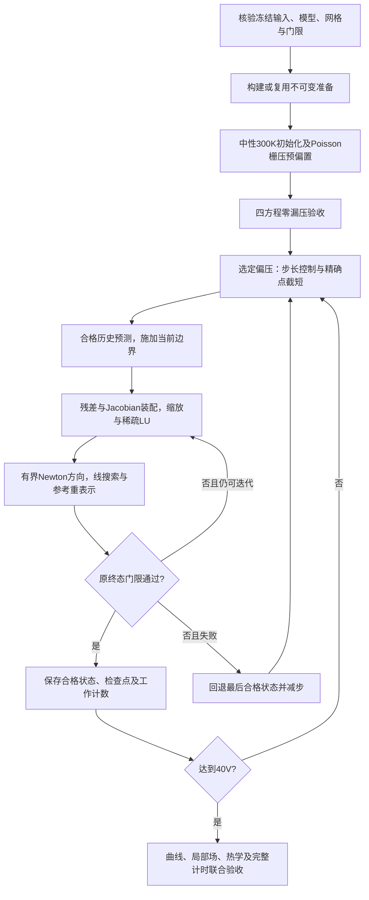

以下是概念级伪代码；近稳态接触修复是受原条件保护的代数一致性修复，不放宽终止规则，也不每次强制改写空穴状态。

```text
核验输入/网格/参数/可执行文件指纹
context = prepare_immutable_geometry_and_inputs()
state = initialize_neutral_300K_and_gate_prebias()
require original_zero_bias_gates(state)

for each requested exact drain point:
    while accepted_bias < exact_target:
        target = truncate_adaptive_step_at_exact_point()
        trial = predict_from_qualified_history(state, target)
        for k in 0 .. Newton_budget:
            F, J, physical_state = assemble(trial, context)
            if all_original_terminal_gates_pass(F, physical_state):
                accept trial; break
            if eligible_for_contact_consistency_repair(trial):
                repaired = restore_neutral_contact_algebraic_consistency(trial)
                reassemble_and_check_original_gates(repaired)
                retain_only_if_original_repair_conditions_pass()
            reuse_symbolic_analysis_only_if_pattern_matches(J)
            direction = sparse_LU_solve(scaled_J, -scaled_F)
            alpha = variable_update_limit(direction)
            candidate = residual_line_search(trial, direction, alpha)
            if no_acceptable_candidate_or_stagnation_failure:
                mark_attempt_failed; break
            trial = preserve_small_QF_increments_and_recenter(candidate)
        record ALL updates, assemblies, candidates and elapsed cost
        if solve accepted:
            state = trial; atomically_save_checkpoint(state)
            update_qualified_history_and_step()
        else:
            restore_last_qualified_state_and_reduce_step()
            stop_with_evidence_if_minimum_step_exceeded()

audit exact curves + local fields + heat balance + restart + paired timing
```

### 4.4 验收标准：数值闭合与参考误差分别检查

| 类别 | 当前门限/定义 |
|---|---|
| 电学块残差 | 原缩放口径：Poisson ≤$5\times10^{-8}$、电子 ≤$10^{-11}$、空穴 ≤$3\times10^{-10}$；不得解读为 V 或相对电流误差 |
| 载流子逐行闭合 | `eps_row=1e-8`；保留原行尺度和小量处理 |
| D0/D4/D5 最终曲线合同 | 非零电流误差中位数 ≤5%、P95 ≤12%；低压微分电阻误差 ≤10%、40 V 电流误差 ≤10%、栅压电流比误差 ≤8%、归一化 KCL ≤0.1% |
| G3 六项合同 | 对数误差中位数 ≤0.1 dex、P95 ≤0.2 dex；强反型端点误差 ≤20%、阈值差 ≤0.1 V、最大 gm 误差 ≤20%、KCL 比值 ≤0.01 |
| 热平衡 | $|P_{\rm src}-P_{\rm out}|/\max(|P_{\rm src}|,|P_{\rm out}|)\le0.1\%$；零功率另检常温平衡，不除零 |
| 峰值温升 | 误差 ≤max(1 K，参考峰值温升×5%) |
| 温升场 | 体积加权温度 RMS 误差 ≤max(1 K，参考温升场 RMS×5%) |
| 局部密度 | 全硅、界面分别检查 n/p；体积加权相对 RMS ≤**2%** |
| 带边 | 恢复记录的参考电势后，硅区导带和价带最大差各 ≤30 meV；不拟合整体平移 |
| 性能 | 同环境、同初始化/输出范围，串行端到端墙钟 ≤原生的1.5倍；CPU 单列 |

密度统计只包括参考密度严格大于其全硅峰值 $10^{-12}$、且硅体积为正的节点：

$$
\epsilon_{n,\rm RMS}=\sqrt{\frac{\sum_{i\in\Omega_*}V_i[(n_i-n_i^{\rm ref})/n_i^{\rm ref}]^2}{\sum_{i\in\Omega_*}V_i}}.
$$

**门限修订须透明说明：** 9 月 14 日用户明确批准将密度 RMS 从 1% 改为 2%，其余门限不变。旧 1% 合同下曾有 4 个 Vg8 点界面密度超限；不能将新版“全部通过”表述为所有偏差都被算法消除。进一步收紧双方 Newton 误差未消除这些局部余差。[S6]

## 5. 本周工作进展

| 主要工作 | 结果与边界 |
|---|---|
| 高精度 Fermi/导数/逆函数、BGN 与材料审计；Auger H/N0；温度物性、IALMob 温度链式导数；四方程 Jacobian 与一致热源 | 首版 D0 双栅压 62 点通过当时原电学/热学门限；300 K 冻结回放通过，独立电热入口建立 |
| 实现有限 hRecVelocity；核对 Auger 生成语义并同步共享等温路径；固定原生状态物性与算子隔离 | 完成 A→B 串行实现与联合复核；不将代表点资格自动转移给新版全曲线 |
| 发现并对齐 Poisson 边/硅电荷体积组合；静态物性准备及符号分析复用 | 新模型完整 62 点通过；40 V 导带最大差约 387.6/462.1 meV → 7.8/26.7 meV |
| 局部场联合门限与余差定位；生产 `electrothermal_dc_sweep` 集成；中性初始化、预偏置、保存/恢复及同 VM 基线 | 原生与 Vela 同环境比较成立；建立 R7 基线；密度 RMS 2% 合同获批准 |
| A–E 外推/步长/切线/局部拟合/NGMRES；F0 逐次相位重放；密度投影、自然阻尼、Jacobian 刷新、伪瞬态 | 获得明确失败或无稳定收益的证据，未晋级；未以新的 floor 停止规则放宽终态要求 |
| 通量/复合抵消审计，定位有限接触代数一致性长尾；根缓存与保护标量 Newton 对照 | 接触修复完整验收，R9 更新 366/321→344/302；局部求根候选虽减少计算量但未获稳定整机收益 |
| UCRT64 gprof 复核；跨点几何/输入复用与单元高场复用，形成 R10；显式高场偏导与低场符号生成对照 | R10、R11 各有完整双栅压重复配对；仅显式高场晋级 R11，低场生成继续关闭 |
| R11 最终源码补跑 G3/D5/D4 全部等温长曲线 | 155 点通过，四条 Id–Vd 零失败回退；使用独立等温 SparseLU 路径 |

**重要认识：本构、离散、数值求解和实现成本必须逐层隔离。** 前期端电流约 1%–2% 的差异及较大的局部带边偏差，不能仅通过增加 Newton 次数修复；对齐 Poisson 几何后，电流与热场的误差明显下降。后期状态几乎不变的优化则主要节省装配和准备成本。[S7–S12]

| 算法尝试 | 获得的证据 | 当前决策 |
|---|---|---|
| 保护外推、切线及局部拟合 | 固定目标序列的更新数几乎不变；切线准备另有成本 | 不作为已获收益的优化推广 |
| 全迭代局部密度投影 / QF 局部裁剪 | 代表点有失败；少子正性、耦合代数约束和残差接受需一起处理 | 保留诊断，未纳入 R11 |
| NLEQ_ERR 型阻尼、按需 Jacobian 刷新 | 前者未恢复指定失败点；后者少量分解节省被额外更新/装配抵消 | 未晋级 |
| 投影伪瞬态、Poisson 初态及近稳态切换 | 有准备后可闭合的轨迹，但完整代表轨迹 32/31 次更新，R7 对照为 15/15 | 未证明净收益；不是新增物理瞬态资格 |
| 中性根精确缓存 | 完整曲线求根次数减少约 38%–40%，墙钟结果有反转 | 默认关闭 |
| 保护标量 Newton 求根 | 代表点密度评估减少 77.50%，墙钟仅减 1.34%/0.46% | 未认领完整曲线加速资格 |
| 近稳态接触代数一致性 | 原门限下减少高压 floor 长尾，完整曲线与恢复通过 | 纳入 R9，并被 R10/R11 继承 |
| 跨点静态准备、高场复用、显式高场偏导 | 同 VM 重复完整曲线证实墙钟收益，状态保持一致性 | 分别纳入 R10、R11 |

## 6. 电学与关键物理量的结果对比

### 6.1 D0 完整电热曲线

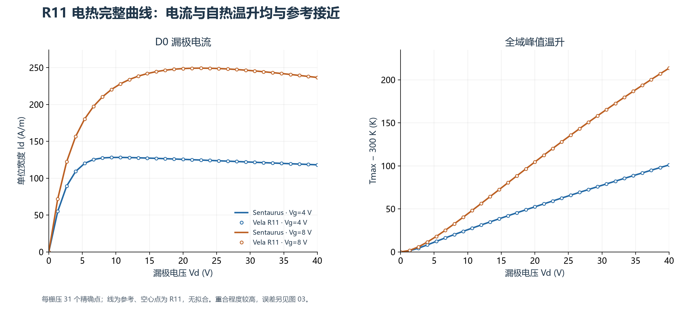

**图 2.** R11 与原生各 31 个精确点；实线为原生、空心点为 Vela。高压下温升反馈使输出电流出现下降趋势。该趋势是完整电热模型结果；不能将不同物理配置的 D4 与 D0 电流差直接当作只改变自热的一因素实验。

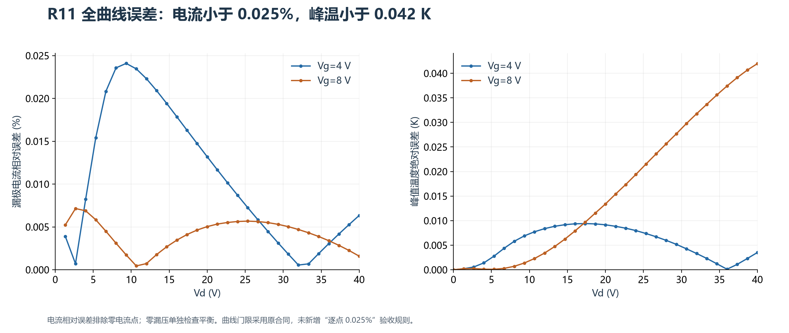

| D0 全偏压最差指标 | Vg=4 V | Vg=8 V | 结论 |
|---|---:|---:|---|
| 非零漏极电流最大相对误差 | 0.024087% | 0.007144% | 原曲线合同通过 |
| 峰值温升最大误差 | 0.009401 K | 0.041982 K | 通过 |
| 温升场体积加权 RMS 最大误差 | 0.006308 K | 0.010847 K | 通过 |
| 非零漏压热平衡相对误差 | ≤$1.17\times10^{-14}$ | ≤$1.00\times10^{-14}$ | 通过；不是相对原生温度误差 |
| 电流比、低压电阻及 KCL | 通过 | 通过 | 原联合合同全部通过 |

40 V 端点的实际物理量如下；它们与“全曲线最大误差”是不同统计：

| 量 | 原生 Vg4 | R11 Vg4 | 原生 Vg8 | R11 Vg8 |
|---|---:|---:|---:|---:|
| Id，A/m | 118.150893 | 118.158382 | 236.627090 | 236.623342 |
| 全域峰温，K | 401.112357 | 401.115871 | 513.568615 | 513.526633 |
| 峰值温升，K | 101.112357 | 101.115871 | 213.568615 | 213.526633 |

### 6.2 温度场：不只比较一个峰值

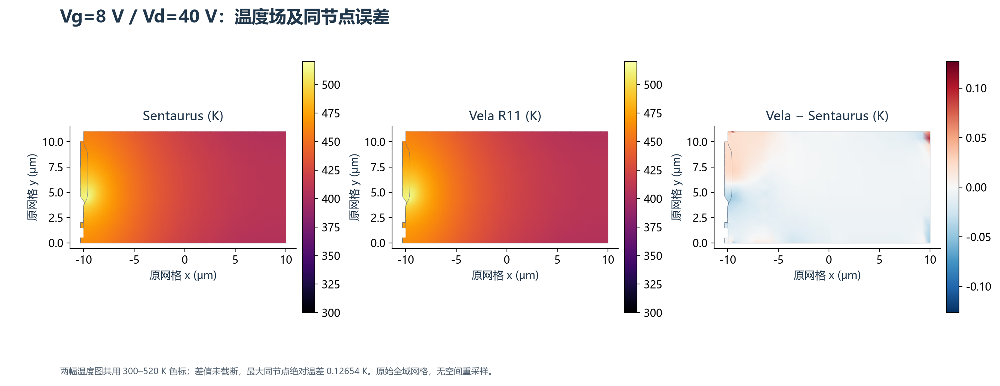

**图 6.** Vg=8 V、Vd=40 V，所有 10,241 节点上的温度场；前两幅统一色标，第三幅展示同节点差值，未截断。最大同节点绝对温差约 **0.12654 K**，大于两幅场的峰值之差 **0.04198 K**，两者定义不同。图中的三角形着色仅作显示，不参与评分或改变节点值。

### 6.3 密度、带边与局部余差

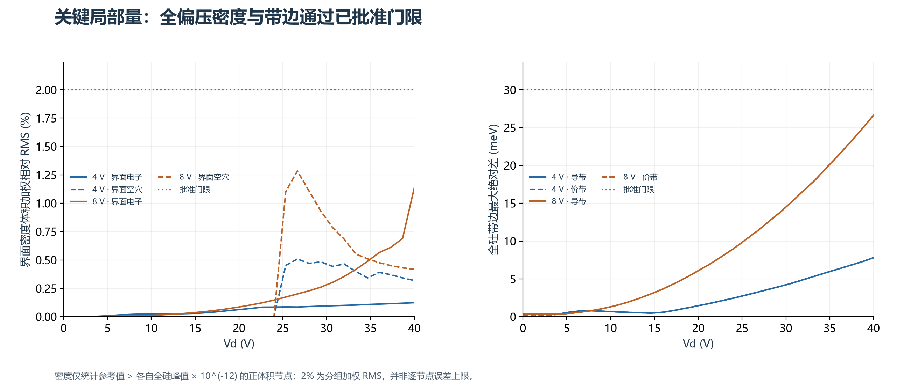

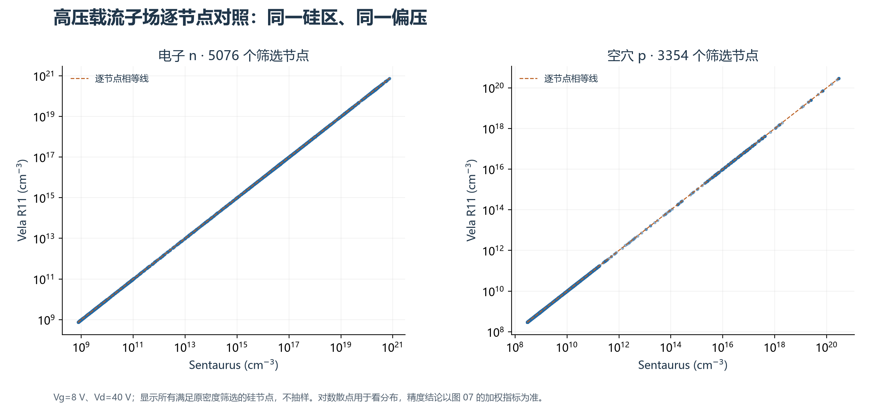

**图 8.** Vg8/Vd40 的逐节点 n/p 对照，完整显示符合既定筛选的硅节点。对数坐标容易掩盖百分比差异，因此定量结论以加权 RMS 为准。

| 全曲线最大局部指标 | Vg4 | Vg8 | 门限 |
|---|---:|---:|---:|
| 全硅电子密度相对 RMS | 0.07685% | 0.21642% | 2% |
| 全硅空穴密度相对 RMS | 0.07856% | 0.40697% | 2% |
| 界面电子密度相对 RMS | 0.12349% | 1.13583% | 2% |
| 界面空穴密度相对 RMS | 0.50851% | 1.28486% | 2% |
| 导带/价带合并最差绝对差 | 7.802973 meV | 26.653141 meV | 30 meV |

这些结果支持“在已批准工程门限内一致”，不支持“每个节点完全一致”。界面输运重构和 Fermi/BGN 经 Poisson 的耦合仍有研究空间。已经观察到电势与准费米势误差相互抵消，故不能从单一最大带边差推算端子电流误差。[S1、S6–S7]

### 6.4 最终源码的等温长曲线回归

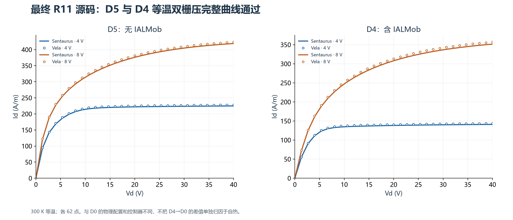

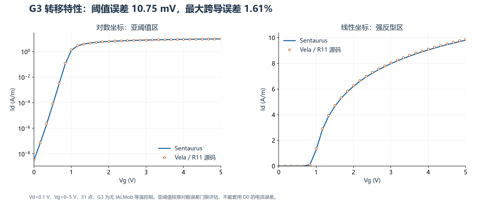

| 等温曲线 | 精确点 | 与各自原生配置比较 | Newton 更新 | Windows 墙钟 |
|---|---:|---|---:|---:|
| G3 Id–Vg | 31 | 阈值差 10.752 mV；最大 gm 误差 1.6101%；强反型端点误差 0.8043% | 131 | 88.27 s |
| D5 Vg4 | 31 | 最大电流误差 1.5924% | 1131 | 865.79 s |
| D5 Vg8 | 31 | 最大电流误差 1.6251% | 1086 | 841.21 s |
| D4 Vg4 | 31 | 最大电流误差 1.8918% | 1127 | 1397.30 s |
| D4 Vg8 | 31 | 最大电流误差 1.8015% | 1073 | 1329.92 s |

全部原门限通过。四条 Id–Vd 从零漏压重新闭合后连续推进至 40 V，无失败回退，参考系切换检查通过。G3 对数误差中位数 0.003957 dex、P95 0.09967 dex，亚阈值偏差仍需按该独立指标解释。

这些时间属于 **R11 源码、Windows Release、SparseLU、旧等温推进协议**；G3 不包含历史预偏置种子生成，D5/D4 包含本轮零漏压闭合和外层评分。没有本轮原生重复配对，不能与下一节 D0 Linux 时间直接相除。[S2]

## 7. 性能优化：哪些收益已经得到验证

### 7.1 两轮同 VM 的完整配对

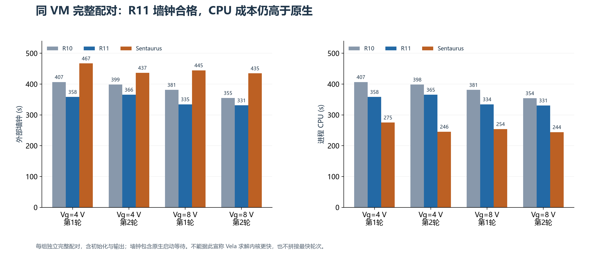

| 栅压/轮次 | R10 墙钟 s | R11 墙钟 s | 原生墙钟 s | R11 相对 R10 减少 | R11/原生墙钟 | R11/原生 CPU |
|---|---:|---:|---:|---:|---:|---:|
| 4 V / 1 | 406.756 | 358.392 | 467.024 | 11.890% | 0.7674 | 1.3016 |
| 4 V / 2 | 398.582 | 365.654 | 436.622 | 8.261% | 0.8375 | 1.4878 |
| 8 V / 1 | 381.250 | 334.520 | 444.756 | 12.257% | 0.7521 | 1.3158 |
| 8 V / 2 | 354.997 | 331.019 | 434.891 | 6.754% | 0.7612 | 1.3550 |

**计时口径：** 同一本机 Sentaurus VM，Linux GCC 11.2.1、Release、UMFPACK；串行执行，两轮反转 Vela 配置顺序。墙钟/CPU 包含初始化、预偏置、失败尝试和同范围物理输出，不含后续审计。两轮每档分别运行 R10、R11、原生，共 **12 条完整曲线**。

原生启动等待包含在端到端墙钟内，所以墙钟更短不等于求解内核更快。两轮还不足以证明在其他宿主负载下具有固定加速比例。第一轮 Vg8 原生与 Vela 之间有按用户要求暂停的间隔；中断原生在恢复后冷启动重跑，中断的 215.191 s 单独保留，不冒充完整曲线。[S1]

### 7.2 Newton 数量与单次成本的变化

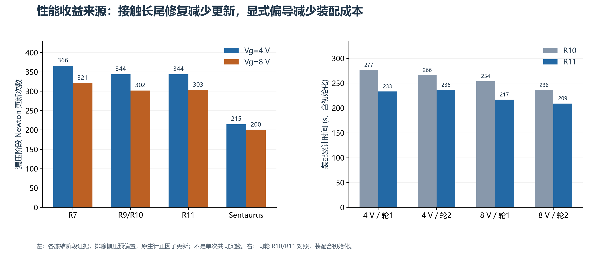

| 版本/阶段 | 主要改变 | 漏压 Newton：Vg4 / Vg8 | 能认领的收益 |
|---|---|---:|---|
| R7 | 已冻结生产基线 | 366 / 321 | 本阶段基准 |
| R9 | 近稳态有限接触代数一致性修复 | 344 / 302 | 相比 R7 更新减少 **6.01% / 5.92%** |
| R10 | 跨点不可变准备及单元高场复用 | 344 / 302 | 对 R9 四组完整墙钟减少 **13.64%–31.64%**；更新未变 |
| R11 | 高场值和偏导显式求值 | 344 / 303 | 对 R10 四组完整墙钟减少 **6.754%–12.257%**；主要减少装配时间 |
| 原生配对日志 | 正因子更新统计 | 215 / 200 | 漏压口径，含零漏压各 1 次；排除栅压预偏置 |

R11 的 Vg8 在 40 V floor 段比 R10 多 1 次更新，两轮均重现，未从总数扣除。最新更新数仍约为原生的 **1.60 / 1.52 倍**。主体非线性成本仍有空间，显式公式优化并未解决所有迭代问题。

前序 R10 与本轮 R11 的加速百分比来自不同配对实验，**不得直接相乘成同一基线的总加速率**。9 月 12 日的 Windows 子进程累计时间也与当前冷启动 Linux 端到端范围不同，不用于绘制“几千秒降至几百秒”的严格加速曲线。

### 7.3 热点与下一步后端对照

9 月 17 日 R9 前 8 点 gprof/内部计时显示，漏压阶段装配约占 **61.35%**、数值分解约占 **23.30%**。这是 R9 短曲线的观测，不作为 R11 全曲线的固定占比。R11 对照中装配四组均减少，分解实现未变，分解耗时波动不算新的算法收益。[S10]

关于 SparseLU→UMFPACK：D0 已使用 UMFPACK；等温主入口目前仍是 SparseLU。历史 14 个真实矩阵实验中，UMFPACK 分解加回代耗时降幅中位数为 **40.13%**，但这是本汇报周期之前的矩阵证据，非本周新增成果，也不是完整曲线加速率。等温入口接入并复用符号分析后，仍需重新验证轨迹、误差及完整配对。[S13]

## 8. 工程质量、可复现性与完成范围

| 验证层级 | 已完成证据 |
|---|---|
| 物理函数及导数 | Fermi/逆函数、温度物性、IALMob 低高场偏导、分支/零场/屏蔽边界；保留 AD 与有限差分对照 |
| 完整算子 | 四方程耦合 Jacobian、温度列、有限接触及热守恒测试；不只验证孤立公式 |
| 曲线与局部场 | R11 D0 62 点重新审计；两轮轨迹非计时输出一致；G3/D5/D4 最终源码另有 155 点 |
| 保存/恢复 | 前 8 点实际暂停、退出、新进程恢复；状态与独立连续曲线前缀一致 |
| 编译/回归 | 最近整理提交前 UCRT64 Release 全目标构建及 **834/834 CTest**；SymPy 生成内容检查通过 |
| 脚本回归 | 前序续接与导出 11/11；本轮等温 linked/G3 相关 16/16 |
| 来源管理 | 输入、源代码、二进制、DLL、网格及结果哈希；失败/拒绝尝试、中断日志保留 |

R11 电热冻结 Linux 程序 SHA256 为 `34779c0197961aa98ec29e71d8a1514902cca4d8b58b66250f37a0e45bf81367`。等温复核的源码提交为 `2a6a433b8f736e6c01d082733ba6f68d1ffb293b`，Windows 程序哈希为 `defea9c1aadb5756bc0ccf637918342e2bddbc1b3a92f92495f80d4eb0c94ab7`。程序不同，资格分别记录。

**本次制作会议报告只读取证据和绘图，没有重新执行求解器，没有修改模型或门限。** 62 点与 155 点分别属于不同物理配置，不能说成同一模型的 217 个唯一偏压点；同一配置的重复轮次也不增加独立偏压覆盖数。

## 9. 剩余问题与建议任务顺序

1. **等温 UMFPACK 接入与配对。** 保持网格、物理、门限、目标序列及线程数，保留符号分析缓存；先真实矩阵与代表点，再前 8 点，最后 G3/D5/D4 完整曲线。比较数值分解、回代、Newton 轨迹及端到端墙钟，不能只比较单个 LU 内核。
2. **主体 Newton 与装配次数。** 当前 R11 漏压更新仍比原生多约 52%–60%。围绕具体固定失败/慢收敛样本验证接受规则、耦合状态表示和重复残差装配，避免重复推广已失败的投影/恢复方案。
3. **低场生成内核的真实分布成本。** 分析缓存命中、分支与温度方向的实际调用，再决定是否优化或晋级；微基准有优势不能替代完整曲线收益。
4. **局部余差及推广范围。** 继续研究界面输运重构和 Fermi/BGN 耦合；如需更严格的 1% 密度门限，应独立闭合原 4 个超限点。其他网格、晶向、温度/偏压范围需新增资格。

原脚本未激活的量子方程和额外热输运模型是独立扩展，当前不属于这份工程验收的欠项。本阶段目标已在既定范围内达成；继续研究的重点是 **CPU 效率、主体迭代成本和跨算例适用性**。

## 附录 A：图表、数据及复现方法

主文件为 `report.md`，配套 `figures/` 含 11 张 PNG 与同名 PDF；`data/` 保留电流、温度、局部误差、载流子散点及计时 CSV、汇总 JSON 和来源 SHA256。PDF 图适合放大或粘贴到会议材料，PNG 可直接用于 Markdown。

| 图 | 主题 | 可放大版本 |
|---|---|---|
| 01 | 网格/材料/掺杂 | [PDF](figures/01_mesh.pdf) |
| 02–03 | D0 电流、温升与误差 | [曲线](figures/02_d0_curves.pdf)、[误差](figures/03_d0_error.pdf) |
| 04–05 | D5/D4 输出及 G3 转移曲线 | [Id–Vd](figures/04_isothermal_idvd.pdf)、[Id–Vg](figures/05_g3.pdf) |
| 06–08 | 温度场、局部误差、载流子场 | [温度场](figures/06_temperature_fields.pdf)、[局部指标](figures/07_local_metrics.pdf)、[载流子](figures/08_carrier_parity.pdf) |
| 09–10 | 性能、Newton 与装配 | [配对计时](figures/09_performance.pdf)、[工作量](figures/10_newton_assembly.pdf) |
| 11 | 算法流程 | [流程图](figures/11_solver_flow.pdf) |

复现入口（工作树根目录；需本机冻结证据，不会启动仿真）：

```powershell
$env:Path = "D:\msys64\ucrt64\bin;D:\msys64\usr\bin;$env:Path"
python -X utf8 scripts/plot_templates_ldmos_group_review.py
```

原始大型状态/TDR 继续保存在忽略的 `reference_staging/`。报告包不嵌入全部原始仿真归档；绘图脚本及 `data/figure_provenance.json` 记录精确来源。Markdown 公式使用 LaTeX，流程图同时提供静态图片，不依赖 Mermaid 才能阅读。

## 附录 B：主要证据索引

下列记录按日期保留当时结论；如历史报告写“尚未完成”，以本报告引用的后续验收范围为准。会议包内 `sources/` 为只读文本快照；完整仓库证据仍以原路径和哈希为准。

| 编号 | 证据 | 主要支撑内容 |
|---|---|---|
| S1 | [R11 完整重复联合验收](sources/templates_ldmos_symbolic_full_2026-09-17.md) | 电热最终结果、配对计时、局部场、恢复及冻结程序 |
| S2 | [R11 等温完整曲线](sources/templates_ldmos_r11_isothermal_2026-09-17.md) | 本轮 G3/D5/D4 155 点、SparseLU 与计时范围 |
| S3 | [生产复现指南](sources/templates_ldmos_production_reproduction.md) | R11 显式配置、R10 回退、R7 兼容默认 |
| S4 | [9/12 四方程电热实现](sources/templates_ldmos_d0_electrothermal_2026-09-12.md) | 初始自热、方程、温度物性和热源 |
| S5 | [有限接触与局部物性](sources/templates_ldmos_hrec_and_local_physics_2026-09-13.md) | hRecVelocity、Auger 生成语义及温度 |
| S6 | [联合验收合同与局部差异](sources/templates_ldmos_joint_acceptance_2026-09-14.md) | 2% 门限批准、旧 1% 余差、原生高精度控制 |
| S7 | [原生 Poisson 几何与准备](sources/templates_ldmos_native_poisson_and_preparation_2026-09-13.md) | 几何定位、完整曲线与局部场改善 |
| S8 | [共享 Auger 及阶段复核](sources/templates_ldmos_generation_alignment_2026-09-13.md) | 共享生成开关及早期算子诊断 |
| S9 | [显式/符号生成偏导](sources/templates_ldmos_symbolic_partials_2026-09-17.md) | 高场导数、低场候选、分支与 AD/FD 验证 |
| S10 | [R9 gprof](sources/templates_ldmos_gprof_r9_2026-09-17.md) | 热点与采样限制 |
| S11 | [9/16–17 工作记录](sources/templates_ldmos_work_summary_2026-09-16_17.md) | R9/R10、局部根优化与负结果 |
| S12 | [生产入口集成](sources/templates_ldmos_production_electrothermal_2026-09-14.md) | 初始化、扫描、恢复与同环境基线演进 |
| S13 | [历史线性系统对照](sources/templates_ldmos_stage4_sparselu_matrix_comparison_2026-09-10.md) | 周期前 UMFPACK 矩阵证据，非本周新成果 |
| S14 | [A–E 执行](sources/templates_ldmos_extrapolation_execution_2026-09-15.md) / [Newton 更新执行](sources/templates_ldmos_newton_update_execution_2026-09-15.md) | 外推、密度映射、阻尼与刷新候选结果 |
| S15 | [近稳态自动切换](sources/templates_ldmos_near_switch_2026-09-15.md) / [接触完整验证](sources/templates_ldmos_contact_sweep_2026-09-16.md) | 伪瞬态轨迹成本与接触候选资格 |

原生配置依据为冻结 `IdVd.cmd`、`Siliconc100.par` 与已核读的 T-2022.03 User Guide；本报告不转载手册全文。公式可与仓库 `SiliconThermalPhysics`、`IalMobilityEvaluation`、`IalHighFieldMobility`、`ThermalSgCurrent` 及电热装配实现逐项核对。
