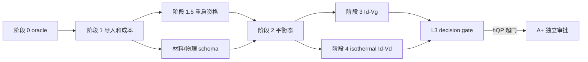

# Templates/LDMOS 方案 A：Oracle、经典 DD 与量子/表面校核

日期：2026-08-26

状态：外部审核修订稿 v2；可独立审批阶段 0/1，不授权 A+ 或方案 B

总方案：
`docs/superpowers/plans/2026-08-26-templates-ldmos-sentaurus-vela-validation-plan.md`

规范条款：所有量化门槛、决策阈值、schema 和合同定义均以总方案为唯一规范来源；
本文件复述的数值只为阅读便利，若有冲突或总方案后续修订，以总方案及其已签署
`threshold_freeze.json`、`budget_freeze.json` 为准。

## 1. 目标与边界

方案 A 只把 Sentaurus T-2022.03-SP2 `Templates/LDMOS` 推进到 L0--L3：

- L0：官方 SProcess、Id-Vg、Id-Vd、BVdss oracle 可复现并封存；
- L1：exact-mesh、单位、接触、点阵、离散 profile 和 KCL 契约可比较；
- L2：平衡态、经典 Id-Vg 与 isothermal Id-Vd 通过；
- L3 decision gate：eQP、IALMob 关闭；hRecVelocity/hQP 完成单因素影响决策。

本方案不实现晶格热方程、Thermode、Okuto、完整 BV continuation 或空穴 DG 新方程，
不得以方案 A 结果宣称 A+ 或 L4--L7 已通过。若 hQP 超过决策门，本方案输出
`hqp_required` 和独立 A+ 范围/预算，L3 等待 A+，不在 A 内自动扩展开发。

## 2. 必须执行的工作包

1. WP0：VM oracle、manifest、PLT/TDR 归一化、`validation_summary`、差异账本、门槛
   冻结、预算冻结的 schema/校验器，Markdown 渲染器和专有证据泄漏检查。
2. WP1：最终 TDR exact-topology 导入、区域侧 occurrence、接触/掺杂/单位/网格审计、
   显式 `discretization_contract`、exact-mesh 成本试跑。
3. WP1.5：17 位有效数字状态 CSV round-trip、Save/Load、`initial_state_file`、
   `frozen_state` solver method、同偏压 reclose、缩放和端口导数资格；只修复本工程
   实证缺陷。
4. WP1.75：材料、solver 物理与离散合同 schema 分层、显式单位、未知键拒绝、范围和
   round-trip 测试。
5. WP2：平衡态、经典低压 DD、G3/G2 与 D5/D4、`G-contact/poly`、PolySi 功函数
   映射和固定状态公式回放。
6. WP3-D：先做 Sentaurus D1-D2 `hRecVelocity` 影响量；仅超出总方案预注册决策门时，
   才在已冻结 A 预算内实现 Robin 边界、residual/Jacobian 和电流分解。
7. WP6-D：量化 hQP/IALMob 单因素影响；hQP 超门只生成 A+ change request，不在 A
   中实现。

## 3. 执行阶段与停止点

第一审批点位于阶段 1：oracle、结构、成本和报告自动化通过后，才允许进入 WP1.5/
WP1.75。第二审批点位于 L3 decision gate：hQP 低于门时可关闭 L3；hQP 超门时必须
先单独批准 A+。只有方案 A（以及触发时的 A+）通过后才允许修订并审批方案 B。

遇到以下任一情况停止：oracle 不可复现；单位/接触/网格映射不唯一；预算不可执行；
重启资格失败且原因未分类；平衡态未关闭；固定状态算子与自洽曲线结论相互矛盾；
任何单个候选同时改变多个物理或数值因素。

## 4. 方案 A 验收产物

- `source_manifest.json`、`run_manifest.json`、`artifact_manifest.json`；
- 顶层 ignored `reference_staging/` 中的原始证据与备份检查；
- exact-mesh 结构、掺杂、接触、网格和离散 profile 报告；
- best/base/worst 运行成本预算及已签署 `budget_freeze.json`；
- 重启/reclose 资格报告和 CI fixture；
- 版本化 materials/physics schema 与单位测试；
- 平衡态、Id-Vg、isothermal Id-Vd 的共同精确点阵结果；
- eQP、hQP、IALMob、hRecVelocity 单因素 ledger；hQP 超门时的 A+ change request；
- `known_difference_ledger.json`，只允许本工程已复核项进入 accepted 状态；
- 机器可读 `validation_summary.json` 及从其生成的 Markdown 报告；
- 全部治理/材料/物理/离散合同的版本化 schema、golden/invalid fixture 和校验结果。

曲线幅值只在共同精确偏压点评分；陡峭段不得跨点线性插值。固定电流 Vth 等标量
交点按总方案预注册局部插值规则处理。

## 5. 方案 B 入口条件

只有同时满足以下条件，才可提交方案 B 的门槛冻结审核：

1. L0--L3 逐级报告给出通过/有限通过/失败/未分辨状态；
2. exact-mesh 重启和同偏压 reclose 资格通过；
3. 材料/物理/离散合同不依赖隐含默认；
4. 运行预算足以支撑热与 Okuto 并行工作包及完整 BV；
5. 已知差异账本区分本工程证据和 PN2D/Slot-LDMOS 外部先验；
6. hQP 是否需要 A+ 已有总方案三重判据证据；hRecVelocity 是否实现已有 D1-D2
   预注册决策证据；
7. 方案 B 的暂定门槛已根据方案 A 实测生成待签署 `threshold_freeze.json`。
