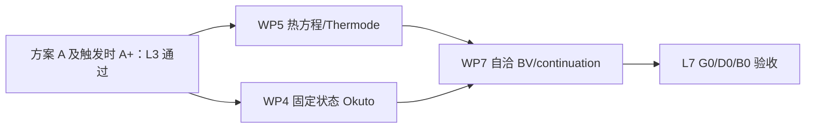

# Templates/LDMOS 方案 B：自热、Okuto 与完整 BV 校核

日期：2026-08-26

状态：条件性外部审核修订稿 v2；方案 A（及触发时 A+）通过前不得实施

总方案：
`docs/superpowers/plans/2026-08-26-templates-ldmos-sentaurus-vela-validation-plan.md`

前置方案：
`docs/superpowers/plans/2026-08-26-templates-ldmos-phase-a-oracle-classical-validation-plan.md`

规范条款：所有量化门槛、决策阈值、schema 和合同定义均以总方案为唯一规范来源；
本文件复述值只为阅读便利，冲突时以总方案及已签署的 `threshold_freeze.json`、
`budget_freeze.json` 为准。

## 1. 目标与入口门

方案 B 覆盖 L4--L7：晶格热/Thermode、固定状态 Okuto、自洽 BV/continuation 以及
官方 G0/D0/B0 最终验收。它只有在方案 A 的 L0--L3、成本预算、重启资格、显式合同
和本工程差异账本通过后才能启动；若方案 A 判定 `hqp_required`，还必须先完成独立
A+ 审批和 L3 关闭。

总方案中热、Okuto 和 BV 的数值目前是设计目标。执行前必须由方案 A 实测生成并签署
`threshold_freeze.json`，其中记录每项门槛、统计支持、硬门/诊断门属性、来源和批准
记录。PN2D 的约 7 mV 或 0.70x 先验不能直接成为本工程豁免。

## 2. 并行工作和汇合关系

WP5 与 WP4 可并行。WP4 可用固定 300 K 和 Sentaurus 状态温度验证 Okuto 温度公式，
不依赖完整热求解；WP7 必须同时等待 WP4、WP5 和门槛冻结。

## 3. WP4：固定状态 Okuto

- 用 T-2022.03 参数查询、参数输出和最小探针冻结电子/空穴系数、温度公式、驱动力、
  RefDens、插值、接触和导数语义；
- B2 默认采用两个 deck：feedback-off 曲线 deck 生成状态，fixed-state deck 读取同一
  状态并输出 Okuto 字段；单 deck 仅在严格证明等价后优化；
- Vela 复用已有 `frozen_state` solver method，并扩展 carrier-term 和 edge-flux
  生产探针；
- 按驱动力、alpha、电流密度、产生率、积分源、qG 闭合和 Jacobian/JVP 逐层验收；
- 固定状态未通过，禁止打开 self-consistent avalanche。

所有运行消费方案 A 冻结的离散 profile。不得把 PN2D
`element_edge_sg_gss_laux` 的单个组件抽出后当作本工程默认。

## 4. WP5：晶格热与 Thermode

- 先完成解析 slab、Dirichlet/Robin 热边界、isothermal recovery 和固定电学热源；
- 再实现电热外层/分块耦合，最后按证据决定是否需要单体 Newton；
- 显式冻结热导率、热源组成、二维 SurfaceResistance 单位、热流方向及温度对电学
  参数的反馈；
- D0-D1 同时比较温度场、热流、能量平衡和电流增量，禁止只拟合峰值温度。

## 5. WP7：自洽 BV 与 continuation

1. B3 avalanche-off 固定电压分支和同偏压 reclose；
2. B2 双 deck IIC/固定状态 qG 闭合；
3. B1 isothermal 自洽 Okuto 固定电压分支；
4. 若出现 fold，再验证 tangent、参数导数、bordered residual、端口电流导数和
   predictor/corrector；
5. B1 通过后加入温度/Thermode，运行 B0 到 `1e-8 A/um` 或 100 V 上限。

B1 明确是固定 `300 K` 的自洽 Okuto 资格分支，B0 才加入空间温度。B1->B0 是计划的
分层耦合，不应误称为逐点严格单因素：晶格温度会同时改变 Okuto 温度因子、电学状态
和热源。通过在同一 B1/B0 状态上分别冻结温度字段回放 alpha/G，并把温度因子直接
增量与电热状态间接增量分栏写入差异账本，避免把两者混成一个拟合项。

BVdss 电压、KCL/连续性/热能量和正常终止始终是硬门。击穿前 Id log 误差在门槛
冻结前为诊断项，设计目标为中位 `<= 0.20 dex`；是否升格为硬门只依据本工程差异
账本。曲线幅值只在共同精确偏压点评分，陡峭段不跨点线性插值；BV 只在有效包围点
间对 `log10(|I|)` 做预注册局部插值。

## 6. 测试与验收产物

- PR CI：Okuto/热公式与单位、schema、局部 residual/Jacobian/JVP、小网格守恒、
  固定状态算子和小型归一化 CSV；
- Nightly：中等网格电热/雪崩、有限 continuation、跨模型回归、报告再生；
- 人工里程碑：exact-mesh 自热 Id-Vd、完整 BV、VM oracle 复核和 G0/D0/B0。

最终交付包括热与 Okuto 分层 ledger、BV 包围点和 continuation 轨迹、差异账本、运行
成本、所有 manifest/hash、`validation_summary.json` 和由它生成的 Markdown 报告。
任何未分类数值失败都不能被报告为 BV；任何守恒门失败都不能由差异账本豁免。
