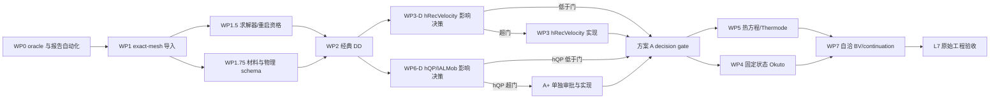

# Sentaurus Templates/LDMOS 与 Vela 对比校核实施方案

日期：2026-08-26

状态：外部分析审核修订稿 v3；方案 A 阶段 0/1 待批准，其余不授权直接实施

Sentaurus 版本：T-2022.03-SP2

Sentaurus 原始路径：
`/atctools/Synopsys/tcad/T-2022.03/tcad/T-2022.03-SP2/Applications_Library/Templates/LDMOS`

Vela 基线：制定本方案时本地 `main` 为 `bbfab43`；正式执行时必须重新记录实际提交

## 1. 执行摘要

本方案拟把 Sentaurus T-2022.03-SP2 官方 `Templates/LDMOS` 工程建设为
Vela 的一套分层 LDMOS 校核基准。该工程同时包含完整 SProcess 工艺结构、低漏压
Id-Vg、两个栅压下的自热 Id-Vd，以及采用 Okuto 雪崩和 continuation 的 BVdss，
适合覆盖 Vela 从结构导入、平衡态、漂移扩散、表面迁移率、量子修正、自热直到
击穿边界控制的完整能力链。

方案的核心决策如下：

1. **不开发 SProcess 替代品。** Sentaurus SProcess 是结构和掺杂的权威生成器；
   Vela 只对最终 TDR 上的 SDevice 器件物理与数值求解做校核。
2. **不从原始完整 BV 开始。** 先建立 exact-mesh 平衡态、低压 IV、固定状态算子、
   avalanche-off 和 isothermal 基线，再依次量化/加入电子量子势、IALMob、Ohmic
   接触复合速度；空穴量子势只做决策，超门后经 A+ 批准再实现；之后进入自热和
   Okuto 雪崩。
3. **每个结论必须来自单因素 A/B。** 不允许靠同时修改多个物理模型后拟合最终
   BV、电流或导通电阻来认领等价性。
4. **PLT 端口曲线与 TDR 空间场量分工明确。** Sentaurus `.plt` 的
   `TotalCurrent` 是端口曲线真值；TDR 接触通量只用于同状态局部诊断，不能在二者
   不一致时替代 PLT。
5. **验收分两级。** 第一层证明数据、网格、单位、偏压和数值闭合可比较；第二层
   才评价模型幅值和完整器件指标是否等价。
6. **原始官方工程永远保留。** 所有消融 deck 都是派生控制；不得修改、覆盖或把
   控制结果冒充官方原始结果。
7. **按 A、条件性 A+、B 审批包执行。** 方案 A 到 L3 decision gate（oracle、导入、
   经典 DD、量子/表面影响决策）；只有 hQP 超门才另批 A+；方案 B 覆盖 L4--L7
   （热、Okuto、自洽 BV），其数值门槛必须在方案 A 形成实测差异和成本预算后冻结。
8. **差异账本先于容差豁免。** 已知 PN2D 结果可用于提醒风险，但不得自动成为
   Templates/LDMOS 的容差地板；只有本工程同状态、同离散合同、可复现实验确认的
   差异，才能进入本基准的 `known_difference_ledger.json`。

建议总体依赖为：

```text
官方工程复现和封存
  -> 最终 TDR 导入及结构契约
  -> 平衡态与 Poisson/Fermi/OldSlotboom
  -> Id-Vg 分层量子/IALMob 对比
  -> Id-Vd isothermal 对比
  -> [自热方程与 Thermode || BV avalanche-off 与固定状态 Okuto 算子]
  -> 自洽 Okuto + continuation + 自热
  -> 原始完整 Id-Vg/Id-Vd/BVdss 最终验收
```

### 1.1 本轮审核意见处置记录

| # | 处置 | 修订决定 |
| ---: | --- | --- |
| 1 | 部分采纳 | 新增工程专属已知差异账本；PN2D 的约 7 mV/0.70x 记录只作风险证据，不直接授权 LDMOS 容差；BV 曲线电流改为暂定诊断门，BVdss 仍为硬门 |
| 2 | 采纳并校正事实 | 新增 WP1.5 求解器/重启资格门；不把已有 `initial_state_file` 能力笼统判为不可用 |
| 3 | 采纳 | 新增 WP1.75 版本化材料与物理 schema；材料字段和 solver 模型字段分开，全部显式单位 |
| 4 | 采纳 | 正式分为方案 A（L0--L3）和方案 B（L4--L7），B 的量化门槛标为待 A 实测冻结 |
| 5 | 采纳 | 增加依赖图；热方程与固定状态 Okuto 在方案 B 内可并行 |
| 6 | 采纳 | 不可再生原始工件改存顶层 ignored `reference_staging/`；`build-release/` 只存可再生构建/运行缓存 |
| 7 | 采纳并收紧 | 曲线幅值门只在共同精确偏压点评分；陡峭段禁止跨点线性插值，阈值电压/BV 的局部插值单独管理 |
| 8 | 采纳 | B2 默认采用 feedback-off 曲线 deck 与固定状态读取 deck；单 deck 仅在语义验证后优化 |
| 9 | 采纳 | 离散 profile 进入 physics contract 和公共不变量；不得套用 PN2D 模板专属原子 bundle |
| 10 | 采纳 | hQP 决策增加 Vth 与强反型电流绝对判据 |
| 11 | 采纳 | 报告 JSON 生成器、Markdown 渲染器和 schema 测试前移到 WP0 |
| 12 | 采纳 | 现在冻结 CI 与夜间/人工验收边界 |
| 13 | 采纳 | 阶段 1 增加 exact-mesh 成本试跑和消融预算上限 |

这张表记录的是方案修订决定，不是功能已实现声明。

### 1.2 第二轮审核意见处置记录

| # | 处置 | v3 修订决定 |
| ---: | --- | --- |
| 1 | 采纳 | 方案 A 只负责 hQP 影响决策；若必须实现，进入独立 A+ 扩展审批，不默认占用 A 预算 |
| 2 | 采纳 | 两份子方案增加“总方案为唯一量化规范来源”条款，复述值仅为阅读便利 |
| 3 | 采纳 | WP0 认领差异、门槛、预算和汇总 schema；WP1.75 认领材料、物理和离散合同 schema |
| 4 | 采纳并按代码校正 | 当前 writer 已使用 17 位有效数字；将其冻结为合同并增加 round-trip/reclose 资格门 |
| 5 | 采纳 | hRecVelocity 先做 D1-D2 影响量化，超过预注册决策门才实现 WP3 |
| 6 | 采纳 | 方案 A 的 WP2 显式加入 `G-contact/poly` 与 PolySi 功函数控制 |
| 7 | 采纳 | 方案 B 明确 B1 等温分支先行，以及温度因子与电热联动差异的记账方式 |
| 8 | 采纳 | 将 `frozen_state` 准确表述为 solver method，与 carrier-term/edge-flux probes 区分 |

本轮事实核验还确认：`initial_state_file`/`frozen_state` 已有实现和测试，状态 CSV
生产 writer 使用 17 位有效数字；这些事实只说明基础设施存在，不替代本 exact mesh
上的资格验证。

## 2. 背景与选择理由

### 2.1 Vela 当前 LDMOS 状态

Vela 已具备二维 Poisson、双极漂移扩散、Scharfetter-Gummel 输运、Gummel 和
耦合 Newton、Fermi-Dirac、OldSlotboom、Masetti/Caughey-Thomas、高场迁移率、
Enhanced Lombardi、SRH、Auger、电子密度梯度量子势、两类雪崩模型、外接电阻、
Voltage-to-Current、实验性伪弧长 continuation、TDR 导入和大量固定状态诊断。

但仓库自带的 `examples/ldmos2d` 仍是工程趋势 fixture，只验证有限输出、单调性、
最大场和场板相对趋势，不是标定 LDMOS。现有 Slot-LDMOS 工作已经证明：

- T-2022.03-SP2 的过程 TDR、二维电流/电阻单位、外接电阻、IIC 和自洽雪崩参考链
  可以建立；
- exact-topology 大型功率网格能够导入 Vela；
- Enhanced Lombardi/IALMob、局部 AD 雪崩 Jacobian、负载线和连续性诊断已有
  实际基础；
- 但高压自洽分支和完整 BVDS 尚不能视为已关闭，旧高压检查点还曾因源支持修正而
  失效。

因此，`Templates/LDMOS` 的价值不是再增加一个简单烟雾测试，而是建立一套官方、
可分层、同时含 Id-Vg/Id-Vd/BV 的完整 LDMOS 标杆。

### 2.2 为什么不直接只用现有 Slot-LDMOS

两者定位不同：

| 项目 | 主要用途 |
| --- | --- |
| Slot-LDMOS | 已有大型功率网格、外接电阻、雪崩 Jacobian、BVDS 和复杂 continuation 压力测试 |
| Templates/LDMOS | 官方无参数化模板，包含工艺、低压栅控、自热输出特性和 Okuto BV 的完整功能覆盖 |

本方案不替代 Slot-LDMOS，而是与其形成交叉验证：

- Slot-LDMOS 继续承担复杂网格、负载线和高压数值鲁棒性压力测试；
- Templates/LDMOS 用于检查经典 LDMOS 电学、自热、空穴量子势、Okuto 和官方
  continuation 语义。

### 2.3 预期使用者

- Vela 物理模型开发者；
- 非线性求解和 continuation 开发者；
- Sentaurus 参考数据生成者；
- 对本方案做独立审查的其他大模型或人工评审者。

## 3. 官方工程基本情况

### 3.1 工程拓扑

Workbench 流程为：

```text
sprocess
  -> IdVg (sdevice)
  -> PlotIdVg (svisual)
  -> IdVd (sdevice)
  -> PlotIdVd (svisual)
  -> BVdss (sdevice)
  -> PlotBV (svisual)
```

工程没有 SWB 参数化分支。原始文件哈希如下，正式执行前必须重新核对：

| 文件 | SHA-256 |
| --- | --- |
| `sprocess_fps.cmd` | `9611aef1a6973be6d7ec2c56d01037b426850328491ca4a741737f347992a609` |
| `IdVg_des.cmd` | `9c4c6c31903e28501e9456126044a185b0a0229561b72138960aa669a01892a6` |
| `IdVd_des.cmd` | `f0badbd36ae1e7fd947a3afb5740221226776d01c79841f5caa91db576570d9b` |
| `BVdss_des.cmd` | `49948ef11e66b64439ab9d5411ef312711edd0586f8c239013ca53fd275bd5f3` |
| `sdevice.par` | `23f82a6d33be5048fcb17f210e09bef7d074c97f2f434f6333b979a58323bc5f` |

`sdevice.par` 引用 `Siliconc100.par`。正式基准必须同时记录实际解析到的材料参数文件、
哈希、Sentaurus 参数查询结果和所有默认模型选择，不能只封存五个表层文件。

### 3.2 SProcess 结构

原始过程大致包括：

- 约 11 um 横向仿真域和约 10 um 外延/衬底深度；
- 初始磷掺杂衬底、砷亚层注入；
- 高掺杂和低掺杂硼外延层；
- 多能量 N well 磷注入和 P well 硼注入；
- well drive-in；
- LOCOS 场氧化；
- 栅氧和磷掺杂多晶硅栅；
- As/P 源漏注入、B 体接触注入及退火；
- 后端氧化层、接触开孔；
- 面向 SDevice 的重新网格；
- `gate`、`drain`、`source`、`substrate` 和热接触 `th_lat`。

最终 Vela 基准使用 SProcess 输出的最终 `!gas` TDR，不用手工矩形网格或解析掺杂
近似替代。SProcess 本身的扩散、氧化、注入和应力预测不属于本方案验收范围。

### 3.3 Id-Vg 原始契约

偏压和求解顺序：

1. 阻尼 Poisson 初值；
2. 耦合 `Poisson Electron Hole`；
3. 漏极升至 `0.1 V`；
4. 栅极从零扫至 `5.0 V`；
5. `CurrentPlot` 在归一化时间 `[0,1]` 上给出 30 个区间。

主动模型：

- `Fermi`；
- Silicon 中 `eQuantumPotential(density)`；
- Silicon 中 `hQuantumPotential(density)`；
- `Mobility(HighFieldSaturation Enormal(IALMob(AutoOrientation)))`；
- `EffectiveIntrinsicDensity(OldSlotboom)`；
- `SRH(DopingDependence TempDependence)`；
- `Auger`。

需要导出的主要量：端口电流、`psi/phin/phip`、n/p、电子/空穴量子势、电子/空穴
迁移率、电场、准费米势梯度、SRH、Auger 相关总源以及接触 KCL。

### 3.4 Id-Vd 原始契约

偏压和求解顺序：

1. 阻尼 Poisson 和双极 DD 初值；
2. 先仅用 Poisson 把栅极分别升至 `4 V`、`8 V` 并 Save；
3. 分别 Load 两个栅压状态；
4. 耦合 `Poisson Electron Hole Temperature`；
5. 漏极从零扫至 `40 V`；
6. 每条曲线输出 30 个区间。

主动模型与 Id-Vg 基本相同，但还包含：

- 晶格 `Temperature` 方程；
- `th_lat` 热接触，300 K、`SurfaceResistance=0.005`；
- 源漏 `hRecVelocity=1.93e6`；
- `RefDens_*GradQuasiFermi_EparallelToInterface=1e12` 数值控制。

原始 Id-Vd 的完整等价必须同时覆盖电学、自热、热边界和接触少子复合速度；只在
300 K 常温下运行 Vela 不能认领原始 Id-Vd 等价。

### 3.5 BVdss 原始契约

偏压和终止条件：

- gate/source/substrate 为 `0 V`；
- drain 使用 `Continuation`；
- `InitialVstep=0.01`；
- `MaxVoltage=100 V`；
- `MaxCurrent=1e-8 A/um`；
- `Iadapt=6.5e-13 A/um`；
- 耦合 `Poisson Electron Hole Temperature`。

主动模型：

- `Mobility(DopingDependence HighFieldSaturation Enormal)`；
- OldSlotboom；
- 掺杂/温度相关 SRH；
- Auger；
- `Avalanche(Okuto)`；
- 晶格温度和两个热接触：substrate 与 `th_lat`。

原 deck 没有显式写出 Okuto 的全部参数、雪崩驱动力和离散默认。正式实施前必须用
T-2022.03-SP2 的参数查询、预处理 deck 和日志确认实际生效语义，禁止凭模型名称
推断与其他 Sentaurus 版本相同。

## 4. 目标、非目标和成功定义

### 4.1 总目标

建立一套可重复、可审计、能定位差异来源的 Sentaurus/Vela LDMOS 校核链，回答：

1. Vela 是否在同一过程结构、同一掺杂和接触上保持正确平衡态？
2. 经典低压双极 DD、Fermi、OldSlotboom、SRH/Auger 是否闭合？
3. HighField、IALMob 和电子量子势的单因素增量是否闭合？
4. 空穴量子势是否值得实现，其对 LDMOS 指标的影响是多少？
5. Vela 是否能够复现自热导致的温升、导通电流变化和热能量平衡？
6. Okuto 系数、驱动力、产生率、源映射和 Jacobian 是否在固定状态上闭合？
7. Vela 是否能够稳定跨越高压非线性区域，并在相同电流判据下复现 BVdss？

### 4.2 非目标

- 不复现 Sentaurus Process 的工艺物理；
- 不开发 3D、瞬态、AC、MixedMode 或一般电路仿真；
- 不以经验缩放迁移率、雪崩系数、热导率、电流或有效宽度换取最终曲线吻合；
- 不把当前 `examples/ldmos2d` 的趋势 fixture 升格为标定器件；
- 不用不同网格上的最终 BV 单一数字代替同状态、同支持的算子比较；
- 不在没有电流分辨率和 KCL 证明时评价极低漏电区相对误差；
- 不在本方案批准前直接修改生产默认值或 PN2D 模板策略。

### 4.3 成功分级

| 等级 | 定义 |
| --- | --- |
| L0 可复现 | 官方工程在 VM 上完整运行，来源、版本、参数、原始输出和哈希齐全 |
| L1 可比较 | exact-mesh 导入、单位、接触、偏压、点阵和 KCL 契约通过 |
| L2 经典 DD 通过 | 平衡态、经典 Id-Vg 和 isothermal Id-Vd 在量化门槛内 |
| L3 量子/表面通过 | eQP、IALMob、hRecVelocity 已关闭；hQP 经 A/B 证明可忽略，或经单独批准的 A+ 实现后关闭 |
| L4 自热通过 | 温度场、热流、能量平衡和自热电流增量通过 |
| L5 Okuto 算子通过 | 固定 Sentaurus 状态上的 alpha、G、积分源和 Jacobian 通过 |
| L6 完整 BV 通过 | 自洽 Okuto、continuation 和 1e-8 A/um BVdss 通过 |
| L7 官方原始工程通过 | 不删减原始物理的三条官方曲线均达到最终门槛 |

任何报告必须明确当前达到的最高等级，不能用“LDMOS 已支持”笼统替代。

### 4.4 方案 A / 方案 B 审批边界

| 方案 | 覆盖等级 | 覆盖阶段 | 允许的开发 | 审批条件 |
| --- | --- | --- | --- | --- |
| A：oracle、经典与量子/表面决策 | L0--L3 decision gate | 阶段 0--4 | 导入、合同/schema、求解器/重启资格、经典 DD、IALMob；hRecVelocity/hQP 只先做影响决策，hRecVelocity 可在预注册预算内实现 | 本修订稿可单独批准阶段 0/1，后续按审批点推进 |
| A+：条件性 hQP 扩展 | 完成 L3 | 仅在 hQP 决策超门时新增 | 空穴 DG 方程、边界、外层/单体耦合、状态格式、Jacobian 与回归 | 不预授权；以 A 的 G0-G1/D2-D3 证据另立范围和预算 |
| B：热与击穿 | L4--L7 | 阶段 5--8 | 热方程/Thermode、Okuto、完整 BV/continuation | A 已交付差异/成本/重启资格；若 hQP 超门则 A+ 已通过；B 门槛完成二次冻结 |

方案 A、条件性 A+ 与方案 B 是独立审批包。方案 A 通过不代表批准 A+ 或方案 B；
若 hQP 决策超过门槛，L3 必须等待 A+ 关闭。`threshold_freeze.json` 先在方案 A
阶段 2 前冻结 hQP/hRecVelocity 决策门；其中方案 B 的热、Okuto 和 BV 数字仍是设计
目标，必须在 A 结束时根据 Templates/LDMOS 自身证据二次签署后生效。

独立审批页：

- 方案 A：`docs/superpowers/plans/2026-08-26-templates-ldmos-phase-a-oracle-classical-validation-plan.md`
- 方案 B：`docs/superpowers/plans/2026-08-26-templates-ldmos-phase-b-thermal-breakdown-validation-plan.md`

### 4.5 已知差异账本

建立 `known_difference_ledger.json`，每条记录至少包含：

- 基准/器件、Sentaurus 与 Vela 版本、提交和输入哈希；
- 偏压、温度、物理合同、离散 profile、网格与状态来源；
- 观测差异、统计支持、重复性和网格/步长敏感性；
- 已排除与尚未排除的原因；
- 影响的门槛、有效范围、到期复核条件和批准人/审核记录。

PN2D 已记录的耗尽区约 `7 mV` 少数载流子准费米差异和部分高场点约 `0.70x`
电流，仅登记为 `external_prior`。同一 PN2D 记录还显示误差会在接近击穿时放大、
曲线膝点仍未关闭，因此不得把 `0.155 dex` 写成 Templates/LDMOS 的固有地板。
只有本工程的单因素、同状态和网格/步长复核完成后，差异才能升格为
`accepted_baseline_difference` 并用于调整门槛；任何账本项都不能豁免 KCL、连续性、
热能量、Jacobian 或 BV 判据正常触发等守恒/数值硬门。

## 5. Vela 能力映射和待开发项

| 官方能力 | Vela 当前状态 | 本方案处理 |
| --- | --- | --- |
| 2D Poisson、双极 DD、SG | 已有 | 直接校核 |
| Fermi-Dirac | Newton 已有 | 直接校核，Gummel 不作为最终 Fermi 路径 |
| OldSlotboom | 已有 | 参数和 Fermi 修正需按 T-2022.03 冻结 |
| SRH(Doping/Temp)、Auger | 已有 | 先固定 300 K，再进入空间温度 |
| HighFieldSaturation | 已有 | 驱动力、插值、RefDens 语义需确认 |
| IALMob(AutoOrientation) | Enhanced Lombardi 有限映射 | 做严格 on/off；不能先认领完整方向语义 |
| 电子量子势 | 已有外层/冻结耦合 | 与 Sentaurus 单体耦合做状态和增量比较 |
| 空穴量子势 | 缺失 | A 只做 Sentaurus A/B 决策；超门后另批 A+ 再实现 |
| Ohmic `hRecVelocity` | 当前只在 Schottky 热发射路径消费类似速度 | 先做 D1-D2；超门后在 A 冻结预算内增加普通 Ohmic 少子 Robin 边界 |
| 晶格热方程 | 缺失 | 新增热传导、热源、热边界和耦合 Jacobian |
| Thermode/SurfaceResistance | 缺失 | 新增二维热边界单位和热接触装配 |
| Okuto avalanche | 缺失 | 新增 T-2022.03 参数、温度因子和解析/AD Jacobian |
| Continuation | 核心已实现但功率器件鲁棒性仍有限 | 先复用固定电压分支，再做折叠曲线验收 |
| TDR 导入 | 已有 | 复核材料、接触、坐标单位、重复接口节点和掺杂策略 |
| 自定义材料 | `MaterialDatabase` 只读取有限标量和电子 DG 参数 | 扩展材料 schema；模型参数仍归 solver 侧 physics schema，二者均显式单位 |
| 状态重启 | `initial_state_file`、写状态和 frozen-state 已实现且有测试 | 在本 exact mesh 上资格验证，失败则先修复，不预判仓库级不可用 |
| Newton 缩放/诊断 | 连续性行缩放、条件估计和多类探针已有 | 用本器件实测决定是否需要行列均衡或 continuation 修复 |

建议按依赖而不是单一线性优先级实施：



WP1.5 只关闭本工程实际暴露的 warm-start、重启、缩放、残差和端口导数问题，不要求
在方案 A 前无条件重写 continuation。方案 A 本体只承担 hQP 决策，不承担未知规模的
空穴 DG 实现；超门后必须另批 A+。hRecVelocity 虽在官方 deck 中显式设置，仍先以
D1-D2 量化幅值，超出预注册决策门才实施 WP3。方案 B 内 WP4 与 WP5 互不依赖，
可并行；完整 BV 同时依赖二者。

## 6. 数据和可复现性契约

### 6.1 每次 Sentaurus 运行必须记录

- VM 主机标识和操作系统；
- `sdevice -h`、`sprocess -h` 的完整版本头；
- Applications Library 绝对路径；
- 原始文件、参数文件和物化 deck SHA-256；
- SWB 节点、执行命令、环境变量和许可证错误检查；
- 生效 Physics、Math、Solve 和 Electrode/Thermode 块；
- 网格节点、区域节点 occurrence、单元、边、接触、材料和区域计数；
- 坐标范围、单位、二维宽度约定；
- 每个 bias 点的收敛状态、迭代数、步长、cutback 和终止原因；
- PLT/TDR/log 文件哈希；
- 原始电流符号、规范化后的 A/um 电流和转换公式。

### 6.2 每次 Vela 运行必须记录

- Git 提交和工作区状态；
- 构建类型、编译器、CMake 选项和线程数；
- config、mesh、doping、materials、初始状态和可执行文件哈希；
- 求解方法、归一化、状态尺度、Jacobian、线搜索、continuation 和边界控制配置；
- 每个接受/拒绝点的残差、更新、KCL、连续性闭合和失败原因；
- 所有候选曲线和状态文件哈希；
- 与 Sentaurus 相同的偏压点阵和电流方向。

### 6.3 文件分层

不可再生证据的持久暂存根：

```text
reference_staging/templates_ldmos_sentaurus2022/run01/
  manifest/
  sentaurus_original/
  sentaurus_ablations/
  imported_structure/
  vela_configs/
  vela_runs/
  fixed_state_replays/
  comparisons/
  reports/
```

`reference_staging/` 必须在 WP0 首个提交中加入 `.gitignore`，并由 manifest 检查确认
没有专有大文件进入 Git。`build-release/reference_tcad/...` 只允许保存可由 manifest、
规范化 reference 和脚本重建的构建/运行缓存；任何 VM 原始产物在清理 build 树前必须
完成持久暂存、哈希和备份检查。

原始 TDR、PLT、日志、tar 包和专有 Applications Library 文件只保存在忽略目录，
不得直接提交。只有经明确评审批准的中性清单、派生配置、小型归一化 CSV、分析脚本、
测试和结论报告才进入 `reference_tcad/` 或 `docs/validation/`。

### 6.4 真值优先级

| 量 | 首选真值 | 备注 |
| --- | --- | --- |
| 端口 I-V | Sentaurus PLT `TotalCurrent` | TDR ContactCurrentFlux 仅局部诊断 |
| 电势、准费米势、密度、温度 | 同偏压 TDR 节点场 | 必须处理区域侧重复节点 |
| 单元电场 | 原生 Sentaurus 单元向量 | 与 Vela P1/box 场做同支持比较 |
| 迁移率和产生率 | Sentaurus 原生字段 | 明确节点/单元和插值位置 |
| 积分复合/产生电流 | Sentaurus Integr* 输出 | 若只能从节点重构，必须标为 reconstructed |
| BV | PLT 曲线的预注册局部阈值插值 | 不用最后一个收敛点直接代替，不用于曲线幅值评分 |

### 6.5 偏压点阵和插值规则

- 曲线幅值、相对/log 误差、增量和排名只在两端共同的精确偏压点上计算；优先让
  Vela 使用 Sentaurus `CurrentPlot` 原始点阵，不用后处理插值补点。
- 若两个原始点阵不同，应在两端重跑共同细点阵；共同点间距不得大于两侧原始点阵中
  的较细间距，且在 `|d log10(I)/dV|` 快速变化、膝点或折返区必须自适应加密。
- 陡峭指数段禁止用跨点线性插值计算曲线幅值门槛或 A/B 排名。无法重跑时该区标记
  `unresolved_sampling`，不得计为通过或失败。
- 插值只允许用于预注册标量交点，例如固定电流 Vth 或 BVdss；必须报告包围点、区间
  宽度、插值坐标（线性 I 或 log I）和局部加密复核。BV 包围区间目标不大于 `0.5 V`，
  若局部斜率/曲率敏感则继续细化。

### 6.6 自动化、CI 与长任务边界

WP0 即交付统一的 `validation_summary.json` schema、结果生成器和 Markdown 渲染器，
后续所有阶段只向同一 schema 增加版本化字段。测试层级现在冻结为：

| 层级 | 硬门内容 | 执行位置 |
| --- | --- | --- |
| PR CI | 公式/单位、schema、解析、局部 residual/Jacobian/JVP、Save/Load、小网格守恒、固定状态算子、小型归一化 CSV 趋势 | 每次提交 |
| Nightly | 中等网格 IV、跨模型回归、有限 continuation、报告再生与哈希检查 | 计划任务 |
| 人工里程碑 | exact-mesh 完整 Id-Vg/Id-Vd、自热、完整 BV、VM oracle 重跑、许可证相关任务 | 阶段验收 |

完整器件结果不能因未进入 PR CI 而降低为软证据；它们仍是 L2--L7 里程碑硬门，只是
不阻塞每个普通提交。

### 6.7 合同 schema、批准和唯一规范来源

所有机器合同使用版本化 JSON Schema、`additionalProperties: false`（除非字段明确
声明扩展点）、golden/invalid fixture 和独立校验器。归属如下：

| 合同 | schema/校验器负责人 | 批准语义 |
| --- | --- | --- |
| `validation_summary.json` | WP0 | 聚合只读结果，不自行改变门槛 |
| `known_difference_ledger.json` | WP0 | 每条 accepted 项须由基准负责人和独立审核者批准 |
| `threshold_freeze.json` | WP0 | A 决策门在阶段 2 前签署；B 门槛在 A 结束后二次签署；记录指标、数值、硬门/诊断门、证据哈希和适用阶段 |
| `budget_freeze.json` | WP0 | 记录 best/base/worst 墙钟、内存、存储、并发、矩阵裁剪及双角色签署 |
| `materials.json` / `physics_contract.json` | WP1.75 | schema 版本随 run manifest 固定 |
| `discretization_contract.json` | WP1.75 | profile 组成、原子约束和适用网格随 run manifest 固定 |

“已批准预算”专指 `budget_freeze.json.approval.status="approved"`，并至少记录
`benchmark_owner`、`independent_reviewer`、`approved_at`、Vela commit、oracle manifest
哈希和预算版本。任何 Markdown 表都是这些 JSON 的渲染结果，不构成第二规范来源。

## 7. 消融矩阵

消融必须以原始 deck 为父节点，每对只改变一个物理或边界因素。所有派生 deck 必须
输出 diff、哈希和生效模型清单。

### 7.1 Id-Vg 矩阵

| ID | 相对父项的唯一变化 | 目的 | 当前 Vela 可比性 |
| --- | --- | --- | --- |
| `G0-original` | 无，官方原始 | 最终目标 | 部分 |
| `G1-no-hQP` | 只移除 hQuantumPotential 及其求解变量 | 得到电子量子势最近映射 | 高 |
| `G2-no-eQP` | 从 G1 只移除 eQuantumPotential | 量化电子量子增量 | 高 |
| `G3-no-IALMob` | 从 G2 只移除 Enormal(IALMob) | 经典 bulk/high-field 基线 | 最高 |
| `G4-no-highfield` | 从 G3 只移除 HighFieldSaturation | 低场迁移率和接触基线 | 高 |

必要时另建 `G-contact/poly` 控制，验证 Sentaurus `Material="PolySi"(N)` 与
Vela metal-gate/work-function 映射；不得把该变化混入量子或迁移率 A/B。

### 7.2 Id-Vd 矩阵

| ID | 相对父项的唯一变化 | 目的 |
| --- | --- | --- |
| `D0-original` | 无，官方原始 | 最终自热输出目标 |
| `D1-isothermal` | 只移除 Temperature 方程与 Thermode 热耦合 | 当前 Vela 电学主基线 |
| `D2-no-hRecVelocity` | 从 D1 只移除源漏 hRecVelocity | 隔离 Ohmic 少子边界 |
| `D3-no-hQP` | 从 D2 只移除 hQuantumPotential | 电子量子最近映射 |
| `D4-classical` | 从 D3 只移除 eQuantumPotential | 经典 isothermal 基线 |
| `D5-no-IALMob` | 从 D4 只移除 IALMob | bulk/high-field 基线 |

当自热实现后，用 `D0-D1` 比较温升和电流增量；当 Ohmic 复合边界实现后，用
`D1-D2` 验收边界模型。不能用 D5 直接评价原始 D0 的幅值误差。

### 7.3 BV 矩阵

| ID | 相对父项的唯一变化 | 目的 |
| --- | --- | --- |
| `B0-original` | 无，官方 Okuto+self-heating+continuation | 最终目标 |
| `B1-isothermal` | 只移除 Temperature/Thermode 耦合 | 隔离自热影响 |
| `B2-avalanche-postprocess` | 从 B1 只关闭雪崩对连续性反馈，保留系数/产生率输出 | 固定分支 IIC/源诊断 |
| `B3-avalanche-off` | 从 B2 只关闭 Okuto 计算 | 漏电、电场和 continuation 数值基线 |
| `B4-no-Enormal` | 从 B3 只移除 Enormal | BV 前迁移率敏感性 |

`B2` 默认是两个 deck：一个 feedback-off 曲线 deck 负责生成可复现状态，一个只读取
该状态并计算 Okuto 输出的固定状态 deck 负责算子对比。Vela 侧复用现有
`frozen_state` solver method，并扩展 `newton_carrier_term_probe`、
`sg_edge_flux_probe` 等生产探针，不另建不受测试约束的回放器。只有参数查询和
最小实验严格证明 T-2022.03 单 deck
语义等价后，才可把单 deck 作为运行优化；不能用未经验证的宏替代。

### 7.4 必须保持不变的公共项

- 同一个最终 SProcess TDR；
- 相同接触几何和二维宽度；
- 相同 Fermi、OldSlotboom、SRH、Auger 参数，除非该项正是 A/B 变量；
- 相同偏压目标、CurrentPlot 点阵和温度初值；
- 相同 Math 设置，除非任务明确是数值算法消融；
- 相同且显式命名的 Vela 离散 profile，包括 SG 电流支持、节点控制体、场恢复、
  雪崩源映射、obtuse/non-Delaunay 策略和接触边积分；
- 不调整迁移率、Okuto、热参数或电流尺度来拟合最终结果。

该 profile 必须写入 `physics_contract.json` 和每个 run manifest。PN2D 的
`element_edge_sg_gss_laux` 是 PN2D BV 模板专属原子 bundle，不能直接视为
Templates/LDMOS 或 Vela 的全局默认；若本工程要采用它或新的组合，必须作为显式
候选做整 bundle A/B，禁止只抽取其中一个源体积或节点体积策略。

## 8. 分阶段实施步骤

## 阶段 0：官方工程复现和封存

### 目标

证明原始工程能够在当前 VM 和 T-2022.03-SP2 上不经物理修改完整运行，建立唯一
官方基线。

### 步骤

1. 重新核对原始五个文件及所有间接参数文件哈希。
2. 记录 `sprocess`、`sdevice`、`svisual` 版本和关键环境变量。
3. 在独立远程运行目录物化 Workbench 输入，禁止在 Applications Library 原目录运行。
4. 运行 SProcess，检查退出码、license、error/fatal 和最终 TDR。
5. 运行原始 Id-Vg、Id-Vd、BVdss。
6. 提取原始 PLT 曲线、求解日志和最终/代表偏压 TDR。
7. 建立 `source_manifest.json`、`run_manifest.json` 和 `artifact_manifest.json`。
8. 解析并记录实际 CurrentPlot 点、终止条件、热接触和 continuation 行为。

### 代表状态

- 平衡态 0 V；
- Id-Vg：Vg=0、阈值邻域、2.5、5 V；
- Id-Vd：Vg=4/8 V 下 Vd=0、0.1、1、10、20、40 V；
- BV：Iadapt 前、Iadapt 邻域、明显雪崩增长点、1e-8 A/um 判据前后。

实际状态必须是 Sentaurus 收敛或 CurrentPlot 精确点；禁止用相邻 TDR 插值构造状态。

### 阶段门槛

- 所有原始节点退出码为 0，或 BV 按预期 MaxCurrent 正常终止；
- 三条曲线均可解析，点坐标有限且单调；
- 每个代表状态 TDR 可导出；
- 原始和物化 deck diff 只有路径、节点名和输出名替换；
- 所有来源和产物有 SHA-256。

## 阶段 1：最终结构导入和拓扑契约

### 目标

把最终 SProcess TDR 转成 Vela exact-topology 输入，证明坐标、材料、区域、接触、
掺杂和二维单位没有污染。

### 步骤

1. 使用 `sentaurus_import` 生成 inventory、mesh、逐节点 donors/acceptors 和字段清单。
2. 明确 TDR 坐标原始单位；不得仅依据导出列名推断。
3. 记录原始全局节点与中性导出 region-side occurrence 的映射。
4. 列出所有材料/区域，分类为：
   - transport semiconductor；
   - electrostatic-only semiconductor/poly；
   - dielectric；
   - contact/metal；
   - ignored gas。
5. 映射 gate/source/drain/substrate；热接触单独保存，电学阶段不得误作电极。
6. 审核补偿掺杂策略：分别报告 `reported` 与
   `dominant_signed_region`，只凭 TDR NetActive 不得反推出未证明的 donors/acceptors。
7. 计算每区域面积、掺杂积分、接触长度、网格角度、非 Delaunay/负 box 权重清单。
8. 运行导入—导出重复性测试，两次产物哈希必须一致。
9. 冻结 `discretization_contract`：SG 电流支持、控制体、场恢复、体源映射、接触边
   积分以及 obtuse/non-Delaunay 资格策略必须有显式命名和值。
10. 用关闭新物理的最低成本配置做一次 exact-mesh 成本试跑，记录初始化、单个 Newton、
    单偏压和 5 点短扫的墙钟、峰值内存、矩阵非零元和迭代次数，据此给出后续矩阵的
    总运行预算、并发上限和应裁剪的非关键点，生成待签署 `budget_freeze.json`。

### 结构验收门槛

- 全部 bulk 三角形和接触边可追溯到 TDR inventory；
- 坐标缩放唯一，边长/面积量纲自洽；
- 同一映射下坐标最大绝对误差不超过 `1e-10 um`；如中性导出拆分接口节点，
  必须以 occurrence 映射而非原始节点数相等作为验收；
- 区域面积相对差不超过 `1e-10`；
- 每个接触的边集合、总长度和相邻材料完全一致；
- donors/acceptors 非负、有限，NetActive 与 Sentaurus 同支持 P95 误差不超过
  `1e-4 dex`，最大误差必须定位和解释；
- semiconductor 之外没有被错误启用载流子连续性；
- 网格异常有清单，不能静默通过或自动更换拓扑。
- 成本报告能外推方案 A、条件性 A+ 与方案 B 的 best/base/worst 三档墙钟和存储预算；
  `budget_freeze.json` 通过第 6.7 节双角色签署；若完整
  消融矩阵超过已批准预算，必须先按信息增益裁剪，不得在执行中静默少跑。

如果 TDR 导出格式的离散精度使上述几何阈值不可达，应先报告观测误差和来源，再由
审核者调整阈值；不得直接降低门槛后继续。

## 阶段 1.5：求解器、重启和状态回放资格

### 目标

在经典 DD 物理调参前，证明 Templates/LDMOS exact mesh 能可靠保存、恢复、同偏压
重闭合和生成诊断；只修复本工程以最小复现证明存在的问题。

### 步骤

1. 在 0 V、Id-Vg 低漏压和 Id-Vd 预偏置各保存一个状态，校验节点覆盖、字段、单位、
   接触投影、量子字段可选列和状态哈希。
2. 冻结状态 CSV 序列化合同：生产 writer 继续使用 17 位有效十进制数字（当前
   `std::setprecision(17)`，等价于完整 binary64 round-trip 能力），并用非平凡电势、
   密度、DG 和准费米参考/增量字段做 write-read-write 测试；不得由报告脚本低精度
   重写状态。
3. 比较连续扫描首点与 `initial_state_file` 恢复首点；分别执行 `frozen_state` 零更新
   回放和正常 Newton 同偏压 reclose。
4. 注入一个受控小扰动，记录 raw/row-scaled block residual、行列尺度、条件估计、
   Newton 更新、线搜索和端口/KCL 导数。
5. 对首个失败建立最小 exact-mesh 或裁剪网格复现；区分物理不一致、接触投影、状态
   格式、行尺度、列尺度、Jacobian 缺项与 continuation predictor 问题。
6. 仅当证据要求时增加行列均衡、重启投影或端口导数修复，并用已有 PN2D、
   BVmethods、TransportModels 和 Slot-LDMOS 回归防止旁路退化。

### 资格门槛

- Save/Load 后全部持久字段在 17 位有效数字合同允许的 binary64 round-trip 误差内
  一致，frozen-state 不改状态；
- 同偏压 reclose 收敛到与连续路径一致的分支：在上述 round-trip 后 `psi` 最大差
  `<= 10 uV`，已分辨端口
  电流差 `<= 0.1%`，KCL 不退化；
- 任何 `line_search_non_decrease`、`max_iterations` 或 rejected restart 都有完整迭代
  证据和最小复现，不得用增加迭代数掩盖；
- 至少一个小型资格 fixture 进入 PR CI，exact-mesh 资格结果进入阶段报告。

本阶段不宣称仓库现有 `initial_state_file` 普遍失效；若本工程所有资格门均通过，
WP1.5 以“无需核心改动”关闭。

## 阶段 2：材料、接触和平衡态闭合

### 目标

在不启用量子、表面、高场、自热和雪崩增量前，关闭材料、Fermi、OldSlotboom、
接触和平衡态差异。

### 步骤

1. 从 T-2022.03 参数查询中提取 Siliconc100 的：
   - `ni`、Nc/Nv、bandgap、affinity、permittivity；
   - OldSlotboom 参数和 Fermi 修正；
   - 低场电子/空穴迁移率；
   - SRH/Auger 参数。
2. 建立版本化 `materials.json`、`physics_contract.json` 及其 JSON schema；不得依赖
   Vela 内置默认恰好接近 Sentaurus。`materials.json` 只保存材料本征、输运基值、
   DG 和热材料字段；OldSlotboom、SRH/Auger、迁移率、Okuto、量子、热源和离散
   profile 归入 solver 侧 `physics_contract.json`，不得为方便解析而混成一层。
3. 每个带量纲字段在键名或 schema 中声明单位，解析器拒绝未知字段、错误维度和
   非法范围；为 `mun`/`mup` 的 `m2/V/s` 与 `cm2/V/s` 转换增加数量级回归。
4. 单独验证 PolySi gate 的电势/功函数映射。
5. 运行 `G4-no-highfield` 或等价最低共同物理的 0 V/低漏压状态。
6. 导入 Sentaurus `psi/phin/phip/n/p`，通过 Vela 生产公式做 frozen-state density、
   BGN、SRH、Auger 回放。
7. 再运行 Vela 自洽平衡态，并检查接触、中性区、PN 结和 Si/oxide 界面。

### 平衡态验收门槛

同节点、同区域侧比较：

| 指标 | 可比较门槛 | 最终等价门槛 |
| --- | ---: | ---: |
| `psi` 中位绝对误差 | `<= 2 mV` | `<= 1 mV` |
| `psi` P95 绝对误差 | `<= 10 mV` | `<= 5 mV` |
| n/p 有效支持中位误差 | `<= 0.03 dex` | `<= 0.015 dex` |
| n/p 有效支持 P95 误差 | `<= 0.10 dex` | `<= 0.05 dex` |
| 接触准费米势偏差 | `<= 1 mV` | `<= 0.2 mV` |
| 总电荷失衡/总离化掺杂 | `<= 1%` | `<= 0.2%` |

“有效支持”定义为 Sentaurus 量大于对应全局峰值 `1e-12`，并另行报告低于该阈值的
数值地板。不得用删除高误差节点的方式调整支持。

## 阶段 3：Id-Vg 经典、IALMob 和量子分层

### 目标

依次通过 G3/G2/G1，并对 G0 完成 hQP 影响决策，建立阈值、跨导、表面电流和量子
增量的因果链。方案 A 不默认承担空穴 DG 实现。

### 步骤

1. 先运行 `G3-no-IALMob`：经典 Fermi/OldSlotboom/SRH/Auger/high-field。
2. 以精确 CurrentPlot 栅压点运行 Vela，不允许插值替代缺失点。
3. 在关态、阈值邻域、中等反型和强反型各导出至少一个同偏压状态。
4. 做 frozen-state mobility、SG edge current、SRH/Auger 和接触电流分解。
5. 加入 `G2` IALMob，比较 `G2-G3` 的局部迁移率和端电流增量。
6. 加入 `G1` 电子量子势，比较 `G1-G2` 的 Qn、n、表面势、Vth 和 Id 增量。
7. 用 Sentaurus `G0-G1` 量化空穴量子势影响：
   - 只有当所有主指标影响低于最终容差的 20%，且固定电流 Vth 移动 `< 10 mV`、
     强反型已分辨电流变化 `< 2%` 时，才可将 hQP 暂列次要并保留差异预算；
   - 否则方案 A 以 `hqp_required` 停在 L3 decision gate，形成 A+ 范围、方程/状态格式、
     测试和独立成本预算，获得新批准后才实现空穴量子势并认领 G0。
8. hQP 判为次要时，比较原始 `G0-original` 并明确 bounded 差异；触发 A+ 时，方案 A
   不用电子量子近似冒充完整 G0。

### Id-Vg 指标

- 完整 Id-Vg 曲线；
- 固定电流 Vth，判据必须在运行前冻结；
- 最大跨导及其 Vg；
- 线性区导通电流；
- 亚阈值摆幅，仅在电流高于两边数值分辨地板时计算；
- 表面电子密度、表面势和量子势剖面；
- drain/source/body/gate KCL；
- e/h 电流分量、SRH/Auger 积分。

### Id-Vg 验收门槛

先采用两级门槛，外部审核后可收紧：

| 指标 | L2 工程门槛 | L7 最终门槛 |
| --- | ---: | ---: |
| 已分辨电流区中位绝对 log 误差 | `<= 0.10 dex` | `<= 0.03 dex` |
| 已分辨电流区 P95 绝对 log 误差 | `<= 0.20 dex` | `<= 0.10 dex` |
| 强反型端点电流相对误差 | `<= 20%` | `<= 10%` |
| Vth 绝对误差 | `<= 100 mV` | `<= 50 mV` |
| 最大 gm 相对误差 | `<= 20%` | `<= 10%` |
| SS 相对误差 | `<= 20%` | `<= 10%` |
| 端口 KCL/最大端口电流 | `<= 1%` | `<= 0.1%` |

只有当 Sentaurus 和 Vela 的端口电流都至少是各自 KCL/残差电流地板的 10 倍时，才
计算相对或 log 电流误差；否则该点标为 unresolved，不能计为通过或失败。

## 阶段 4：Id-Vd isothermal 和接触边界

### 目标

先在无自热条件下复现 Vg=4/8 V 的输出特性，再隔离并决定是否需要实现
`hRecVelocity`。

### 步骤

1. 从最低共同物理 D5 开始，分别构造 Vg=4/8 V 的保存状态。
2. 复用阶段 1.5 已通过的 Save/Load 合同，在 D5/D4 实际状态上做覆盖复核；若失败，
   返回 WP1.5，不能把状态重启问题混入 `hRecVelocity` 或迁移率调试。
3. 按 D5 -> D4 -> D3 -> D2 分层加入 IALMob、eQP 和 hQP 近似/决策；先在 Sentaurus
   上用 D1-D2 量化 `hRecVelocity` 的端口、局部少子通量和 KCL 增量。
4. 在 `threshold_freeze.json` 中预注册 WP3 决策门：若 D1-D2 任一主指标增量超过该
   指标最终容差的 20%，或改变接触通量/KCL 的定性拓扑，则在方案 A 已冻结预算内
   实现 WP3；否则保留 bounded 差异，不因 deck 显式设置而跳过量化。
5. 需要实现时，Ohmic `hRecVelocity` 必须包含：
   - 物理单位和二维边界积分；
   - 电子/空穴独立速度；
   - 平衡态零净通量；
   - residual 与 Jacobian；
   - 接触电流分解和有限差分 Jacobian 测试。
6. 比较线性区电阻、膝点、饱和区电流及两栅压曲线间增量。

### Id-Vd isothermal 验收门槛

| 指标 | 工程门槛 | 最终门槛 |
| --- | ---: | ---: |
| 非零偏压电流中位相对误差 | `<= 15%` | `<= 5%` |
| 非零偏压电流 P95 相对误差 | `<= 25%` | `<= 12%` |
| 低 Vd 微分导通电阻误差 | `<= 20%` | `<= 10%` |
| Vd=40 V 电流误差 | `<= 20%` | `<= 10%` |
| 两个栅压的电流比误差 | `<= 15%` | `<= 8%` |
| KCL 比率 | `<= 1%` | `<= 0.1%` |

若曲线出现负微分电阻或强自热折返，isothermal 阶段只评价其适用的单值电压分支，
不能把完整自热曲线的拓扑用于 isothermal 失败判定。

## 阶段 5：晶格热方程和 Thermode

阶段 5 与阶段 6 在方案 A（以及触发时的 A+）通过后可并行；二者都必须完成后才能
进入阶段 7。

### 目标

实现并验证原始 Id-Vd 所需的热传导、自热源和热接触，使 D0-D1 的增量可比较。

### 最小实现范围

- 每节点或每热材料区域的晶格温度未知量；
- 温度相关热导率和体热容接口；稳态阶段可先不消费热容；
- Joule heating；
- 复合/产生热源的明确第一阶段契约；
- 热传导通量；
- Thermode 固定环境温度和 surface thermal resistance；
- 温度对 ni、Nc/Nv、迁移率、SRH、Auger 和雪崩参数的受控反馈；
- residual、Jacobian、线搜索和温度正值保护；
- 热流、热源和能量平衡输出。

### 实施顺序

1. 纯热 slab：固定体热源、Dirichlet 和 Robin 热边界解析解。
2. isothermal limit：热反馈关闭或无限热导时严格恢复原 DD 曲线。
3. 固定电学状态上的热源和温度求解。
4. 电学—热学外层迭代。
5. 单体耦合 Newton 或经证据证明足够的分块 Newton。
6. D0 原始 Id-Vd 两个栅压完整扫描。

### 自热验收门槛

下表为方案 B 暂定设计目标；方案 A 结束时必须用实测差异和成本通过
`threshold_freeze.json` 二次冻结。

| 指标 | 工程门槛 | 最终门槛 |
| --- | ---: | ---: |
| 全局热能量不平衡/总生热 | `<= 2%` | `<= 0.5%` |
| 峰值温度绝对误差 | `<= 15 K` | `<= 5 K` |
| 峰值温度位置 | `<= 2` 个局部单元 | `<= 1` 个局部单元 |
| 高温区节点温度中位误差 | `<= 10 K` | `<= 3 K` |
| 自热导致的电流变化量相对误差 | `<= 25%` | `<= 10%` |

高温区定义为 Sentaurus `T - 300 K` 大于其峰值温升的 10%。若总温升低于 5 K，
应改以绝对温差和 isothermal recovery 为主，不报告不稳定的相对增量。

## 阶段 6：Okuto 固定状态算子

阶段 6 与阶段 5 在方案 A（以及触发时的 A+）通过后可并行；本阶段不依赖完整热求解，可先使用固定
`300 K` 和 Sentaurus 状态中携带的温度字段分别资格验证温度公式。

### 目标

在不执行 Vela 自洽雪崩更新的前提下，把 Sentaurus 收敛状态逐层回放到 Vela 生产
算子，关闭 Okuto 系数、驱动力、电流、源映射、体积和 Jacobian 差异。

### 步骤

1. 用 `sdevice -P`、参数输出、手册和受控数值探针确认：
   - Okuto 电子/空穴参数；
   - 温度公式；
   - 默认 driving force；
   - RefDens/插值/接触行为；
   - 产生率使用的电流量；
   - element/node/box 源支持；
   - avalanche derivatives 默认是否开启。
2. 新增 `okuto` 模型，参数全部显式可配置并使用统一单位；回放复用现有
   `frozen_state` solver method，并扩展 carrier-term/edge-flux 生产探针。
3. 在 Sentaurus B2 状态上依次比较：
   - 驱动力；
   - electron/hole alpha；
   - electron/hole current density；
   - electron/hole generation；
   - 节点/单元积分源；
   - qG 对端电流的闭合。
4. 对热点单元和全部局部自由度做中心有限差分或局部 AD JVP。
5. 只有 frozen-state 算子闭合后才打开 self-consistent residual。

### 固定状态验收门槛

下表为方案 B 暂定设计目标；方案 A 结束时必须二次冻结。

比较支持必须预注册：全部半导体、Sentaurus 峰值 10% 高场区、峰值 1% 产生区和
接触邻域分别报告。

| 指标 | 工程门槛 | 最终门槛 |
| --- | ---: | ---: |
| 驱动力高场区中位相对误差 | `<= 10%` | `<= 3%` |
| alpha 高场区中位相对误差 | `<= 15%` | `<= 5%` |
| alpha P95 相对误差 | `<= 30%` | `<= 15%` |
| 总积分雪崩电流误差 | `<= 20%` | `<= 8%` |
| 产生率热点距离 | `<= 2` 个单元 | `<= 1` 个单元 |
| 局部 Jacobian/JVP 最大相对误差 | `<= 1e-4` | `<= 1e-5` |

极小 alpha/G 点不使用逐点相对误差；必须用绝对阈值、log 误差或积分权重。

## 阶段 7：自洽 BV 和 continuation

### 目标

从 avalanche-off 分支连续激活 Okuto，自洽追踪到 `1e-8 A/um`，最后加入自热并
复现原始 B0。

### 执行顺序

1. `B3-avalanche-off` 固定电压分支，至少覆盖 0--100 V 或提前到明确电流/场门槛。
2. 在多个固定偏压状态上打开 Okuto residual，先同偏压 reclose。
3. `B2` feedback-off/IIC 与固定状态 qG 闭合。
4. `B1` isothermal 自洽 Okuto 固定电压分支。
5. 若出现 fold，先保存相邻接受状态、切线和首个拒绝状态，再启用 continuation。
6. 逐项验证 tangent、参数导数、bordered residual、端口电流导数和步长缩小原因。
7. 在 isothermal B1 通过后加入 Temperature/Thermode，运行原始 B0。

B1 是固定 `300 K` 的自洽 Okuto 资格分支，B0 才加入空间温度。B1->B0 是计划的
分层耦合，但不是逐点严格单因素：温度同时改变 Okuto 系数、电学状态和热源。必须在
同一 B1/B0 状态上冻结温度字段回放 alpha/G，把 Okuto 温度因子的直接增量与电热
状态变化的间接增量分栏写入差异账本，不得合并成经验校准项。

### BV 定义

主判据为：

```text
|Idrain| = 1e-8 A/um
```

- 在包围判据的相邻两个已接受点之间，对 `log10(|I|)`—内漏极电压做线性插值；
- 如果任一点电流未超过其 KCL/残差地板 10 倍，不能用于插值；
- 报告内漏极电压、外部 continuation 参数、所有接触电流、温度和插值区间；
- 若到 100 V 仍未达到判据，只报告 `BVdss > 100 V`，不得外推；
- 若因未分类数值失败终止，不得把最后接受电压报告为 BV。

### BV 验收门槛

BVdss、守恒和正常终止是硬门。击穿前曲线电流在方案 B 冻结前是诊断门，不能因
PN2D 先验直接豁免，也不能单独阻断 BVdss 电压结论；待 Templates/LDMOS 自身差异
账本形成后，再决定是否升格为硬门。

| 指标 | 工程门槛 | 最终门槛 |
| --- | ---: | ---: |
| `1e-8 A/um` BVdss 相对误差 | `<= 5%` | `<= 3%` |
| 击穿前已分辨 Id 中位 log 误差（暂定诊断） | `<= 0.30 dex` | `<= 0.20 dex` |
| 高场区 E 中位相对误差 | `<= 15%` | `<= 8%` |
| 高场区 E P95 相对误差 | `<= 30%` | `<= 20%` |
| 积分雪崩电流误差 | `<= 20%` | `<= 10%` |
| 热点位置 | `<= 2` 个单元 | `<= 1` 个单元 |
| 全局电子/空穴连续性比率 | `<= 1e-2` | `<= 1e-3` |
| continuation 终止 | 无未分类失败 | 判据正常触发 |

这里的“连续性比率”必须在报告中给出明确定义和分母；局部 carrier-row 比率可以做
诊断，但不能替代全局守恒硬门槛。

## 阶段 8：最终原始工程验收和回归固化

### 目标

在所有必需功能通过后，运行不删减物理的 G0、D0、B0，形成最终结论和小型回归。

### 必须交付

1. 原始与所有消融运行 manifest；
2. exact-mesh 结构/掺杂/接触报告；
3. Id-Vg、Vg=4/8 V Id-Vd、BVdss 对比曲线；
4. 代表偏压的 psi/phin/phip/n/p/Qn/Qp/mobility/T/E/alpha/G 空间比较；
5. frozen-state density、mobility、SG、SRH/Auger、heat、Okuto 分层 ledger；
6. KCL、连续性、热能量和 Jacobian 报告；
7. 失败点、数值地板和不适用门槛清单；
8. 运行成本：墙钟、Newton、残差/Jacobian 次数、cutback 和内存；
9. 可机器读取的 `validation_summary.json`；
10. 人工可读的 Markdown/HTML 报告。

### 回归固化原则

- 不把专有原始 TDR/PLT 提交到仓库；
- 小型 reference CSV 必须包含来源、版本、哈希、单位、方向和提取方法；
- 对曲线分别设置点阵、趋势、幅值和 KCL 门槛，不能只有 `pass=true`；
- 深关态、未分辨漏电和高场区分别验收，不能用全曲线单一均值掩盖；
- 每个新模型至少有公式单元测试、Jacobian 测试、最小 slab/diode 测试和完整器件测试；
- PN2D、BVmethods、TransportModels、Slot-LDMOS 和现有 MOS 回归必须持续通过。

## 9. 建议工作包和提交拆分

### WP0：官方 oracle 和运行器

- 只读 VM 运行器；
- 来源/产物 manifest；
- PLT/TDR 提取和归一化；
- 原始与派生 deck diff 审计；
- `validation_summary.json` 的版本化 schema、生成器和校验器；
- `known_difference_ledger.json`、`threshold_freeze.json`、`budget_freeze.json` 的
  版本化 schema、golden/invalid fixtures、校验器和批准字段；
- 从同一 JSON 渲染 Markdown 摘要、门槛表和证据链接；
- `reference_staging/` ignore/泄漏检查与可再生缓存分层检查。

建议提交：

1. `test(reference): add Templates LDMOS oracle manifest checks`
2. `feat(reference): add Templates LDMOS VM runner`
3. `feat(reference): normalize Templates LDMOS curves and states`
4. `feat(validation): generate Templates LDMOS JSON and Markdown reports`
5. `test(validation): validate Templates LDMOS governance contracts`

### WP1：结构导入

- TDR inventory；
- 材料/区域/contact 映射；
- 掺杂策略；
- 几何和单位审计；
- 显式离散 profile 合同；
- exact-mesh 成本试跑和方案 A/B 预算。

建议提交：

1. `test(import): cover Templates LDMOS material and contact inventory`
2. `feat(reference): prepare Templates LDMOS Vela inputs`

### WP1.5：求解器、重启和状态回放资格

- exact-mesh Save/Load、frozen-state 与同偏压 reclose；
- warm-start 接触投影、状态哈希和迭代诊断；
- raw/row-scaled residual、行列尺度、条件估计和端口导数审计；
- 只对可复现缺陷做最小修复；若无缺陷则以资格报告关闭。

建议提交：

1. `test(solver): qualify Templates LDMOS restart and same-bias reclose`
2. `fix(solver): close measured Templates LDMOS restart or scaling defect`（仅证据要求时）

### WP1.75：版本化材料与物理 schema

- 扩展 `Material`/`MaterialDatabase` 所需的材料本征、DG 与热字段；
- 为 OldSlotboom、SRH/Auger、迁移率、量子、Okuto、热源和离散 profile 建立独立
  solver 侧合同；
- 为 `materials.json`、`physics_contract.json`、`discretization_contract.json`
  建立版本化 schema、校验器和 golden/invalid fixtures；
- 单位、范围、未知键拒绝、版本迁移和 round-trip 测试；
- 以移动率单位误写为重点的数量级回归。

建议提交：

1. `test(config): define Templates LDMOS material and physics schemas`
2. `feat(material): add required versioned material fields`
3. `feat(config): add explicit Templates LDMOS physics contract`

### WP2：经典低压 DD

- 消费已通过 WP1.75 的材料/物理合同；
- 平衡态；
- G3/G2 和 D5/D4；
- `G-contact/poly` 控制、PolySi gate 功函数/电势映射；
- frozen-state 公式回放。

建议提交：

1. `test(ldmos): add equilibrium and fixed-state baselines`
2. `feat(ldmos): add Templates LDMOS classical IV configs`

### WP3：Ohmic 接触复合速度

先交付 D1-D2 影响报告；只有超过 `threshold_freeze.json` 中预注册决策门才执行后两项：

1. `docs(validation): quantify LDMOS hRecVelocity delta`
2. `test(boundary): define Ohmic carrier recombination velocity contract`（触发时）
3. `feat(boundary): add Ohmic carrier Robin fluxes`（触发时）
4. `docs(validation): close LDMOS hRecVelocity delta`（触发时）

### WP4：Okuto

1. `test(physics): add T-2022 Okuto coefficient fixtures`
2. `feat(physics): add Okuto impact ionization model`
3. `test(jacobian): qualify Okuto local derivatives`
4. `docs(validation): close fixed-state Okuto operator`

### WP5：晶格热和 Thermode

1. `test(thermal): add conduction and Robin slab oracles`
2. `feat(thermal): add lattice heat equation`
3. `feat(boundary): add Thermode surface resistance`
4. `feat(solver): couple lattice temperature to DD`
5. `docs(validation): close self-heated LDMOS Id-Vd`

### WP6-D / A+：空穴量子势决策与条件性实现

方案 A 的 WP6-D 只交付 G0-G1、D3-D2 影响量和三重判据结论，不实现新方程。只有
影响超过差异预算后，另行批准 A+，才执行：

1. `test(quantum): add hole density-gradient formula fixtures`
2. `feat(quantum): add hole density-gradient outer solve`
3. `docs(validation): close LDMOS hole-quantum delta`

### WP7：continuation 和完整 BV

1. `test(continuation): add Templates LDMOS bordered-system fixtures`
2. `fix(continuation): close measured LDMOS corrector defect`
3. `docs(validation): qualify Templates LDMOS BVdss`

WP4 与 WP5 可并行；WP7 必须等待二者和方案 B 门槛冻结完成。所有工作包按第 6.6 节
分成 PR CI fixture、nightly 子集和人工 exact-mesh 里程碑，不能把完整器件运行塞入
普通 PR，也不能用小 fixture 代替完整器件验收。

每个提交只允许一个物理或数值因果变化，并附 baseline/candidate JSON。禁止把模型参数、
求解器和后处理同时改在一个不可拆分提交中。

## 10. 风险、阻塞条件和停止规则

### 10.1 主要风险

| 风险 | 影响 | 应对 |
| --- | --- | --- |
| Siliconc100 默认参数未完全解析 | 表面看似同模型，实际公式不同 | 参数查询、预处理 deck、显式材料合同 |
| TDR 接口节点拆分/owner 语义错误 | 场、掺杂、量子势和电流整体污染 | occurrence 映射与区域侧审计 |
| PLT 与 TDR 接触通量不一致 | 端口电流真值混乱 | PLT 主验收，TDR 只做局部诊断 |
| IALMob AutoOrientation 映射不完整 | 表面电流和 Vth 偏差 | 严格 on/off，先报告 bounded 状态 |
| hQP 影响未知 | 方案 A 预算开放 | A 只做决策；超门后独立 A+ 审批和预算 |
| hRecVelocity 被显式 deck 参数误当作必开发 | 违反单因素/信息增益纪律 | 先做 D1-D2，超预注册门再实现 |
| 自热源定义不完整 | 温度场可拟合但能量不守恒 | 热能量硬门槛和源分解 |
| Okuto 驱动力/默认参数误判 | BV 可被错误系数偶然拟合 | 固定状态逐层闭合后才自洽 |
| obtuse/non-Delaunay 网格差异 | box 体积和雪崩源不等价 | 网格审计、同支持比较、显式策略 |
| 极低电流低于数值地板 | 相对误差无意义 | KCL/残差分辨率门槛 |
| continuation 失败被误报为 BV | 错误器件指标 | 只有判据被包围和插值时报告 BV |
| 把其他器件差异当作本工程容差 | 假通过或假失败 | 工程专属差异账本、范围和到期条件 |
| exact-mesh 成本未预算 | 消融矩阵执行中缩水 | 阶段 1 成本试跑和 best/base/worst 预算 |
| 专有数据进入 Git | 合规风险 | 原始工件只存 ignored staging |

### 10.2 阶段阻塞条件

遇到以下任一情况必须停止向下一阶段推进：

1. 原始官方工程不能复现或来源哈希不一致；
2. 单位、有效宽度、接触电流方向未关闭；
3. 网格/接触/区域映射不唯一；
4. exact-mesh 成本和消融预算未形成；
5. 重启/同偏压 reclose 资格未通过却依赖保存状态开展 A/B；
6. 平衡态未通过但开始调迁移率或雪崩；
7. frozen-state 算子未通过但开始自洽拟合；
8. KCL 或连续性未分辨却报告低电流相对误差；
9. 热能量不守恒却调整热导率拟合峰值温度；
10. Okuto 参数或驱动力未证明却调整 A/B 系数；
11. continuation 未正常达到判据却把最后电压称为 BV；
12. 一个候选同时改变多个未声明物理或数值因素；
13. 用 PN2D/Slot-LDMOS 的账本项直接修改本工程容差而没有 LDMOS 复核；
14. hQP 超过决策门却未批准 A+，仍把方案 A 报告成完整 L3/G0；
15. hRecVelocity 未做 D1-D2 量化就直接开发，或超门后以 bounded 差异跳过。

## 11. 报告模板

每一阶段报告至少包含：

```text
1. 结论：通过 / 有限通过 / 失败 / 未分辨
2. 范围：本阶段唯一变化和明确未包含项
3. 来源：Sentaurus/Vela 版本、提交和所有输入哈希
4. 几何：节点/occurrence/单元/区域/接触/单位
5. 物理：主动模型和参数表
6. 数值：求解器、残差、Jacobian、步长和终止
7. 结果：曲线、场量、积分量和门槛表
8. 守恒：KCL、连续性、热能量
9. A/B：单因素增量及空间支撑
10. 限制：数值地板、不可比字段和未关闭差异
11. 决策：是否允许进入下一阶段
12. 证据：工件路径和 SHA-256
```

结果表不得只给百分比；必须同时给 Sentaurus 值、Vela 值、绝对差、相对/log 误差、
支持点数和不适用点数。

## 12. 外部模型重点审核问题

请独立审核者优先回答以下问题：

1. 本方案把 SProcess 作为冻结结构生成器、只校核 SDevice，范围是否合理？
2. G/D/B 三套消融是否真正保持单因素，是否遗漏会改变同一方程契约的隐含默认？
3. T-2022.03 `Avalanche(Okuto)` 的默认 driving force、温度公式、参数和导数语义应
   如何通过最小探针确认？
4. `hRecVelocity` 在 Ohmic 接触上的严格连续性边界公式和符号是什么？
5. `Thermode SurfaceResistance` 在二维 SDevice 中的单位和热流方向如何映射？
6. `e/hQuantumPotential(density)` 的边界条件、有效质量、gamma 和耦合方式与 Vela
   外层 DG 的差异是否需要单独新增门槛？
7. `IALMob(AutoOrientation)` 是否能由当前 Enhanced Lombardi 加界面法向场近似，
   还是必须先实现晶向/表面族参数？
8. 原始 Id-Vg 未显式写 `DopingDependence`，Vela 对应基线应使用什么低场迁移率合同？
9. 当前建议的平衡态、IV、热、Okuto 和 BV 门槛是否过严、过松或缺少统计定义？
10. `1e-8 A/um` BV 的 log(I)-V 插值是否与该官方 continuation 输出最一致？
11. 对 obtuse/non-Delaunay 元素，是否需要在任何 BV 实施前增加 Sentaurus
    `ElementVolumeAvalanche`/WeightedVoronoiBox 对照？
12. 空穴量子势的开发决策阈值“主指标影响低于最终容差的 20%”是否合理？
13. 自热第一阶段应包含哪些 Sentaurus 热源才能避免“温度曲线看似吻合但能量合同不同”？
14. 是否应先以固定温度 300 K 的 Okuto 完成 BV，再加入空间温度，还是二者的参数
    耦合使这种拆分不再是严格单因素？
15. 第 6.6 节已经冻结的 CI/nightly/人工边界是否有遗漏或错误归类？
16. 方案 A 结束时，哪些 Templates/LDMOS 自身差异证据足以把 BV 曲线电流诊断门
    升格为硬门，或调整 `0.20 dex` 暂定目标？
17. `discretization_contract` 是否完整覆盖本器件需要冻结的电流、控制体、场恢复、
    源映射和非 Delaunay 语义？

审核者应把意见分为：阻断性问题、范围调整、模型语义、数值方法、阈值调整和文档问题，
并明确是否批准阶段 0、阶段 1 和后续开发。

## 13. 实施批准后的首轮任务

本方案 A 审核通过后，第一轮只执行 WP0、阶段 0 和阶段 1，不开发新物理：

1. 建立 T-2022.03-SP2 原始 Templates/LDMOS 可复现运行；
2. 封存原始三条曲线和代表状态；
3. 生成 exact-topology Vela 输入和结构审计；
4. 输出所有隐含参数、单位、材料、接触和网格疑点；
5. 根据实际结果修订后续消融语法和量化门槛；
6. 交付 `validation_summary`、`known_difference_ledger`、`threshold_freeze`、
   `budget_freeze` schema/校验器，以及 Markdown 渲染器；
7. 完成 exact-mesh 成本试跑、方案 A/A+/B 运行预算、差异账本空表和待签署预算；
8. 再提交一次人工/模型审核，批准后执行阶段 1.5/材料 schema；这些资格通过后才
   进入经典 DD 和功能开发。

这一限制用于防止在 oracle、单位或结构尚未关闭前，过早实现错误的 Okuto、热边界或
空穴量子势语义。

## 14. 供新任务使用的启动指令

```text
请在 D:\code-repo\vela-tcad 中执行 Sentaurus Templates/LDMOS 与 Vela
对比校核方案的阶段 0 和阶段 1。

先阅读：
docs/superpowers/plans/2026-08-26-templates-ldmos-sentaurus-vela-validation-plan.md
docs/sentaurus_vm_ssh_workflow.md
docs/validation/sentaurus2022_applications_library_sdevice_audit_2026-08-18.md
docs/validation/slot_ldmos_bvds_sentaurus_reference_2026-08-20.md
docs/validation/slot_ldmos_device_jacobian_filter_audit_2026-08-23.md

先检查当前 main、工作区、Sentaurus SSH 和 T-2022.03-SP2 banner。只读核对
Applications_Library/Templates/LDMOS 原始文件和全部依赖参数哈希，在独立远程目录
复现 SProcess、Id-Vg、Id-Vd 和 BVdss。不得修改 Applications Library 原目录，
不得提交专有 TDR/PLT/日志；原始证据存入 ignored 的 `reference_staging/`，
`build-release/` 只作可再生缓存。生成来源、运行和产物 manifest，提取规范化 A/um 曲线
和代表偏压 TDR。随后使用 sentaurus_import 建立 exact-topology Vela mesh、逐节点
掺杂、材料和接触输入，完成坐标单位、区域侧 occurrence、接触长度、区域面积、掺杂
和网格质量审计；同时冻结离散 profile，执行 exact-mesh 成本试跑并给出后续预算。

本轮不得实现或修改 Okuto、热方程、Thermode、hRecVelocity、空穴量子势、IALMob
或 continuation。若原始工程、单位、网格或接触映射不能唯一关闭，立即停止并报告。
交付阶段 0/1 报告、机器可读 manifest、四类治理合同 schema/校验器、
`validation_summary.json`/Markdown 自动化、哈希、成本预算和后续消融语法疑点，
然后等待审核。
```
