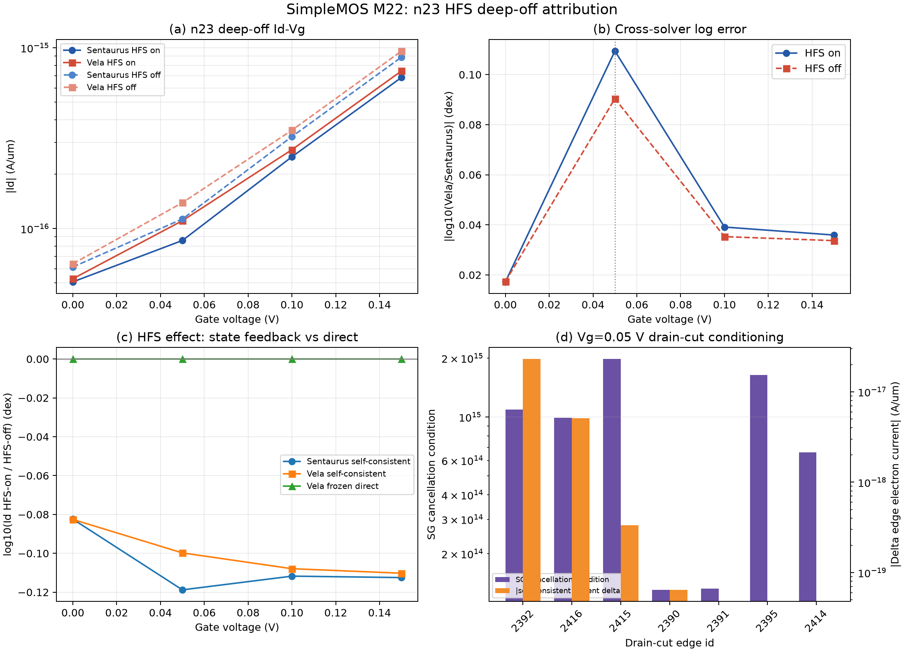

# SimpleMOS M22：n23 深关断 HFS 定向归因

日期：2026-08-30

## 结论

`n23, Vd=0.05 V, Vg=0.05 V` 的 `0.10942 dex` 尖峰不能归因为漏端
HighFieldSaturation 迁移率的直接作用。关闭 HFS 后跨求解器 log 误差降至
`0.09040 dex`，只闭合 `0.01902 dex`（原 log 差距的 `17.38%`）；与此同时，
绝对电流误差反而由 `2.4602e-17` 增至 `2.6119e-17 A/um`。

同一 Vela 状态只切换 HFS 时，端电流变化仅 `-4.31e-6 dex`、
`-1.10e-21 A/um`。与约 `-0.10 dex` 的 Vela 自洽 HFS 响应相比，直接贡献可忽略，
说明开关实验观察到的差别几乎全部经由非线性状态反馈和数值分支产生。

漏端 cut 上 HFS on/off 的迁移率和载流子浓度在导出精度内不变，关键准费米势降只有
`0--4.4e-16 V`。每条边的 SG 正反项抵消条件数最高达到 `1.98e15`。因此这些
sub-fA 电流处于 binary64 差分分辨率附近，微小的准费米状态扰动足以形成 10%--30%
的相对电流变化，但不构成稳定的 HFS 物理参数校准证据。

## 关键数据

| 指标 | HFS on | HFS off | 解释 |
| --- | ---: | ---: | --- |
| Sentaurus Id (A/um) | 8.58625e-17 | 1.12874e-16 | 自洽 HFS 效应 -0.11879 dex |
| Vela Id (A/um) | 1.10464e-16 | 1.38994e-16 | 自洽 HFS 效应 -0.09977 dex |
| 跨求解器误差 | 0.10942 dex | 0.09040 dex | 只改善 0.01902 dex |
| 跨求解器绝对误差 (A/um) | 2.46019e-17 | 2.61190e-17 | 关闭 HFS 后略增 |
| 冻结态直接 HFS 效应 | -4.31e-6 dex | — | 远小于自洽效应 |

## 试验范围

- 器件：n23，`NWell=2e17 cm^-3`、`GOxTime=15 min`。
- 偏压：`Vd=0.05 V`；`Vg=0/0.05/0.10/0.15 V`。
- 自洽对：Sentaurus 和 Vela 的 full/no-HFS 已验收直接偏压曲线。
- 新增运行：8 个 Vela 精确目标状态、16 个冻结态 full/no-HFS 公式评估。
- 漏端截面：恰有一个端点属于 drain 接触节点集的 FV 边。
- Vela HFS 驱动力离散：生产配置 `transport_cell_vector`。

## 证据边界

本阶段支持“HFS 会通过自洽状态反馈改变深关断电流”，但不支持“HFS 直接迁移率差异
导致尖峰”。由于电流低于 1 fA/um 且逐边 SG 抵消已接近双精度分辨率，本阶段不修改
任何默认模型，也不将 0.01902 dex 作为 HFS 拟合目标。

