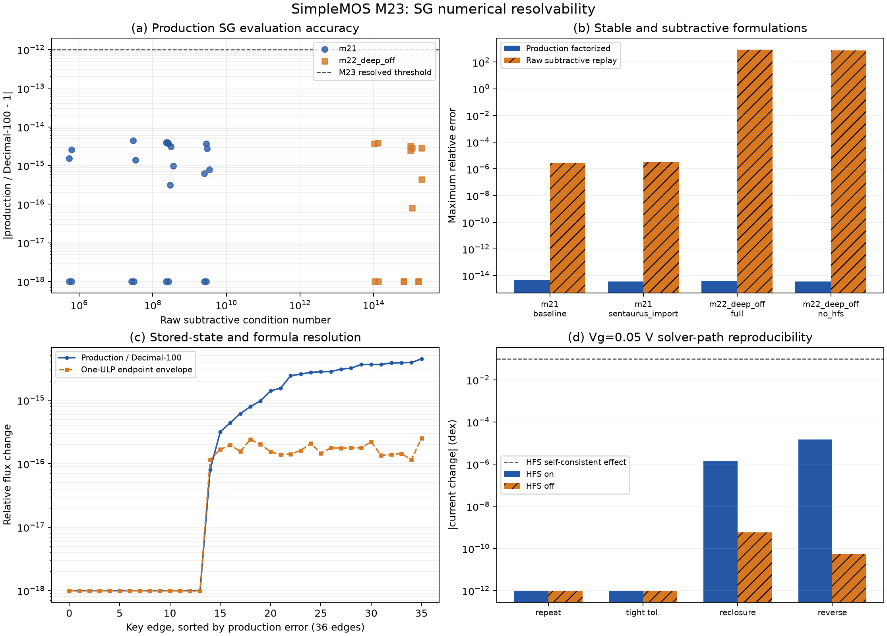

# SimpleMOS M23：SG 数值可分辨性边界

日期：2026-08-30

## 结论

M23 修正了 M22 对深关断数值精度的初步解释。M22 观察到最高 `1.98e15` 的
原始 SG 正反项抵消条件数，以及 10 条边的绝对准费米势导出发生末位折叠；但 Vela
生产路径并不使用这些已舍入的绝对量相减。生产路径保存 contact-basin 参考坐标增量，
并以 factorized `expm1(log-left/right)` 形式计算通量。

36 条关键边的生产 SG 通量与 Decimal-100 稳定回放全部闭合，最大相对误差为
`4.49e-15`，单个参考坐标端点扰动一 ULP 的最大通量包络为 `2.52e-16`。因此，
原始抵消条件数乘 machine epsilon 不能作为生产端电流误差界，深关断的
`0.10942 dex` 跨求解器尖峰也不能归因于生产 SG 公式的 binary64 分辨率不足。

`n23, Vd=0.05 V, Vg=0.05 V` 的 HFS-on 求解路径控制给出最大
`1.64e-5 dex` 电流离散度；HFS-off 为 `5.71e-10 dex`。前者仍比 Vela 自洽
HFS 效应 `0.09977 dex` 小约 6,000 倍，说明该自洽响应不是简单的重复运行、
收敛容差或扫描方向噪声。

## 关键数据

| 指标 | 结果 | 判定 |
| --- | ---: | --- |
| 关键边评估数 | 36 | M21 弱反型 22 条；M22 深关断 14 条 |
| 最大原始抵消条件数 | 1.9794e15 | 仅描述不稳定减法形式 |
| 生产/Decimal-100 最大相对误差 | 4.4903e-15 | 生产公式可分辨 |
| 一 ULP 最大通量包络 | 2.5160e-16 | 保存状态可分辨 |
| 绝对 QF 导出末位折叠边数 | 10 | 显示/交换格式限制，不是生产求解限制 |
| HFS-on 求解路径 spread | 1.6389e-5 dex | 远小于 0.09977 dex HFS 自洽响应 |
| HFS-off 求解路径 spread | 5.7052e-10 dex | 高度复现 |

## 方法和证据边界

- 状态：M21 的 `n21, Vd=0.05 V, Vg=0.8 V` 与 M22 的
  `n23, Vd=0.05 V, Vg=0.05 V`，均覆盖 HFS on/off 或导入驱动力变体。
- 公式审计：使用运行器只读 SG 探针导出的参考坐标端点、`log(left/right)`、
  right factor 和 long-double 参考通量；Python Decimal 精度为 100 位。
- 求解路径：基线重复、紧容差、同态重闭合、由 `Vg=0.1 V` 反向扫描。
- 本阶段没有执行新的 Sentaurus 仿真，没有修改 HFS、SG 或求解器默认值。
- M23 只排除“生产 SG 计算/存储精度不足”这一根因，不排除接触边界条件、
  准费米状态构造、自洽 Jacobian 耦合或跨求解器物理模型差异。

