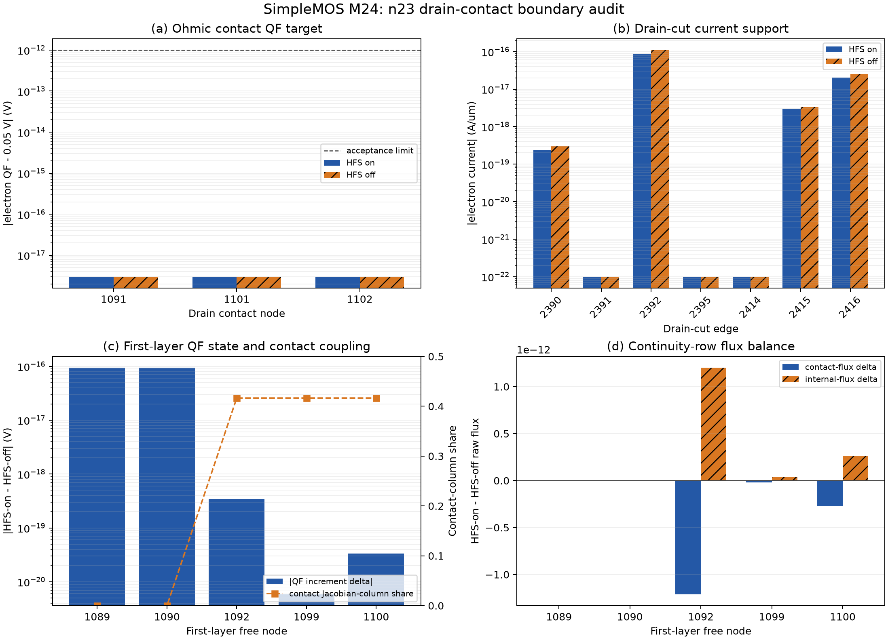

# SimpleMOS M24：n23 漏端接触边界对账

日期：2026-08-30

## 结论

在 `n23, Vd=0.05 V, Vg=0.05 V` 深关断关键状态中，Vela 的漏端欧姆接触
不是 HFS on/off 自洽电流差异的直接来源。3 个漏端接触节点的 `psi`、电子/空穴浓度
和绝对准费米势在两种状态间完全相同；电子准费米势相对 0.05 V 边界目标的最大误差
仅 `3.00e-18 V`，参考坐标增量差最大为 `9.47e-26 V`。

尽管接触边界不变，第一层自由节点的电子准费米增量仍出现最高
`9.39e-17 V` 的 HFS on/off 差异。漏端 cut 的电子电流由
`1.39011e-16 A/um` 变为 `1.10464e-16 A/um`，即 `-0.09983 dex`；这与 M22
自洽端电流效应一致。连续性行中，接触通量变化和内部通量变化方向相反，SRH/其他源项
差异约低 9 个数量级，说明该响应由内部准费米状态和通量平衡传递，而不是接触目标变化。

稳定 SG cut 求和与曲线电子电流提取的最大差异为 `5.13e-20 A/um`、
`3.69e-4` 相对值。该相对值在 sub-fA 区域可见，但比约 20% 的 HFS 电流响应小三个
数量级，因此不能解释当前跨求解器尖峰。

## 关键数据

| 指标 | 结果 |
| --- | ---: |
| 漏端接触节点 | 3 |
| 漏端 cut 边 | 7 |
| 第一层自由节点 | 5 |
| 最大接触 QF 目标误差 | 3.00e-18 V |
| HFS on/off 接触物理状态最大差异 | 0 |
| 第一层最大 QF 增量差 | 9.39e-17 V |
| 第一层最大接触 Jacobian 列占比 | 0.41647 |
| SG cut 自洽 HFS 电流效应 | -0.09983 dex |
| 连续性项最大绝对闭合误差 | 1.79e-28 |

## 证据边界与后续方向

- 本阶段使用 4 个 Vela 只读探针，没有重新运行 Sentaurus，也没有修改默认模型。
- 结论排除了“Vela 接触边界值随 HFS 开关改变”这一直接机制。
- 由于当前没有 n23 Sentaurus 节点态导出，本阶段不能证明 Vela 与 Sentaurus 的 n23
  欧姆接触载流子边界公式完全等价。
- M25 应继续对账第一层节点与接触边之间的参考坐标准费米插值、SG 对数失衡量和
  contact-basin 跨边变换；M26 再审查这些量如何经 Jacobian 自洽反馈放大。

