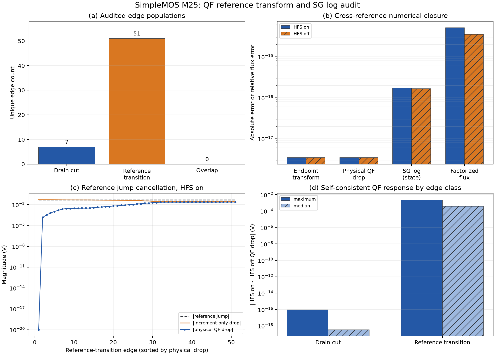

# SimpleMOS M25: QF reference transform and SG log audit

Date: 2026-08-30
Scope: SDevice-only, n23, Vd = 0.05 V, Vg = 0.05 V
States: self-consistent HFS on (`full`) and HFS off (`no_hfs`)

## Question

M24 located the remaining HFS-on/off response at the first free-node layer next
to the drain. M25 asks whether the response can be explained by the
`contact_basin` representation itself: reference-coordinate interpolation,
cross-basin transformation, or the SG logarithmic imbalance calculation.

The audit deliberately separates two edge populations:

- the seven edges defining the drain-contact finite-volume cut;
- every edge whose two endpoints have different electron QF references.

These populations must not be conflated. The drain cut is the terminal-current
support. Reference-transition edges audit coordinate transformations wherever
they occur in the mesh, but do not form an additive terminal-current cut.

## Method

For every selected edge and both converged states, M25 reconstructs with
Decimal-100 arithmetic:

1. the endpoint QF values expressed relative to the node-0 reference;
2. the physical electron QF drop
   `(reference1-reference0) + (increment1-increment0)`;
3. the production SG log imbalance `Delta phin / Vt`;
4. the factorized flux `right_factor * expm1(log_imbalance)`.

The reconstructed quantities are compared with the read-only SG edge probe.
No Sentaurus simulation was rerun and no Vela contact, HFS, SG, or solver
default was changed.

## Results

| Result | Value |
|---|---:|
| Unique audited edges | 58 |
| Drain-cut edges | 7 |
| Reference-transition edges | 51 |
| Drain-cut edges that cross a reference basin | 0 |
| Reference jump | 0.05 V = 1.93409 Vt |
| Maximum anchored-endpoint transform error | 3.46945e-18 V |
| Maximum physical-QF-drop closure error | 3.46945e-18 V |
| Maximum SG log closure error | 1.74748e-16 |
| Maximum factorized-flux relative error | 5.11643e-15 |
| Error from omitting the reference jump | 0.05 V |
| Maximum HFS-on/off QF-drop delta, drain cut | 9.39498e-17 V |
| Maximum HFS-on/off QF-drop delta, reference transitions | 2.36607e-3 V |

All contract closure thresholds pass.

## Interpretation

The drain-contact cut lies entirely inside the 0.05 V drain reference basin.
Consequently, the terminal cut does not execute a cross-basin reference
transformation at all. Its HFS-on/off physical QF-drop change remains below
`1e-16 V`, consistent with the M24 observation that the contact state is pinned.

Elsewhere in the device, all 51 reference transitions close at binary64
roundoff. The stored increment at the 0.05 V endpoint compensates the 0.05 V
reference jump before the SG logarithm is formed. Ignoring the reference and
subtracting increments alone would inject a spurious 0.05 V drop, about 1.93
thermal voltages; the production path does not make that mistake.

The independently converged HFS-on/off states do differ on internal
reference-transition edges, by as much as 2.37 mV in physical QF drop. That is
a self-consistent state response, not a transform-closure error, and those
edges are not the drain terminal cut.

## Supported conclusion

Within Vela, reference-coordinate interpolation, cross-`contact_basin`
transformation, SG log-imbalance construction, and factorized flux evaluation
are numerically closed for the frozen n23 states. The remaining deep-off
current difference is therefore not explained by a faulty cross-reference
transformation on the drain cut.

M25 does not establish that Sentaurus uses the same undocumented coordinate
implementation. A Sentaurus node-level QF/reference export would be required
for that cross-solver claim.

## Next task

M26 should follow the M24 first-layer response through the self-consistent
Jacobian: perturb or replay the QF increments at nodes 990--992, decompose the
contact and internal flux derivatives, and quantify which coupling transfers
the internal HFS response onto the drain cut.
