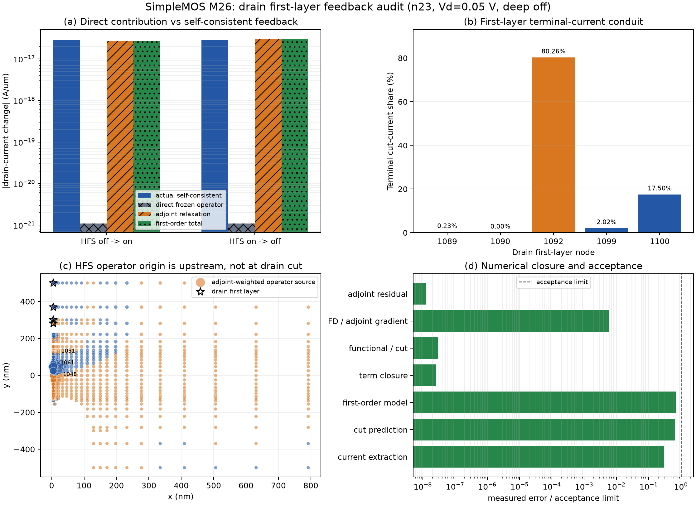

# SimpleMOS M26: drain first-layer self-consistent feedback audit

Date: 2026-08-31
Scope: SDevice-only, n23, Vd = 0.05 V, Vg = 0.05 V
States: self-consistent HFS on (`full`) and HFS off (`no_hfs`)

## Question

M24 showed that the five free nodes adjacent to the drain contact reproduce the
terminal cut-current change, while M25 excluded a faulty cross-reference QF
transform on that cut. M26 asks two separate questions:

1. Does switching the HFS operator directly change the frozen-state drain
   current?
2. Which residual rows and state increments transfer the HFS operator change
   into the self-consistent terminal current?

This distinction is essential because a frozen operator response and a
self-consistent response are different derivatives.

## Method

The current n23 topology identifies drain-first-layer nodes
`1089, 1090, 1092, 1099, 1100`. Earlier references to nodes 990--992 were from
an obsolete mesh numbering and are not used. The perturbation basis contains
these five response nodes plus their complete noncontact one-ring, for 12 QF
columns in total.

For both HFS-on and HFS-off converged states, M26 performs:

- a reference-aware terminal-current adjoint solve `J^T lambda = dI/dx`;
- a cross-operator frozen residual evaluation;
- 48 central QF perturbation states (12 columns, two signs, two variants);
- terminal-functional, SG-edge-flux, and carrier-term probes on each state;
- a reconstruction of the drain-cut response from the first-layer QF changes.

The matrix contains 150 read-only probes. No Sentaurus simulation was rerun and
no default contact, HFS, SG, mobility, or solver setting was changed.

Two diagnostic infrastructure defects were found and corrected before freezing
the result:

- the arclength diagnostic state pack now preserves referenced sub-ULP QF
  increments instead of repacking rounded absolute QF values;
- the default terminal-functional scale now includes the finite-volume line
  integral factor, making its current and gradient consistent with the native
  SG contact-cut extraction.

## Numerical closure

| Check | Maximum result | Acceptance |
|---|---:|---:|
| Adjoint relative residual | 1.25524e-16 | < 1e-8 |
| Central FD vs adjoint direct-gradient disagreement | 6.09261e-7 | < 1e-4 |
| Terminal functional vs SG-cut gradient disagreement | 2.89237e-16 | < 1e-8 |
| Contact + internal + source term closure | 2.63782e-16 | < 1e-8 |
| Bidirectional finite-switch first-order error | 7.11549% | < 10% |
| First-layer cut-current prediction error | 0.064786% | < 0.1% |
| Terminal functional vs M24 cut-current disagreement | 0.029928% | < 0.1% |

All contract acceptance checks pass.

## HFS response decomposition

| Direction | Actual self-consistent delta I | Direct frozen operator | Adjoint relaxation | First-order total | Relative error |
|---|---:|---:|---:|---:|---:|
| HFS off -> on | -2.85476e-17 A/um | -1.09768e-21 A/um | -2.69751e-17 A/um | -2.69762e-17 A/um | 5.504% |
| HFS on -> off | +2.85476e-17 A/um | +1.09706e-21 A/um | +3.05778e-17 A/um | +3.05789e-17 A/um | 7.115% |

For HFS turn-on, the frozen direct contribution is only 0.003845% of the
finite self-consistent current change. The adjoint relaxation accounts for
94.49% in the turn-on linearization and 107.11% in the reverse linearization;
the difference is the finite nonlinear remainder. The signed operator response
is 99.9997% associated with electron-continuity rows.

## Drain-first-layer role

| First-layer node | No-HFS linearized drain-cut share |
|---:|---:|
| 1089 | 0.2258% |
| 1090 | 0% |
| 1092 | 80.2589% |
| 1099 | 2.0155% |
| 1100 | 17.4998% |

The five first-layer QF increments predict the independently observed M24
drain-cut electron-current change with 0.0648% error. Thus they are the
terminal-current conduit. They are not, however, the physical origin of the
HFS response: only about 1.18e-7 of the absolute adjoint-weighted operator
source lies on these rows. The largest turn-on contributions occur upstream at
nodes 1051, 1061, 1048, 1064, and 1070. Including the complete noncontact
one-ring also closes the QF-only contact/internal cancellation in
contact-support rows to 5.09e-7 relative.

## Supported conclusion

The deep-off HFS-on/off current difference in Vela is not a direct frozen
mobility multiplier at the drain contact. It is predominantly produced by the
self-consistent Jacobian response to a distributed, upstream,
electron-continuity operator perturbation. The drain-first-layer nodes then
carry that altered state into the terminal SG cut, with node 1092 providing the
dominant extraction sensitivity.

This closes the mathematical disconnect observed in M10: a mobility-field
change can be large on selected active edges yet have almost no frozen terminal
effect, while the same operator change alters the converged terminal current
through the global nonlinear state response.

## Limits and next comparison

The local adjoint is a first-order diagnostic and retains 5.5--7.1% error for
the finite HFS switch. M26 also does not prove that Sentaurus follows the same
internal pathway. A cross-solver attribution requires Sentaurus node- or
edge-level QF, mobility, current, and residual outputs at the same deep-off
state. No production default should be changed from this audit alone.
