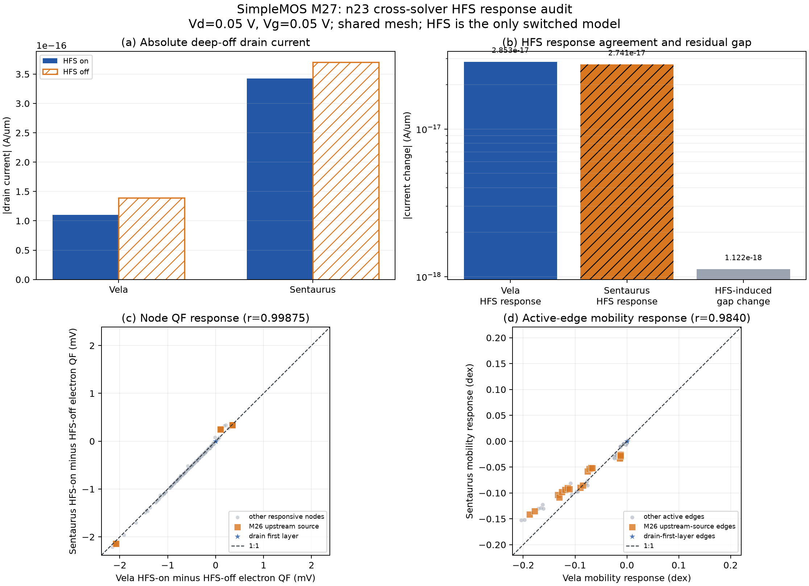

# SimpleMOS M27: Sentaurus–Vela HFS response audit

Date: 2026-08-31
Scope: SDevice-only, n23, Vd = 0.05 V, Vg = 0.05 V
Solvers: Sentaurus Device T-2022.03-SP2 and Vela

## Question

M26 established inside Vela that the deep-off HFS current change is produced
mainly by a distributed self-consistent response, not by a frozen mobility
multiplier at the drain contact. M27 asks whether Sentaurus exhibits the same
finite HFS-on/off response on the shared n23 mesh.

The comparison deliberately separates:

- absolute deep-off current agreement;
- response to switching HFS while retaining every other model;
- node-level self-consistent state response;
- edge mobility, driving-force, and projected-current diagnostics.

## Controlled matrix

Two new Sentaurus simulations were executed from the same `input_fps.tdr`:

| Variant | Silicon mobility configuration |
|---|---|
| HFS on | `PhuMob HighFieldSaturation(GradQuasiFermi) Enormal` |
| HFS off | `PhuMob Enormal` |

Both retain OldSlotboom band-gap narrowing and
`SRH(DopingDependence)`, use the same drain and gate ramps, and save the final
state at Vd = 0.05 V and Vg = 0.05 V. The TDRs export electrostatic potential,
carrier quasi-Fermi potentials and densities, mobility, GradQuasiFermi,
current-density vectors, and `srhRecombination`.

Vela reuses the independently converged M22 HFS-on/off states. Only read-only
edge mobility, common-HFS-operator drive, and SG flux probes were added. No
default model or solver setting changed.

## Data integrity

| Check | Result |
|---|---:|
| New Sentaurus states | 2 |
| Common silicon nodes | 942 |
| Common silicon edges | 2,691 |
| Responsive QF nodes | 415 |
| Active current edges | 730 |
| Maximum bias error | 0 V |
| Nonfinite raw values | 0% |
| Contract checks | all pass |

Derived log responses are undefined on zero-magnitude edges; those rows are
excluded from the corresponding correlation rather than treated as invalid raw
data.

## Terminal-current response

| Solver | HFS on | HFS off | HFS-on minus HFS-off |
|---|---:|---:|---:|
| Vela | 1.10464e-16 A/um | 1.38994e-16 A/um | -2.85291e-17 A/um |
| Sentaurus | 3.42695e-16 A/um | 3.70102e-16 A/um | -2.74067e-17 A/um |

The two solvers predict the same response sign. Sentaurus' absolute HFS
response is 96.07% of Vela's, a relative disagreement of 3.93%.

The absolute cross-solver current gap is 2.32231e-16 A/um with HFS and
2.31108e-16 A/um without HFS. Switching HFS changes that gap by only
1.12244e-18 A/um, or 0.483% of the full-physics gap. Therefore HFS affects the
deep-off current in both solvers but does not explain the dominant absolute
Sentaurus–Vela baseline offset.

## State and mobility response

| Response comparison | Samples | Pearson r | Sign agreement | P95 difference |
|---|---:|---:|---:|---:|
| Electron QF, responsive nodes | 415 | 0.99875 | 99.76% | 4.62268e-5 V |
| Electron mobility, responsive active edges | 133 | 0.98398 | 87.97% | 0.03368 dex |

The fitted Sentaurus-per-Vela electron-QF response slope is 1.02090. Thus the
self-consistent state response agrees not only in location and sign but also in
amplitude.

The M26 upstream operator-source zone reaches 2.086 mV in Vela and 2.144 mV in
Sentaurus. In contrast, the five drain-first-layer nodes remain QF-pinned:
Vela's maximum change is below 1e-16 V and Sentaurus writes exactly zero at TDR
precision. This independently confirms the M26 distinction between an upstream
physical response source and a drain-side terminal-current conduit.

## Interpretation limits

The response of Sentaurus nodal GradQuasiFermi and projected nodal current does
not correlate strongly with Vela's transport-cell-vector drive and SG edge
flux. This is not evidence that the state response is inconsistent: those
quantities have different support, reconstruction, smoothing, and limiting
semantics. They are retained as localization diagnostics only.

Sentaurus does not expose its nonlinear continuity residual rows or Jacobian,
so M27 cannot reproduce the exact M26 adjoint decomposition inside Sentaurus.
It can establish that the observable finite state and terminal-current response
is highly consistent.

## Supported conclusion

M27 substantially narrows the remaining discrepancy. HFS is a real and
reproducible contributor to each solver's deep-off current, and the two solvers
agree closely on its absolute response and upstream QF pathway. However, the
large absolute current offset survives almost unchanged when HFS is disabled.
Further work should therefore investigate HFS-independent baseline variables,
especially equilibrium/barrier state, carrier statistics and BGN, SRH
generation, and absolute contact/SG flux construction. The default HFS model
should not be tuned to absorb this residual.
