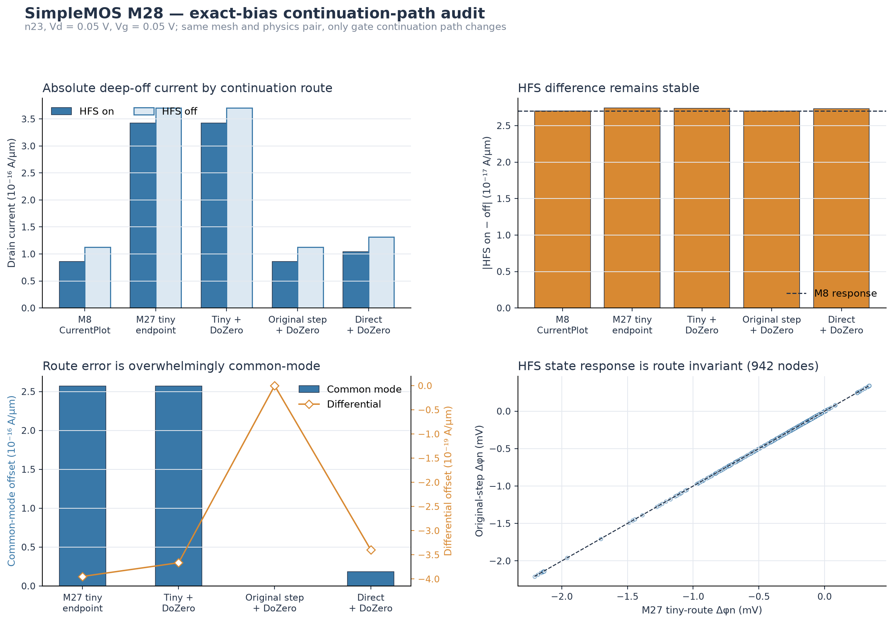

# SimpleMOS M28 exact-bias continuation-path audit

## Objective

M27 reproduced the HFS on/off response on newly converged Sentaurus states, but
its exact Vg = 0.05 V endpoint current differed materially from the frozen M8
51-point `CurrentPlot` ordinate. M28 separates an absolute continuation-route
effect from the HFS difference before any BGN or SRH causal ablation is begun.

The device, TDR, drain and gate biases, mobility models, OldSlotboom BGN, and
SRH(DopingDependence) are unchanged. Three new exact-endpoint routes are run for
both HFS on and HFS off. M8 and M27 results are reused as independent anchors.

## Controlled routes

| Route | Gate continuation |
|---|---|
| M8 CurrentPlot | 0 to 2.5 V sweep, sampled at Vg = 0.05 V |
| M27 tiny endpoint | Goal 0.05 V, normalized InitialStep = 0.01, no DoZero |
| Tiny + DoZero | M27 schedule with DoZero |
| Original initial + DoZero | Goal 0.05 V, normalized InitialStep = 0.5, matching the original sweep's 0.025 V first step |
| Direct + DoZero | One exact 0.05 V gate step |

Six new Sentaurus T-2022.03-SP2 states were computed. All reached the exact
Vd = 0.05 V, Vg = 0.05 V endpoint and exported 942 common silicon nodes without
nonfinite raw values.

## Terminal-current result

| Route | HFS on (A/um) | HFS off (A/um) | HFS on minus off (A/um) | Difference from M8 response |
|---|---:|---:|---:|---:|
| M8 CurrentPlot | 8.58625e-17 | 1.12874e-16 | -2.70120e-17 | 0% |
| M27 tiny endpoint | 3.42695e-16 | 3.70102e-16 | -2.74067e-17 | 1.461% |
| Tiny + DoZero | 3.42703e-16 | 3.70082e-16 | -2.73784e-17 | 1.356% |
| Original initial + DoZero | 8.58625e-17 | 1.12874e-16 | -2.70120e-17 | 0% |
| Direct + DoZero | 1.04032e-16 | 1.31383e-16 | -2.73513e-17 | 1.256% |

The original-initial-step exact endpoint reproduces the frozen M8 values
exactly for both physics variants. Therefore the M8 ordinate is not a parser or
CurrentPlot interpolation error. The deep-off terminal current is sensitive to
the normalized gate continuation path.

The largest path offset is 2.57030e-16 A/um in common mode, while its
full-versus-no-HFS differential part is only 3.94702e-19 A/um. Across all
routes, the HFS response differs from M8 by no more than 1.461%. This closes the
apparent M27 contradiction: the absolute current changed with route, whereas
the HFS difference-in-differences remained stable.

## State response

All routes retain a Pearson correlation of 1.0 against the M27 nodal electron
quasi-Fermi HFS response. For the route that exactly reproduces M8 current, the
P95 nodal HFS-response difference is only 2.52e-12 V. Individual full and
no-HFS path shifts are also at the picovolt level in the exported nodal state.

Thus sub-fA contact-current extraction amplifies changes that are below normal
TDR state precision. Absolute terminal current is path conditioned, while the
finite HFS response is much more robust.

## Supported conclusion

M27's conclusion that HFS is not the dominant source of the original deep-off
Sentaurus-Vela discrepancy remains supported by the route-stable HFS response.
Its exact-endpoint absolute Sentaurus current, however, must not replace the
frozen M8 Id-Vg value. Future BGN, SRH, contact, or SG audits must use a fixed
continuation route and report absolute values separately from paired model
responses. No production default is changed by M28.
