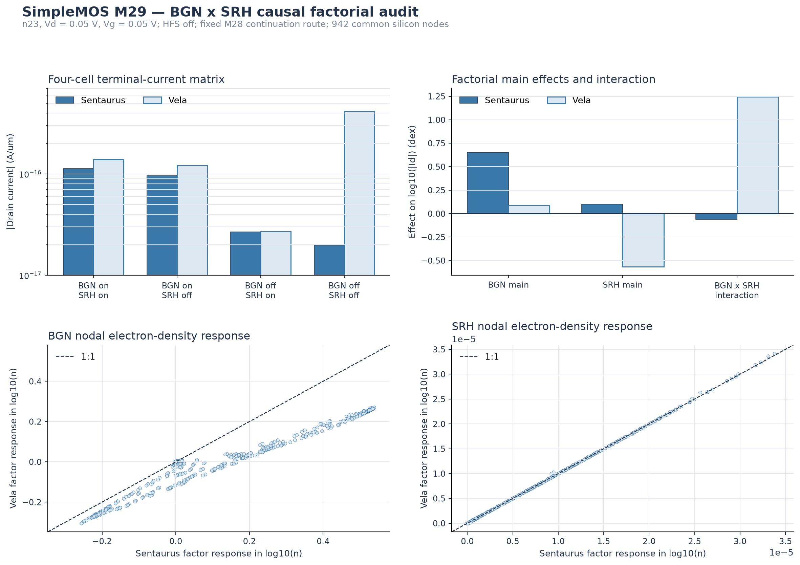

# SimpleMOS M29 BGN x SRH causal factorial audit

## Objective

M29 tests whether the remaining n23 deep-off discrepancy can be assigned to
OldSlotboom band-gap narrowing (BGN), SRH(DopingDependence), or their
self-consistent interaction. HighFieldSaturation is disabled in every cell, so
the experiment does not mix the HFS response with the BGN or SRH response.

The audit uses the M28 continuation route that exactly reproduces the frozen M8
Vg = 0.05 V ordinate. The device, mesh, contacts, Vd = 0.05 V, Vg = 0.05 V,
PhuMob, and Enormal are fixed. Three new Sentaurus T-2022.03-SP2 states and four
Vela states complete the BGN on/off x SRH on/off matrix. Every state reached the
exact requested biases and yielded 942 common silicon nodes.

## Four-cell terminal-current matrix

| BGN | SRH | Sentaurus | Vela | Absolute gap | Relative error |
|---|---|---:|---:|---:|---:|
| On | On | 1.12874e-16 A/um | 1.38994e-16 A/um | 0.09040 dex | 23.14% |
| On | Off | 9.58830e-17 A/um | 1.22229e-16 A/um | 0.10543 dex | 27.48% |
| Off | On | 2.68882e-17 A/um | 2.70316e-17 A/um | 0.00231 dex | 0.533% |
| Off | Off | 1.98990e-17 A/um | 4.16936e-16 A/um | 1.32124 dex | 1995.27% |

Turning BGN off while leaving SRH on nearly eliminates the terminal-current
gap, but this single cell is not sufficient evidence that BGN is the root
cause. Turning both BGN and SRH off drives Vela and Sentaurus in opposite
directions and creates a 1.321 dex discrepancy. The apparent agreement in the
BGN-off/SRH-on cell is therefore a conditional compensation, not a validated
production-model correction.

## Factor effects on log10(|Id|)

| Effect | Sentaurus | Vela | Vela minus Sentaurus |
|---|---:|---:|---:|
| BGN main effect | 0.65297 dex | 0.08911 dex | -0.56386 dex |
| SRH main effect | 0.10079 dex | -0.56619 dex | -0.66698 dex |
| BGN x SRH interaction | -0.05988 dex | 1.24402 dex | 1.30390 dex |
| BGN effect with SRH on | 0.62303 dex | 0.71112 dex | 0.08809 dex |
| SRH effect with BGN on | 0.07085 dex | 0.05582 dex | -0.01503 dex |

The two single-factor responses adjacent to the production-like baseline are
reasonably aligned: the BGN response with SRH on differs by 0.0881 dex, and the
SRH response with BGN on differs by 0.0150 dex. The large averaged main-effect
errors arise from the double-off corner. In particular, Vela's BGN x SRH
interaction is 1.244 dex, whereas Sentaurus gives -0.0599 dex.

This local-versus-global distinction is important: neither BGN nor SRH alone
explains the baseline gap. The unresolved defect is activated when both
carrier-statistics corrections are absent and is consistent with a different
self-consistent deep-off branch, source balance, or ill-conditioned contact
current extraction. M29 does not yet distinguish those mechanisms.

## Nodal state response

The spatial factor-response patterns remain strongly correlated across 942
nodes. BGN-response Pearson correlations are 0.9908 for electron quasi-Fermi
potential and 0.9642 for log electron density. SRH-response correlations are
0.999965 for both fields. Thus the 1.321 dex double-off current gap is not
accompanied by a comparably obvious global nodal-pattern disagreement. This is
consistent with the earlier finding that deep-off terminal current can amplify
small state differences and cancellations.

## Supported conclusion and next test

M29 rules out a simple one-factor attribution. BGN-off/SRH-on is a useful
diagnostic null, but must not be promoted to a default-model change. The next
causal step should focus on the BGN-off/SRH-off corner: replay the same frozen
state with the four source combinations, decompose source and drain electron
and hole contact fluxes, report their condition numbers, and compare the
continuity residual/Jacobian response along the fixed continuation path. This
will separate a state-branch effect from terminal-flux extraction sensitivity.

No production BGN, SRH, mobility, contact, SG, or solver default is changed by
M29.
