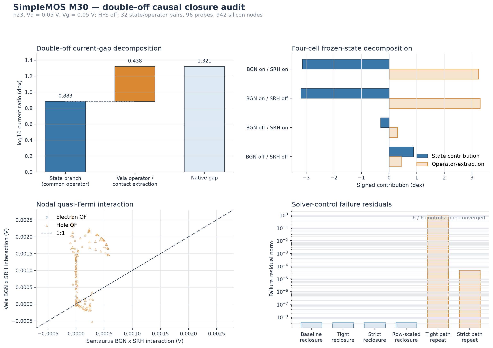

# SimpleMOS M30 double-off causal-closure audit

## Technical summary

M30 closes the arithmetic decomposition of the anomalous n23 BGN-off/SRH-off
corner at Vd = 0.05 V and Vg = 0.05 V, with HighFieldSaturation disabled. The
native Vela-to-Sentaurus drain-current gap is 1.321239 dex. Under a common Vela
operator, 0.882589 dex is associated with the frozen-state difference; the
remaining 0.438444 dex is associated with replaying the Sentaurus state through
Vela's operator and contact-current extraction. The two terms reconstruct the
native gap exactly within floating-point precision.

This is a diagnostic decomposition, not proof that either term is a single
physical root cause. In the other three factorial cells, large signed state and
operator terms cancel. Imported Sentaurus states are not Vela-discrete steady
states, so the replay operator term includes discretization, contact-cut, model,
and residual incompatibility.

Six stricter self-consistent controls did not produce a replacement double-off
solution. Four same-bias reclosures reached the same approximately 3.705e-9
Newton residual floor and failed at the fifth iteration. Two strict repeats of
the original 0 to 0.05 V gate path also ended with line-search non-decrease.
Therefore the M29 double-off current must remain labelled as a
continuation-conditioned, near-numerical-floor result rather than a fully closed
physical branch.

## Exact current-gap decomposition

For each BGN x SRH cell, M30 uses the identity

`log10(Iv_native / Is_native) = log10(Iv_probe / Is_probe) + log10(Is_probe / Is_native) - log10(Iv_probe / Iv_native)`.

The first term compares Vela and Sentaurus frozen states under the same Vela
operator. The combined second and third terms measure the Sentaurus-state replay
through Vela's operator and contact extraction, including Vela cut closure.

| Factor cell | Native gap | Common-operator state term | Vela operator / extraction term | Closure |
|---|---:|---:|---:|---:|
| BGN on, SRH on | 0.09040 dex | -3.13627 dex | 3.22683 dex | 0.000 dex |
| BGN on, SRH off | 0.10543 dex | -3.19162 dex | 3.29769 dex | 0.000 dex |
| BGN off, SRH on | 0.00231 dex | -0.30655 dex | 0.30771 dex | 0.000 dex |
| BGN off, SRH off | 1.32124 dex | 0.88259 dex | 0.43844 dex | 0.000 dex |

The double-off split is exact as bookkeeping, but it is not an additive causal
model of private Sentaurus physics. The large cancellations in the other cells
are a robustness warning: cross-solver frozen-state replay is highly sensitive
to whether the imported state satisfies the receiving solver's discrete
equations.

## Contact cuts and continuity balance

The native Vela double-off state has |Id| = 4.16936e-16 A/um. Its Vela drain-cut
replay is 4.16738e-16 A/um, a -0.000207 dex extraction closure. The source cut is
-2.64963e-16 A/um and the substrate cut is -1.37685e-19 A/um, leaving a signed
all-terminal imbalance of 1.51637e-16 A/um. This imbalance is about 36% of the
drain current and cannot be assigned to substrate leakage.

For the Sentaurus frozen state under the Vela double-off operator, the drain-cut
condition number is 11.7495 and the source-cut condition number is 4.2767,
compared with 1.0 for both Vela native cuts. This confirms contact-flux
cancellation sensitivity in the cross-solver replay. It does not establish that
the native Sentaurus contact current is computed with the same cut construction.

## Carrier-state interaction

The BGN x SRH nodal interaction was compared on 942 common silicon nodes. The
electron quasi-Fermi interaction remains strongly aligned (Pearson 0.98816;
P95 absolute difference 3.10e-9 V), while the hole quasi-Fermi interaction is
only moderately aligned (Pearson 0.55721; P95 1.522e-3 V). The corresponding
P95 log-hole-density difference is 0.02556 dex.

The drain current is electron-dominated, so the hole-state mismatch is not by
itself a terminal-current root cause. It is, however, evidence that removing SRH
and BGN together changes the minority-carrier/self-consistent branch differently
in the two solvers. The next experiment should test whether this hole response
feeds back into Poisson and the electron barrier or remains dynamically
irrelevant to Id.

## Solver-control robustness

All six controls ended in `line_search_non_decrease`; none is reported as a new
converged solution. The four same-bias reclosures share the same failure residual
3.70546e-9, dominated by the Poisson block (3.70533e-9); the electron block is
3.07109e-11 and the hole block is 7.68929e-17. Tight and strict path repeats
also fail, at residuals 1.0 and 4.82170e-5 respectively under their normalized
criteria.

This explains how M29 could accept the original sweep point while a same-state
reclosure fails: relative convergence in the original continuation is normalized
against a much larger initial Poisson residual, whereas reclosure starts near the
residual floor and demands further reduction. M30 therefore freezes the original
point as a path-conditioned diagnostic state, not a precision reference.

## Supported conclusion and next step

M30 supports three bounded conclusions:

- The 1.321239 dex double-off gap can be split exactly into a 0.882589 dex
  frozen-state term and a 0.438444 dex Vela-operator/contact-extraction term.
- Cross-solver contact cuts are ill-conditioned enough that the split cannot be
  interpreted as a private-model causal percentage.
- The double-off corner lacks a stricter converged replacement state and should
  be excluded from default-model fitting or validation pass/fail thresholds.

The next causal stage should perturb the minority-hole branch while holding the
electron/contact operator fixed, and separately close the Poisson residual floor
at the dominant nodes. The acceptance criterion should be absolute continuity
and terminal-balance closure, not only a relative Newton residual.

No production BGN, SRH, mobility, contact, SG, solver, or convergence default is
changed by M30.
