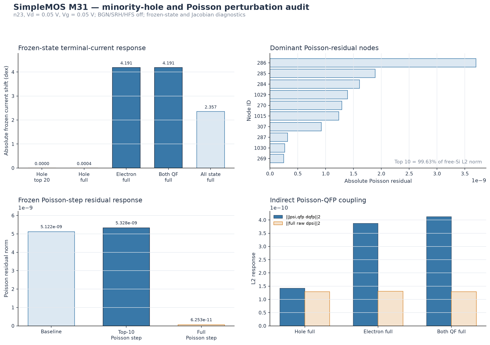

# SimpleMOS M31 minority-hole and Poisson perturbation audit

## Technical summary

M31 tests the two remaining M30 hypotheses at the anomalous n23 corner,
Vd = 0.05 V and Vg = 0.05 V, with BGN, SRH, and HighFieldSaturation disabled.
It separates the exact frozen-state terminal-current response from the indirect
Poisson/quasi-Fermi response encoded in the baseline production Jacobian. No new
Sentaurus run was required and no production model default was changed.

The minority-hole branch is not the direct controller of drain current in this
state. Replacing the 20 largest hole discrepancies produces no measurable
frozen-current change; replacing the complete silicon hole state changes the
current by only 2.252e-22 A/um, or 0.000407 dex. In contrast, replacing the
electron quasi-Fermi state changes the frozen current by 4.191177 dex. The full
hole perturbation's adjoint prediction differs from its exact frozen response
by only 4.275e-25 A/um, while the much larger electron replacement is outside
the useful linear range of the baseline adjoint.

The Poisson residual floor is highly localized: nodes 286, 285, 284, 1029,
270, 1015, 307, 287, 1030, and 269 account for 99.6315% of the free-silicon
Poisson residual L2 norm. Applying only their Poisson Newton entries reduces
the residual inside that same set but raises the global Poisson norm from
5.122e-9 to 5.328e-9, showing redistribution into the complementary mesh.
Applying the complete Poisson-only step to all mesh nodes reduces the global
norm to 6.253e-11.

## Frozen direct response

| State perturbation | Absolute current shift | Exact current change |
|---|---:|---:|
| Hole, 20 largest-discrepancy nodes | 0 dex | 0 A/um |
| Hole, all silicon nodes | 0.000407 dex | -2.252e-22 A/um |
| Electron, all silicon nodes | 4.191177 dex | +3.731e-15 A/um |
| Electron and hole QF, all silicon nodes | 4.191177 dex | +3.731e-15 A/um |
| Complete mapped Sentaurus state | 2.356557 dex | +5.437e-17 A/um |

The electron-only and both-QF responses agree to 2.62e-8 dex. Therefore the
minority-hole mismatch identified by M30 has negligible direct control over the
frozen drain current. The complete mapped state gives a smaller current shift
because replacing electrostatic potential and all densities changes the Vela
operator response and is not a superposition of the separate large
perturbations.

## Poisson residual and direct-current sensitivity

The drain-current functional has zero nodal derivative with respect to
electrostatic potential when carrier densities and quasi-Fermi potentials are
held frozen. Consequently both the top-10 and complete psi-only perturbations
have exactly zero direct frozen-current response. This does not mean Poisson is
irrelevant to a self-consistent solution: psi changes carrier/QF state through
the coupled equations, and that indirect route is measured by the cross blocks.

The ten dominant nodes lie in three y rows around y = 0 and +/-0.02459227,
over x = 0.03360702 to 0.07594921 in mesh coordinates. M31 reports coordinates
rather than assigning a device-region name because the causal selection was
made from the free-silicon residual, not from a hand-selected geometric region.

## Indirect Poisson-QFP coupling

| Replacement direction | QF target L2 | `J_psi,qfp * delta_qfp` L2 | Full raw psi step L2 |
|---|---:|---:|---:|
| Hole only | 0.228075 V (phip) | 1.418e-10 | 1.292e-10 V |
| Electron only | 0.002656 V (phin) | 3.875e-10 | 1.307e-10 V |
| Electron and hole | both above | 4.126e-10 | 1.292e-10 V |

The electron replacement produces 2.73 times the hole-only Poisson forcing
norm despite its much smaller QF-state L2 displacement. The combined response
is not a scalar addition after the block solves, but all three Schur
decompositions close below 5.2e-23 relative error. The active feedback loop in
this BGN-off/SRH-off/HFS-off corner is entirely classified as
transport/boundary; SRH/Auger and SG-avalanche loop norms are zero by the
configured physics.

For runtime practicality, M31 adds a diagnostic-only
`compute_condition_estimates` switch to the Poisson-QFP cross-block probe.
Its default is `true`, preserving prior output and behavior. M31 sets it to
`false` because the three perturbation directions share the same baseline
Jacobian and do not use repeated dense SVD condition estimates. All residual,
Jacobian-block, Schur-loop, and directional-derivative calculations remain
enabled.

## Supported conclusion and next step

M31 supports the following bounded conclusions:

- The M30 minority-hole disagreement is not a direct cause of the anomalous
  drain current; its full frozen contribution is only 0.000407 dex.
- The deep-off drain-current functional is controlled by the electron state.
  The electron replacement changes it by 4.191177 dex, but this large
  perturbation cannot be interpreted with the first-order adjoint alone.
- The Poisson floor is spatially concentrated and can be nearly removed by the
  complete Poisson block step, yet psi influences current only through the
  self-consistent carrier/QF feedback path in this frozen-functional
  formulation.
- Transport/boundary coupling, rather than disabled SRH/Auger or avalanche
  source coupling, carries the remaining indirect Poisson-QFP loop.

The next stage should perturb the electron QF state in scaled increments
(for example 1%, 3%, 10%, 30%, and 100%) and recompute the self-consistent
linear response. This will identify the adjoint's valid range and localize the
transport/boundary coupling at the dominant Poisson nodes before attempting any
model or contact-boundary change.

No production BGN, SRH, mobility, contact, SG, solver, or convergence default
is changed by M31.
