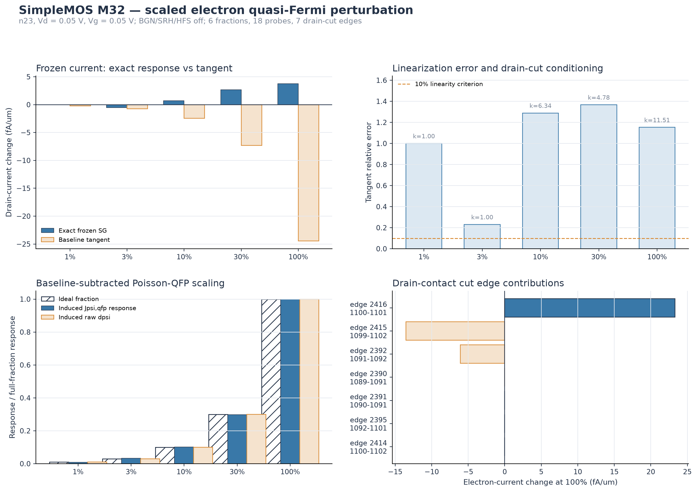

# SimpleMOS M32 scaled electron quasi-Fermi perturbation audit

## Technical summary

M32 scales the mapped Sentaurus-to-Vela electron quasi-Fermi-potential
difference by 1%, 3%, 10%, 30%, and 100% at the n23, Vd = 0.05 V,
Vg = 0.05 V BGN-off/SRH-off/HFS-off corner. A 0% control is included for all
three probes. Each state remains frozen; the stored electron density is not
interpolated because the production assembler reconstructs carrier density
from psi and phin.

The test separates two very different responses. The baseline-subtracted
Poisson-QFP Jacobian response scales almost linearly with the perturbation.
The frozen SG drain current does not: 1% produces no resolved change, 3%
produces a negative current change, and 10% through 100% produce positive
changes while the baseline tangent remains negative. No tested nonzero
fraction satisfies the 10% tangent-error criterion.

This distinction narrows the remaining issue. The baseline transport/boundary
Jacobian feedback is regular under directional scaling, while the sub-fA
terminal-current functional is dominated by nonlinear SG contact-edge
response, finite numerical resolution, and cancellation between a few drain
edges.

## Scaled terminal-current response

| Fraction | Exact frozen current change | Baseline tangent prediction | Relative tangent error | Drain-cut condition |
|---:|---:|---:|---:|---:|
| 1% | 0 fA/um | -0.2444 fA/um | 100.0% | 1.000 |
| 3% | -0.5640 fA/um | -0.7331 fA/um | 23.06% | 1.001 |
| 10% | +0.7064 fA/um | -2.4437 fA/um | 128.91% | 6.339 |
| 30% | +2.6924 fA/um | -7.3312 fA/um | 136.72% | 4.777 |
| 100% | +3.7313 fA/um | -24.4374 fA/um | 115.27% | 11.506 |

The 3% point is the closest to the baseline tangent, but still fails the 10%
criterion. The exact response reverses sign between 3% and 10%. Because the
terminal functional and the independently summed seven-edge SG drain cut agree
within 2.5e-28 A/um at every fraction, the observed response is not caused by
using different current-extraction domains.

The exactly unchanged 1% current is evidence of a resolution boundary for this
specific direction and baseline, not proof that the mathematical derivative is
zero. Smaller perturbations would be even less suitable for extracting a
terminal-current slope in double precision unless the calculation is
reformulated around edge flux differences or higher precision.

## Baseline-subtracted Poisson-QFP response

The uncorrected cross-block outputs contain the baseline residual-floor step:
at 0% the raw psi step is already 1.306817e-10 V in L2 norm. M32 therefore
subtracts the complete 0% vector before assessing scaling.

| Fraction | Induced `J_psi,qfp` response L2 | Induced raw psi-step L2 | Raw psi response / 100% |
|---:|---:|---:|---:|
| 1% | 3.509e-12 | 1.075e-15 V | 0.997% |
| 3% | 1.257e-11 | 3.232e-15 V | 2.997% |
| 10% | 3.927e-11 | 1.079e-14 V | 10.002% |
| 30% | 1.159e-10 | 3.236e-14 V | 30.005% |
| 100% | 3.881e-10 | 1.078e-13 V | 100% |

All six Schur decompositions close below 6.8e-23 relative error. Thus the
baseline-subtracted indirect psi response follows the imposed fraction to
within approximately 0.03 percentage point across 1% to 30%. The failure of
the terminal-current tangent cannot be assigned to a non-scaling
Poisson-QFP block solve.

The strongest full-fraction `psi <- phin` nodes are 837, 846, 836, 91, 831,
844, 835, 838, 843, and 85. None is a contact node. Their coordinates span
x = 0.01594 to 0.06074 and y = -0.36951 to 0.5 in mesh coordinates. This
localizes the largest indirect feedback inside the device rather than on the
Dirichlet contact rows.

## Drain-cut and edge localization

At 100%, three drain-cut edges carry essentially the complete current change:

| Edge | Nodes | Electron-current change |
|---:|---:|---:|
| 2416 | 1100-1101 | +23.334 fA/um |
| 2415 | 1099-1102 | -13.537 fA/um |
| 2392 | 1091-1092 | -6.065 fA/um |

Their signed cancellation leaves the +3.731 fA/um terminal change and raises
the drain-cut condition number to 11.506. Four other drain-cut edges are
negligible at the reported precision. The largest whole-device edge responses
also occur in paired positive/negative contributions: edges 1058 and 1081
change by approximately +87.97 and -58.68 fA/um. These are internal edges, so
their magnitudes cannot be added directly to the terminal current; they expose
where the scaled phin direction drives large compensating transport fluxes.

Several reported SG cancellation indicators are extremely large, up to the
finite double-precision ceiling on one weak edge. These indicators support a
numerical-conditioning explanation but do not identify a private Sentaurus
formula or justify changing the SG implementation.

## Supported conclusion and next step

M32 supports four bounded conclusions:

- The 1%-100% electron-phin direction is outside a 10%-accurate terminal-current
  tangent range at this deep-off state.
- The independently summed production SG drain cut exactly reproduces the
  terminal functional, so the nonlinearity belongs to the same contact-edge
  flux path rather than an extraction-domain mismatch.
- After subtracting the 0% residual-floor vector, the Poisson-QFP Jacobian
  response scales nearly linearly. It is not the source of the sign reversals.
- Edges 2416, 2415, and 2392 control the full-fraction drain response through
  strong signed cancellation; nodes 837, 846, 836, 91, and 831 lead the
  interior Poisson-feedback response.

The next causal experiment should freeze all non-target edges and perturb the
endpoint phin values of drain edges 2416, 2415, and 2392 separately. Reporting
their Bernoulli terms, high-precision SG reference flux, and signed cut closure
will distinguish endpoint-coordinate precision from genuinely nonlinear SG
transport. A higher-precision or cancellation-free directional-difference
probe is preferable to simply adding smaller global fractions.

No production BGN, SRH, mobility, contact, SG, solver, or convergence default
is changed by M32.
