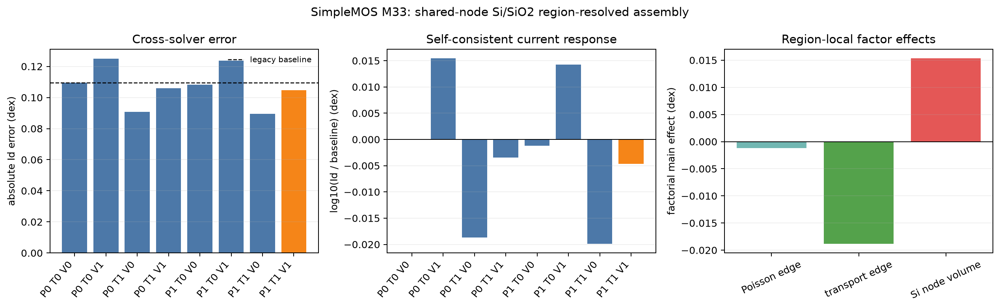

# SimpleMOS M33 region-resolved interface-assembly audit

## Technical summary

M33 tests whether the shared-node Si/SiO2 finite-volume geometry contributes
to the n23 deep-off mismatch at Vd = 0.05 V and Vg = 0.05 V. The production
physics remains OldSlotboom + SRH(DopingDependence) + PhuMob + Enormal +
HighFieldSaturation(GradQuasiFermi), with the documented
`transport_cell_vector` driving-field discretization.

The diagnostic retains one potential degree of freedom at every material
interface node. Three region-local assembly factors are independently enabled
in a complete 2^3 self-consistent matrix:

- Poisson interface edges use `sum(epsilon_cell * local_couple_cell)`;
- carrier interface edges use only transport-cell local couples;
- mobile charge and carrier source terms use only transport-cell barycentric
  node-volume shares.

Every variant is rerun through equilibrium, the drain ramp to 0.05 V, and the
gate ramp to 0.05 V. The default values of all three switches are false.

## Geometry closure

The imported Vela mesh has 20 Si/SiO2 interface edges and 21 interface nodes.
For these edges the legacy total couple is 4.98408 times the Si-local couple.
The legacy arithmetic-permittivity coefficient is 1.42727 times the
cell-weighted Poisson coefficient. The total-node-volume / Si-volume ratio
ranges from 3.65606 to 11.28750, with median 4.83373.

These are local operator ratios, not terminal-current error multipliers.

## Self-consistent factorial result

`P`, `T`, and `V` denote Poisson-edge, transport-edge, and transport-volume
region resolution respectively.

| Variant | P | T | V | Id (A/um) | Error (dex) | Improvement (dex) |
|---|---:|---:|---:|---:|---:|---:|
| p0_t0_v0 | 0 | 0 | 0 | 1.10464e-16 | 0.109419 | 0 |
| p1_t0_v0 | 1 | 0 | 0 | 1.10167e-16 | 0.108248 | 0.001170 |
| p0_t1_v0 | 0 | 1 | 0 | 1.05806e-16 | 0.090706 | 0.018713 |
| p0_t0_v1 | 0 | 0 | 1 | 1.14460e-16 | 0.124850 | -0.015432 |
| p1_t1_v0 | 1 | 1 | 0 | 1.05525e-16 | 0.089550 | 0.019869 |
| p1_t0_v1 | 1 | 0 | 1 | 1.14150e-16 | 0.123672 | -0.014253 |
| p0_t1_v1 | 0 | 1 | 1 | 1.09580e-16 | 0.105929 | 0.003490 |
| p1_t1_v1 | 1 | 1 | 1 | 1.09287e-16 | 0.104765 | 0.004654 |

The Sentaurus reference current is 8.58625e-17 A/um. The historical Vela
baseline is reproduced exactly.

## Interpretation

The transport-edge factor has the largest mean log-current effect,
-0.01881 dex. Poisson edge weighting has a smaller -0.00117 dex mean effect.
Restricting the node volume to the Si share acts in the opposite direction,
+0.01532 dex. Consequently, enabling the complete physically coherent trio
reduces the error by only 0.004654 dex, or 4.25% of the original log gap.

The lowest-error factorial corner is `p1_t1_v0`, which closes 18.16% of the
gap, but it intentionally leaves the node-volume treatment inconsistent and
therefore is not a valid production default or calibration target. It is only
evidence that the interface transport-edge geometry has a measurable causal
response that is partly cancelled by the Si-volume correction.

M33 therefore supports a bounded result: shared-node interface assembly is a
real contributor to the deep-off current, but the complete region-local
correction does not explain most of the 0.109419 dex mismatch. Explicit
double-node/interface-equation work is not justified as the next production
change from this single point. The next diagnostic should compare Sentaurus
and Vela region-local box coefficients and interface-node charge/source
measures before choosing which topology is actually equivalent.
