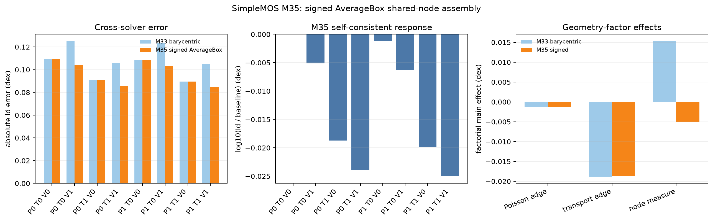

# SimpleMOS M35 signed AverageBox assembly audit

## Scope

M35 repeats the M33 n23 deep-off diagnostic at Vd = 0.05 V and Vg =
0.05 V, but replaces the barycentric transport-node volume factor with the
signed circumcentric measure used by Sentaurus `AverageBoxMethod`.  The
production physics remains OldSlotboom + SRH(DopingDependence) + PhuMob +
Enormal + HighFieldSaturation(GradQuasiFermi), with
`transport_cell_vector` driving-field discretization.

The new `transport_signed_average_box_node_volume` switch is opt-in and
mutually exclusive with M33's `transport_node_volume`.  It does not change the
default model.  Every factorial corner is recomputed self-consistently through
equilibrium, drain ramp, and gate ramp.

## Direct geometry closure

The M34 debug export showed that `Measure` and `Coefficients` have different
local-slot permutations: `[0, 2, 1]` and `[1, 0, 2]`, respectively.  After
interpreting them independently, Vela's signed Si measure agrees with all 21
Si/SiO2 interface-node values to a maximum relative error of `2.92e-15`.
The 8 negative local Si shares assemble to positive measures at every Si node;
the smallest assembled measure is recorded in the frozen report.

This direct closure covers the Si/SiO2 interface.  It does not establish that
a raw circumcentric formula reproduces Sentaurus's special treatment of every
external boundary/contact element, so M35 remains a diagnostic rather than a
new default.

## Self-consistent factorial result

`P`, `T`, and `V` denote region-local Poisson edge, transport edge, and signed
AverageBox transport-node measure, respectively.

| Variant | P | T | V | Id (A/um) | Error (dex) | Improvement (dex) |
|---|---:|---:|---:|---:|---:|---:|
| p0_t0_v0 | 0 | 0 | 0 | 1.10464e-16 | 0.109419 | 0 |
| p0_t0_v1 | 0 | 0 | 1 | 1.09171e-16 | 0.104304 | 0.005115 |
| p0_t1_v0 | 0 | 1 | 0 | 1.05806e-16 | 0.090706 | 0.018713 |
| p0_t1_v1 | 0 | 1 | 1 | 1.04560e-16 | 0.085561 | 0.023857 |
| p1_t0_v0 | 1 | 0 | 0 | 1.10167e-16 | 0.108248 | 0.001170 |
| p1_t0_v1 | 1 | 0 | 1 | 1.08877e-16 | 0.103133 | 0.006286 |
| p1_t1_v0 | 1 | 1 | 0 | 1.05525e-16 | 0.089550 | 0.019869 |
| p1_t1_v1 | 1 | 1 | 1 | 1.04282e-16 | 0.084406 | 0.025013 |

The Sentaurus reference current is `8.58625e-17 A/um`.  All 8 workflows
converged and the historical Vela baseline was reproduced exactly.

## Interpretation

The factorial main effects on log current are:

| Factor | M35 main effect (dex) |
|---|---:|
| Region-local Poisson edge | -0.001163 |
| Region-local transport edge | -0.018720 |
| Signed AverageBox Si node measure | -0.005130 |

Unlike M33's barycentric node-volume factor (`+0.015323 dex`), the signed
AverageBox factor moves the current in the same direction as the transport-edge
correction.  The coherent all-on corner is therefore also the lowest-error
corner.  It reduces the log error from `0.109419 dex` to `0.084406 dex`, a
`0.025013 dex` improvement or `22.86%` closure of the original gap.

M35 strengthens the evidence that shared-node finite-volume geometry is a
material contributor to the deep-off mismatch.  It still leaves `77.14%` of
the log gap unexplained and does not justify changing the default assembly.
The remaining work should first audit Sentaurus boundary/contact node measures
and then separate their response from contact flux and self-consistent
quasi-Fermi feedback.
