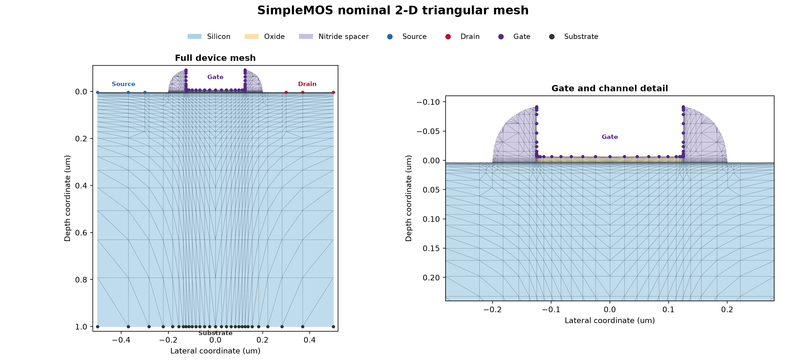
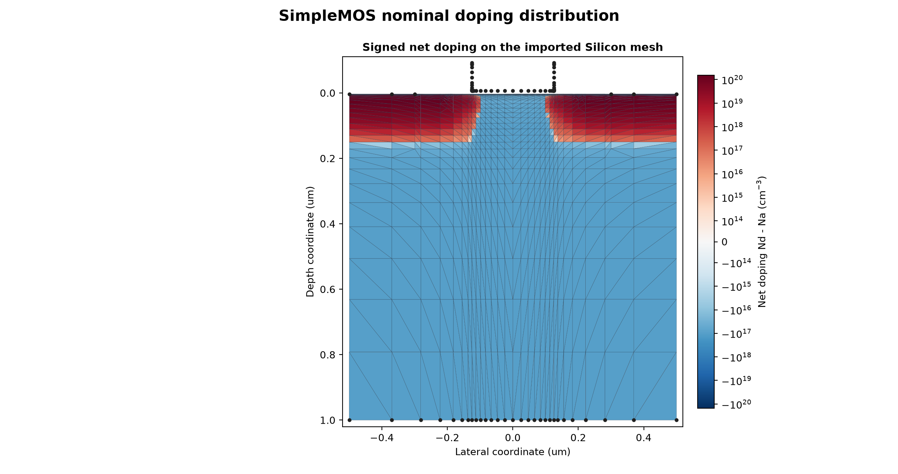
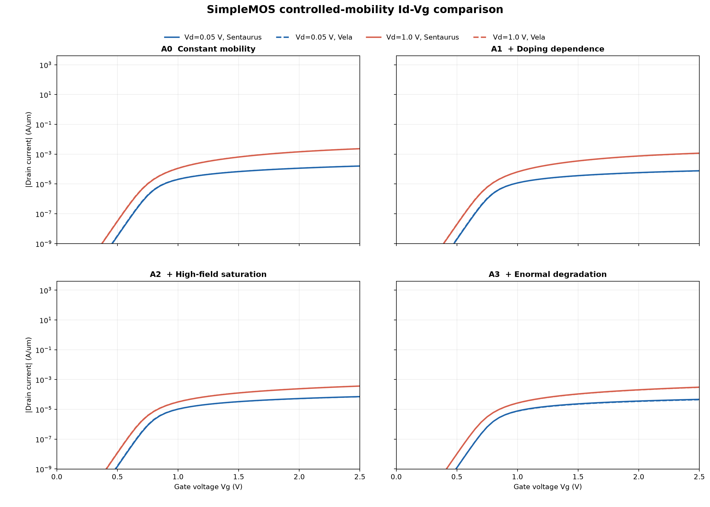
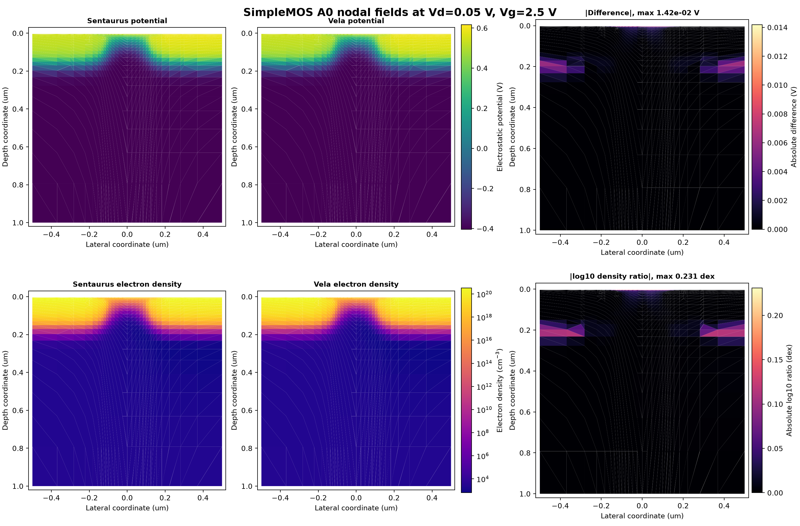

# SimpleMOS M4 visual validation report

Date: 2026-08-26

Scope: Sentaurus Device versus Vela; no SProcess validation

## Device mesh



The nominal imported structure contains 1,542 vertices and 2,864 triangular
cells. The overview shows the four contacts and the Silicon, Oxide, and Nitride
regions; the detail view exposes the refined gate/channel mesh.

## Net doping



The signed logarithmic scale shows the p-type substrate and the symmetric
n-type source/drain profiles. Values are the element averages of the imported
nodal `Nd - Na` field in `cm^-3`.

## Controlled-mobility Id-Vg curves



Each panel uses all 51 direct gate-voltage points for both drain voltages.
Solid curves are Sentaurus and dashed curves are Vela. No interpolation is
used. All eight comparisons pass the frozen M4 contract.

## Nodal physical quantities



This direct nodal comparison uses the A0 case at `Vd=0.05 V`, `Vg=2.5 V` on
the identical Silicon mesh. Sentaurus `eDensity` is converted from `cm^-3` only
for comparison with Vela's internally exported `m^-3` values. The maximum
element-averaged potential difference is 0.0142 V and the maximum absolute
electron-density log10 ratio is 0.231 dex. The largest localized differences
occur around the source/drain junction transition rather than in the channel.

## Reproduction

First export the final Sentaurus A0 field data into the ignored build tree:

```text
build-release/sentaurus_import.exe \
  --tdr build-release/reference_tcad/simplemos_sentaurus2022/m4_controlled_mobility/sentaurus_raw/sentaurus_bundle/a0_vd_0p05/a0_vd_0p05_des.tdr \
  --export-dir build-release/reference_tcad/simplemos_sentaurus2022/m4_visuals/a0_export
```

Then render the four figures:

```text
python scripts/plot_simplemos_m4_validation.py
```

The plotting script consumes only neutral CSV exports, the checked-in exact
comparison tables, and the generated Vela state. Proprietary TDR/PLT files and
raw solver states remain excluded from version control.
