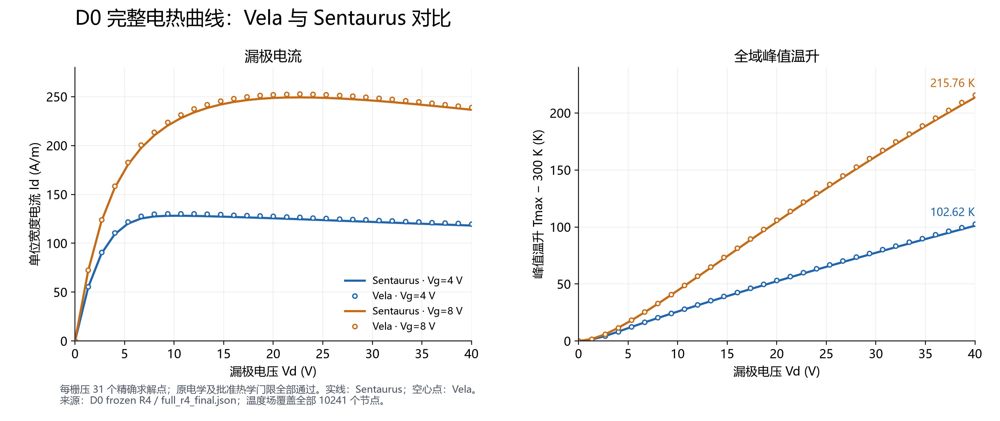
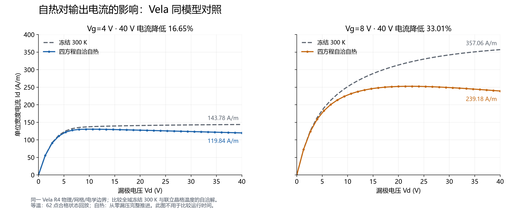
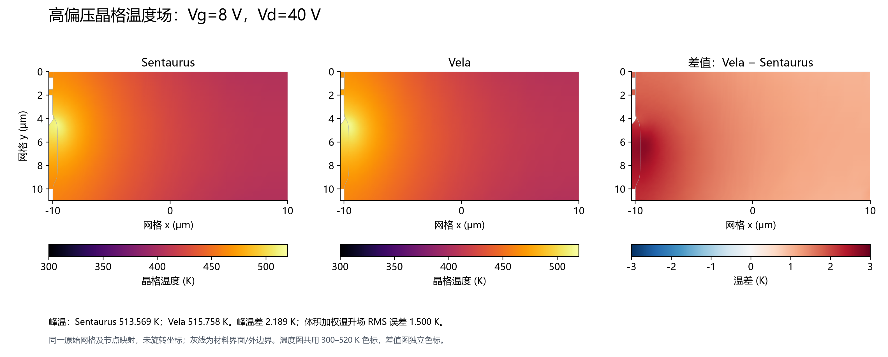

# LDMOS 工作日报素材｜2026-09-12

## 可直接用于日报的工作摘要

今日围绕 LDMOS 与 Sentaurus 的物理一致性及自热验证，完成高精度载流子
统计、BGN 和材料参数审计，补齐 Auger 密度增强及温度依赖，接入 IALMob
温度链式导数，并实现电势、电子/空穴准费米势与晶格温度的四方程自洽求解。
晶格热源直接使用实际离散电流计算，保持原 D0 未启用
Thermodynamic/Peltier/RecGenHeat 的范围。

完成 Vg=4/8 V、Vd=0–40 V 各 31 个精确点的完整 D0 验证，原电学和已批准
热学门限全部通过。两栅压最大电流误差为 1.7744%/1.5825%，最大峰温误差为
1.5051/2.1893 K，最大体积加权温升场 RMS 误差为 0.9552/1.5001 K。
冻结 300 K 的双栅压 62 点回放通过，电流最大相对变化为 8.83e-14，验证
新电热入口在等温极限下保持既有 D4 数值结果。

重新核对原始 Sentaurus 脚本的生效方程与边界参数，明确量子势仅声明而
未加入 Solve，有限空穴接触复合仍只保留此前等温消融的限定等效范围。
当前资格属于独立电热实验入口，生产 DC 入口继续默认等温；完整曲线通过
不等于通用量子、有限速度接触或所有内部离散算法均已实现。

## 工作明细及证据

| 工作 | 完成内容 | 验证结果 |
|---|---|---|
| 高精度 Fermi/BGN | 分段高精度函数、解析导数及逆函数，BGN 联动；按原生参数审计 Eg、亲和势及 DOS | 来源一致材料使原生固定状态密度误差中位数约降至 10 ppm；G3/D5/D4 共 155 个精确点复核通过 |
| Auger H/N0 | 密度增强、自洽复合源及 Jacobian；新增独立配置和种子证据 | 新 H/N0 配置 G3/D5/D4 共 155 点通过；这是一轮独立资格，不与前轮累计成唯一偏压点数 |
| D3/D2/D1 范围核对 | 重核量子方程是否参与 Solve、源漏接触消融数据 | 原工程/最终等效门限通过；复用 D4 合格解评分，不额外计为新求解点 |
| 温度相关输运与物性 | 逐节点能带/DOS、Fermi/BGN、SRH/Auger、低/高场 IALMob 温度项及解析偏导 | 局部数值/导数测试、冻结 300 K 62 点和代表偏压点通过 |
| 完整自热 | 四方程 Jacobian、温度相关热导、Robin 热边界、与离散电流一致的晶格源 | D0 双栅压 62 点联合验收通过，全部 78 次接受求解重审通过，无拒绝步 |
| 工程整理 | 独立准备/运行/原生场提取/评分脚本、输入保护、UTF-8 兼容、状态索引及冻结证据 | 提交前 Release 构建完成，完整 CTest 799/799 通过（777.26 s）；图表与文档另行核验 |

相关报告：[高精度统计](templates_ldmos_fermi_accuracy_2026-09-12.md)、
[Auger 与阶段链](templates_ldmos_auger_and_stage_chain_2026-09-12.md)、
[温度迁移率](templates_ldmos_d0_mobility_temperature_2026-09-12.md)、
[完整电热验收](templates_ldmos_d0_electrothermal_2026-09-12.md)、
[当前状态](templates_ldmos_current_status.md)。

此前 IALMob 记录优化的几何/状态复用成果一并整理归档：前八点运行时间
651.584→456.333 s，减少 29.97%，完整 62 点状态哈希不变。
它属于前期性能对照，不能与本日新 D0 自热计时混为同一性能基准。

## 建议日报配图

推荐正文采用图 1 和图 2；需要突出与 Sentaurus 的空间分布对照时，再加入图 3。
PNG 适合直接插入日报，PDF 适合缩放和排版。图中使用 A/m 表示单位宽度电流，
不将其误写为器件总电流 A。所有数据来自冻结验收结果，没有平滑拟合或补造点。

### 图 1：D0 电流与峰值温升完整曲线



图注：Vg=4/8 V、Vd=0–40 V，每栅压 31 个精确求解点。Vela 的漏极电流和
峰值温升均与 Sentaurus 保持接近；原电学及批准热学门限全部通过。40 V 时，
Vela 峰温分别为 402.617 K 和 515.758 K，对应原生 401.112 K 和 513.569 K。

[下载 PDF](figures/ldmos_d0_2026-09-12/d0_curves_temperature.pdf)

### 图 2：自热导致高压输出电流下降



图注：同一 Vela R4 模型、网格及电学边界下，对比全域冻结 300 K 与四方程
自洽自热曲线。40 V 时 Vg=4/8 V 电流分别降低 16.65%/33.01%，Vg=8 V 时
从 357.06 A/m 降至 239.18 A/m。等温曲线来自
已通过原门限的 62 点状态回放；自热曲线来自从零漏压连续推进。此图展示
物理结果差异，不用于比较两种运行方式的耗时。

[下载 PDF](figures/ldmos_d0_2026-09-12/d0_self_heating_current.pdf)

### 图 3：高偏压温度场与误差分布



图注：Vg=8 V、Vd=40 V，原始 10241 节点网格上的晶格温度。两幅温度图共用
300–520 K 色标；第三幅为同节点 Vela−Sentaurus 温差，采用独立差值色标。
峰温误差 2.189 K、体积加权温升场 RMS 误差 1.500 K，均通过批准门限。
最大同节点绝对温差为 2.715 K，差值色标为 ±3 K，未截断局部误差。
图示网格坐标没有旋转；灰线仅表示材料界面及外边界。

[下载 PDF](figures/ldmos_d0_2026-09-12/d0_temperature_field_vg8_vd40.pdf)

## 性能观察及后续工作

| 本轮 D0 指标 | Vg=4 V | Vg=8 V |
|---|---:|---:|
| Vela 非零接受推进 / 拒绝尝试 | 38 / 0 | 38 / 0 |
| Vela Newton 更新 | 369 | 366 |
| Sentaurus Newton 更新（含零压及失败尝试） | 217 | 202 |
| Vela 求解子进程墙钟累计 | 4953.084 s | 4195.531 s |
| Sentaurus 漏压阶段各求解 Total time 累计 | 709.15 s | 658.36 s |

原生漏压阶段统计包括加载栅压状态后的两次零压求解和失败尝试，排除栅压
预偏置。原生整个脚本墙钟为 2175.05 s，包含初始化、预偏置及场输出；
Vela 两曲线子进程累计 9148.615 s，存在并行及其他宿主负载，不包含栅压
预偏置，也不等于调度整体历时。计时边界和环境不一致，日报不将这些数字
写成严格的加速/减速倍率。原生日志来源：
`reference_staging/templates_ldmos_d0_electrothermal_20260912/native_full_r1/raw/n4_des.log`。

后续优先定位四方程 Newton 更新限幅和单次组装/分解成本，验证可信预测；
继续分析局部带边与界面输运差异，并补原生 Auger 温度场逐节点对照。
若需与原始脚本做到功能逐项一致，仍须实现并验证有限 hRecVelocity 边界；
完整量子方程或额外热源属于另一明确范围，不能从当前资格自动推导。

## 图片复现

使用已有 UCRT64 Python、matplotlib、numpy 和本机中文字体，无需重跑求解器。
从工作树根目录运行：

```powershell
D:/msys64/ucrt64/bin/python.exe -X utf8 scripts/plot_templates_ldmos_d0_report.py --evidence reference_staging/templates_ldmos_d0_electrothermal_20260912 --mesh reference_staging/templates_ldmos_sentaurus2022/phase01_original_20260826_02/stage1_v4/vela_exact_topology/mesh.json --output docs/validation/figures/ldmos_d0_2026-09-12
```

输入哈希与输出哈希记录于图目录的 `figure_provenance.json`。原始 TDR、
逐点求解输出、冻结程序及日志继续单独保存在忽略的证据目录中。
提交前完整测试日志为
`reference_staging/templates_ldmos_d0_electrothermal_20260912/commit_release_ctest.log`。
