# PN2D incremental validation results

Overall status: **pass_on_refined_mesh**. Stage A accepted: **True**.

Sentaurus T-2022.03-SP2; Vela MSYS2 UCRT64 GNU 16.2.0 Release; HDF5 enabled; ordinary DD uses Eigen SparseLU/COLAMD (SPQR/UMFPACK also compiled).

Silicon, 300 K, 2 x 0.5 um, straight junction x=1 um. Boltzmann DD, no avalanche. AreaFactor=1 and 1 um depth; currents in A/um. Anode is swept; Cathode is grounded.

Frozen contract SHA256: `0d1b39d4518b8adab750d807783a1ef34f396b12923d7cd7aa11b62ef08c09fe`. See `../acceptance.json`, `summary.json`, `spatial_metrics.json` and the adjacent exact-point CSV tables for every gate and metric.

Completed paired runs: 28. Required final pairs: 20. The remaining 13 generated entries are optional controls and retain their explicit not-run status.

| Case | Mesh | Required | Input | Ports | Spatial | Conservative transport | Result |
|---|---|---|---|---|---|---|---|
| P0 | original | yes | pass | pass | pass | pass | pass |
| P0 | M0 | no | pass | pass | pass | pass | pass |
| P0 | M1 | no | pass | pass | pass | pass | pass |
| P0 | M2 | yes | pass | pass | pass | pass | pass |
| P0 | M3 | yes | pass | pass | pass | pass | pass |
| P0 | E1 | yes | pass | pass | pass | pass | pass |
| P1 | M0 | no | pass | pass | pass | pass | pass |
| P1 | M1 | no | pass | pass | pass | pass | pass |
| P1 | M2 | yes | pass | pass | pass | pass | pass |
| P1 | M3 | yes | pass | pass | pass | pass | pass |
| P1 | E1 | no | not_run | not_run | not_run | not_run | incomplete |
| P2 | M0 | no | pass | pass | pass | pass | pass |
| P2 | M1 | no | pass | pass | pass | pass | pass |
| P2 | M2 | yes | pass | pass | pass | pass | pass |
| P2 | M3 | yes | pass | pass | pass | pass | pass |
| P2 | E1 | no | not_run | not_run | not_run | not_run | incomplete |
| P3 | M0 | no | pass | pass | pass | pass | pass |
| P3 | M1 | no | pass | pass | pass | pass | pass |
| P3 | M2 | yes | pass | pass | pass | pass | pass |
| P3 | M3 | yes | pass | pass | pass | pass | pass |
| P3 | E1 | no | not_run | not_run | not_run | not_run | incomplete |
| D1 | M0 | no | not_run | not_run | not_run | not_run | incomplete |
| D1 | M1 | no | not_run | not_run | not_run | not_run | incomplete |
| D1 | M2 | yes | pass | pass | pass | pass | pass |
| D1 | M3 | yes | pass | pass | pass | pass | pass |
| D1 | E1 | no | not_run | not_run | not_run | not_run | incomplete |
| D2 | M0 | no | not_run | not_run | not_run | not_run | incomplete |
| D2 | M1 | no | not_run | not_run | not_run | not_run | incomplete |
| D2 | M2 | yes | pass | pass | pass | pass | pass |
| D2 | M3 | yes | pass | pass | pass | pass | pass |
| D2 | E1 | no | not_run | not_run | not_run | not_run | incomplete |
| G1 | M0 | no | not_run | not_run | not_run | not_run | incomplete |
| G1 | M1 | no | not_run | not_run | not_run | not_run | incomplete |
| G1 | M2 | yes | pass | pass | pass | pass | pass |
| G1 | M3 | yes | pass | pass | pass | pass | pass |
| G1 | E1 | yes | pass | pass | pass | pass | pass |
| G2 | M0 | no | not_run | not_run | not_run | not_run | incomplete |
| G2 | M1 | no | not_run | not_run | not_run | not_run | incomplete |
| G2 | M2 | yes | pass | pass | pass | pass | pass |
| G2 | M3 | yes | pass | pass | pass | pass | pass |
| G2 | E1 | yes | pass | pass | pass | pass | pass |

## Mesh and model effects

| Case | M0/M1 | M1/M2 | M2/M3 | M3/E1 |
|---|---|---|---|---|
| P0 | fail | fail | pass | pass |
| P1 | fail | pass | pass | not_run |
| P2 | pass | pass | pass | not_run |
| P3 | fail | pass | pass | not_run |
| D1 | not_run | not_run | pass | not_run |
| D2 | not_run | not_run | pass | not_run |
| G1 | not_run | not_run | pass | pass |
| G2 | not_run | not_run | pass | pass |

Final qualification requires P0/original and all eight configurations on M2/M3, plus P0/G1/G2 on the endpoint control pair M3/E1, with the unchanged current and source-integral mesh thresholds. Earlier coarse controls and their failures remain visible. Unrun coarse B/C controls are not required to qualify the final refined pair.

## Numerical correction

The original PN2D IV template uses source-only continuity row scaling. Independent P0 scans stalled near +1.12 mV and -1.08 mV with rejected continuity closure. Tightening tolerances and jumping directly to 0.02 V did not resolve the issue. The campaign uses flux_fraction=1 in left row scaling. It changes conditioning, retaining equations, local eps_row=0.001 and global closure tolerance=0.01. The original template and global defaults are unchanged. Failed probes remain under P0/original/initial_source_scaling.

P3 exposed loss of sub-femtovolt conductive increments in the homogeneous-ni SG path: separate quasi-Fermi exponentials rounded to equal values. The homogeneous functions now use the existing expm1-factorized law at equal ni. A physical small-signal conductance test failed before the fix and passes afterward. The 26 SG tests (221 assertions), 13 Gummel cases, and the six selected PN2D/import/reference regressions passed. Failed P3 scans remain under P3/M0/initial_unstable_constant_ni. Repaired independent solves are recorded separately by executable fingerprint.

D1/D2 initially failed low-current port gates with the native double-precision reference. Their input, spatial and conservative checks passed. The D1/M2 EP128 diagnostic reduces native equilibrium current from 4.3e-20 to about 1e-34 A/um; all port components at -0.1 V agree within 0.057%. Separate EP80 controls pass D1/M3 zero/-0.1 V and both D1/M3 and D2/M3 zero/0.02 V with strict RHS. B/C therefore use EP80 (long double), chosen before G results; EP128 cost controls remain separate. Digits=8 and every frozen gate remain unchanged. Each exact Goal starts with a full segment and may shrink adaptively; required spatial states remain saved. All A inputs, all Vela inputs and all mesh/material inputs remain byte-identical. Original double-precision failures and the frozen exported-state roundoff diagnostic are retained separately. Only complete repeated sweeps qualify the final results.

The first EP128 full sweep additionally exposed premature native stopping at 0.02 V: update error was still 811 when RHS=1.03e-6 met default RHSMin=1e-5. Both EP128/M2 and EP80/M3 strict-RHS probes reduce all 0.02 V component errors below 0.057%. B/C therefore explicitly use RHSMin=1e-20, retaining Digits=8 and all physical parameters. Complete native sweeps are rerun; no reference points are patched from these probes. The prior complete and interrupted attempts are archived under initial_EP128_loose_rhs.

## Scope and conventions

The historical source sweeps to 10 V; the IV template defaults to 20 V. The checked-in legacy fixture IV contract covers 0.2--0.3 V; the separate high-voltage forward guard has anchors at 1, 2, 5, 10, 15, 20 V. This campaign solves 0--0.8 V and 0---1 V and does not requalify those high-voltage anchors for Sentaurus 2022.

The shipped material laws are evaluated at 300 K. SRH uses fixed 1e-5/3e-6 s lifetimes with doping dependence off. Constant mobility is 1417/470.5 cm2/V/s. P3 removes OldSlotboom and its associated -0.01595 eV band-gap reference correction. No parameters are fit to current.

Vela terminal electron/hole columns are q times particle inflow. Conventional current is electron minus hole; the hole column is negated for component comparison. A +x section equals minus the Cathode terminal current. VTK densities use cm^-3; restart CSV density columns serialize SI m^-3 and are read through the matching restart API.

M0/M1 add four left-boundary vertices and local endpoint refinement; M1 halves mesh length limits. The original unsegmented P0 mesh is retained as a separate control. P1/P2/P3 copy the corresponding P0 binary mesh. D1/D2 export fresh node doping. Uncontacted left-boundary segments have no electrode and use insulating natural conditions.

Nodal current vectors are reconstruction diagnostics, not conservative fluxes. The numerical acceptance uses production SG edge cuts at x=0.25, 0.75, 1, 1.25, 1.75 um, alongside terminal KCL and global continuity closure. SRH integrals use common triangular area lumping; endpoint and junction region statistics accompany nodal maxima.

nodal_section_diagnostics.json additionally integrates both tools' piecewise-linear reconstructed electron, hole and total current fields on the same five sections. These are not native discrete face fluxes and are not declared conserved: at 0.8 V the stage-A junction-line deviations reach 2.67% in the native vector and 9.08% in the Vela vector, while the same Vela states' exact SG fluxes pass. At P2 reverse leakage, the native nodal integral can differ by 75% (about 5e-19 A/um), and the Vela nodal integral by 13.5%, despite agreeing terminal currents. The raw absolute residuals remain visible; reconstruction errors are not counted as port or SG conservation passes.

The raw solver closure ratio is qualified only when its integrated source exceeds the configured source floor. For P2, zero source can produce a roundoff/roundoff ratio of one. Unqualified points instead receive an explicit electron/hole net-port-current check using the same frozen absolute floor and 1% through-current tolerance. Raw ratios, qualification flags and physical port-net currents are retained in conservation.csv; no threshold is relaxed.

Missing data are not passes. B/C simulations are gated on stage A. Binary TDR/PLT, VTK, states and logs are kept in the ignored build directory.

Legacy current_spreading maps and the left panel of current_spreading_metrics show the original nodal quasi-Fermi-gradient reconstruction, including its large G1/G2 discrepancy. They are retained as diagnostics; use the separately exported SG recovery maps and table for the transport-consistent spreading comparison.

The SG y partitions sum fluxes between node sets on opposite sides of a coordinate threshold. Their staircase dual faces can include longitudinal-current contributions, including in P0; they are not flat-plane integrals of Jy. The recovered SG/native field comparison supports the physical spreading conclusion.

## Current-vector recovery diagnosis

The legacy nodal quasi-Fermi-gradient current is a reconstruction diagnostic. Its large local-contact discrepancy is reproduced on the unchanged exported native state. Existing SG recoveries agree much more closely without solving again, fitting currents, changing defaults, or changing gates. The original fields remain recorded; the additional SG maps use shared symlog scales. These recoveries are not native internal face fluxes.

| Case | Frozen state | Recovery | Weighted L2 error | Jy/Jx norm |
|---|---|---|---|---|
| G1/E1 | vela | SentaurusTotalCurrentDensityVector | 61.2413% | 0.177598 |
| G1/E1 | vela | DualFaceSgTotalCurrentDensityVector | 0.5091% | 0.115960 |
| G1/E1 | vela | CellFirstSgTotalCurrentDensityVector | 0.3230% | 0.115261 |
| G1/E1 | native_exported | SentaurusTotalCurrentDensityVector | 61.2659% | 0.177600 |
| G1/E1 | native_exported | DualFaceSgTotalCurrentDensityVector | 0.5088% | 0.115962 |
| G1/E1 | native_exported | CellFirstSgTotalCurrentDensityVector | 0.3222% | 0.115263 |
| G2/E1 | vela | SentaurusTotalCurrentDensityVector | 85.0859% | 0.252031 |
| G2/E1 | vela | DualFaceSgTotalCurrentDensityVector | 0.7559% | 0.190924 |
| G2/E1 | vela | CellFirstSgTotalCurrentDensityVector | 0.4501% | 0.190098 |
| G2/E1 | native_exported | SentaurusTotalCurrentDensityVector | 85.1197% | 0.252033 |
| G2/E1 | native_exported | DualFaceSgTotalCurrentDensityVector | 0.7559% | 0.190927 |
| G2/E1 | native_exported | CellFirstSgTotalCurrentDensityVector | 0.4495% | 0.190101 |

## Figures

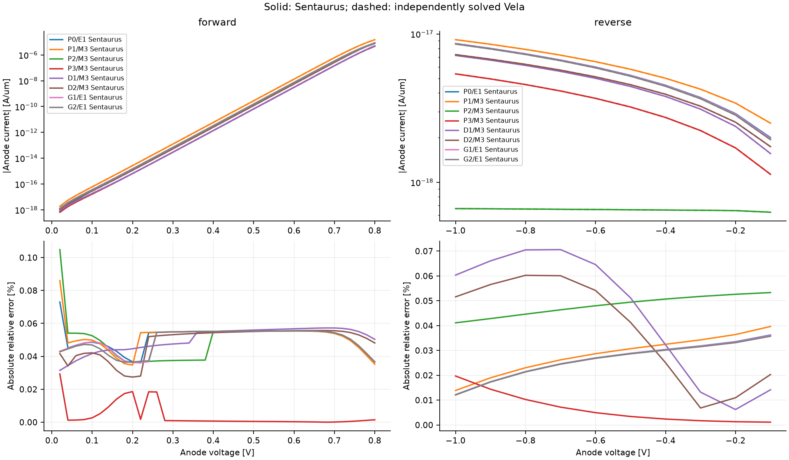

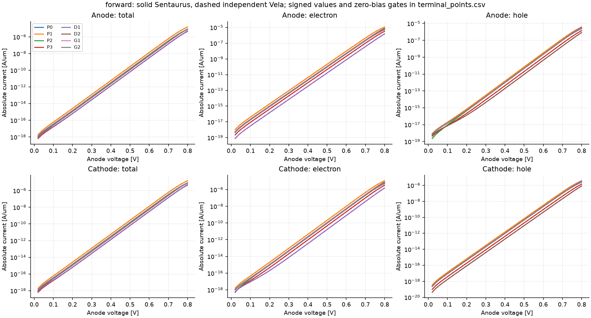

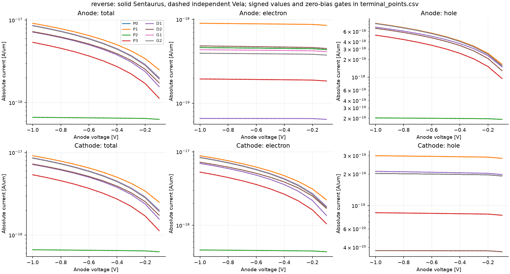

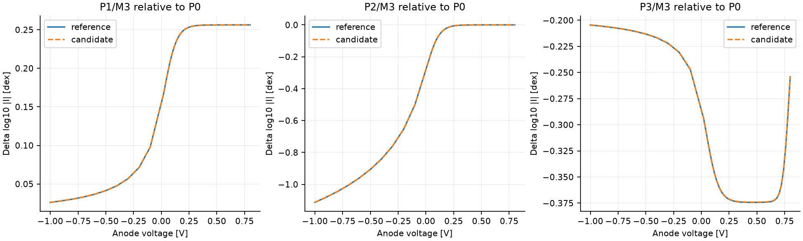

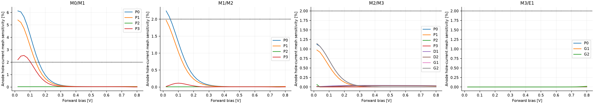

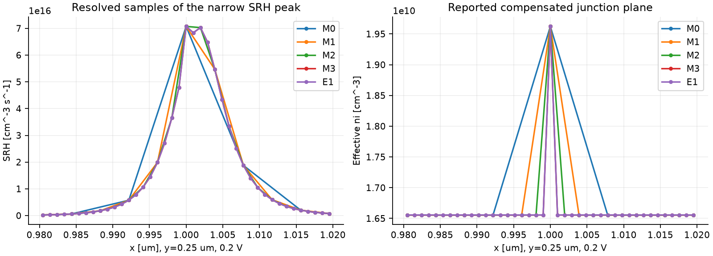

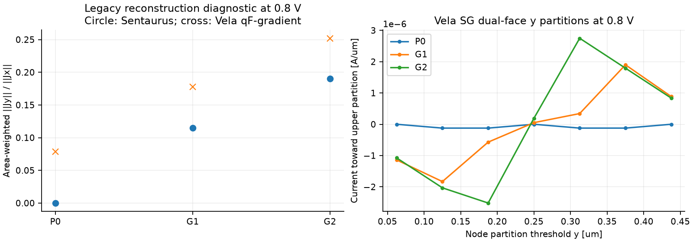

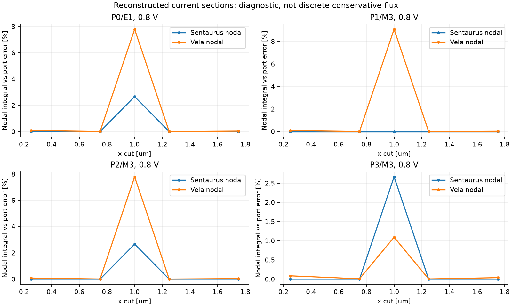

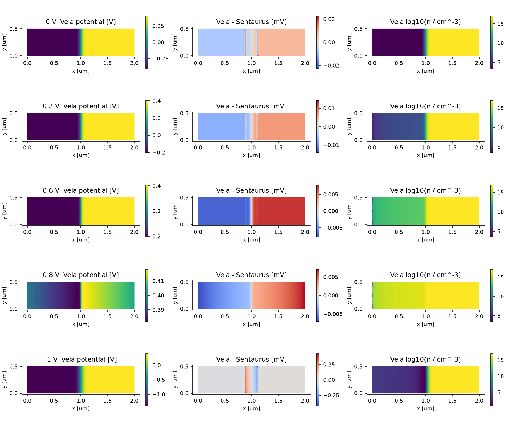

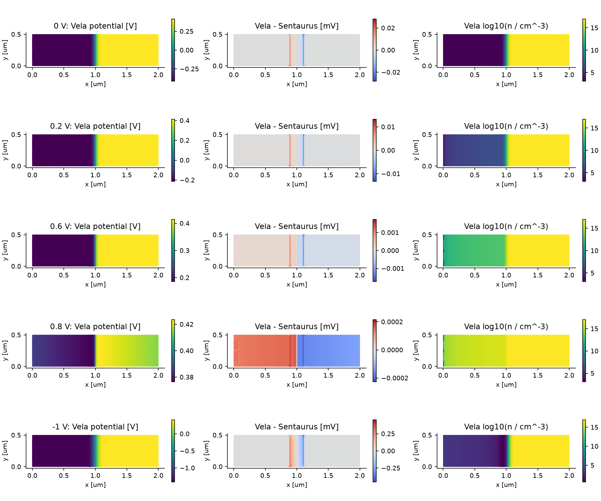

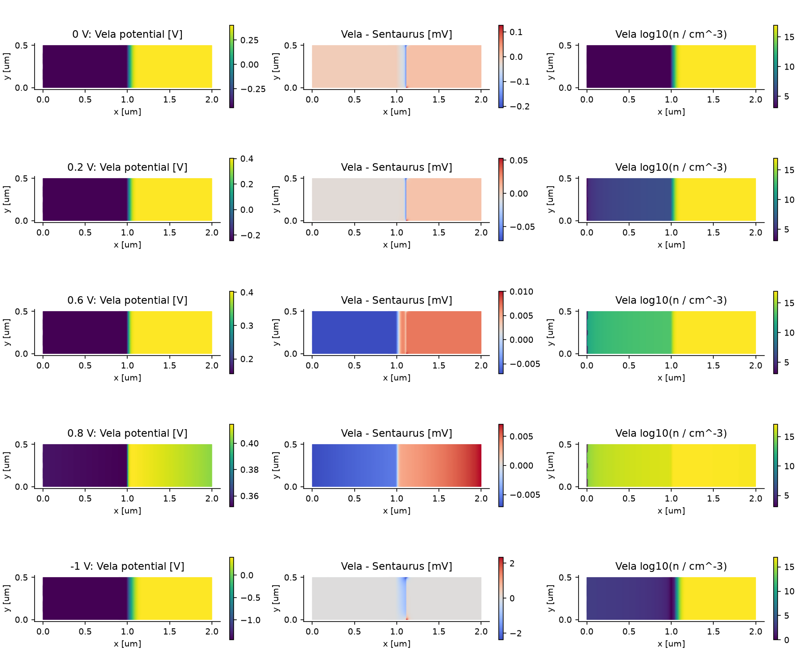

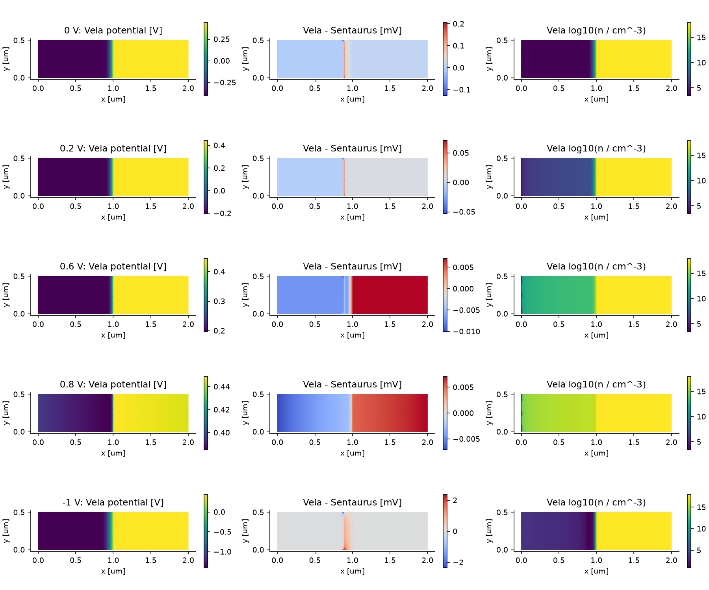

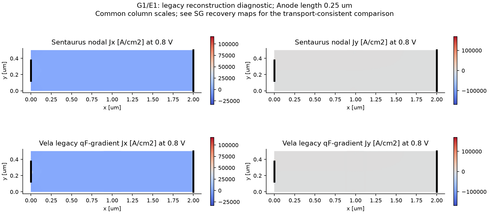

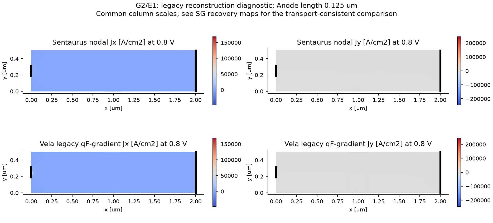

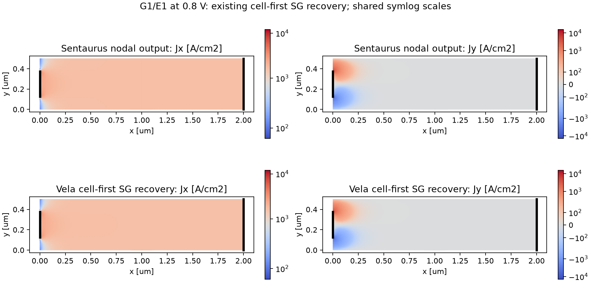

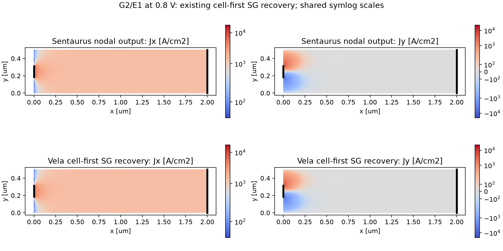
